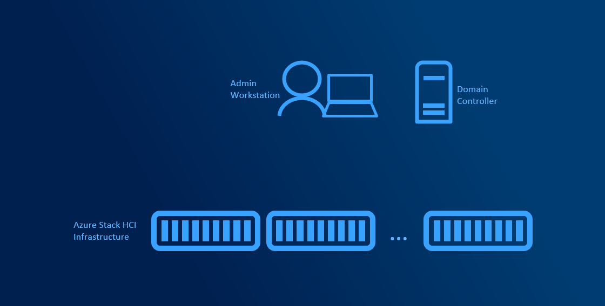
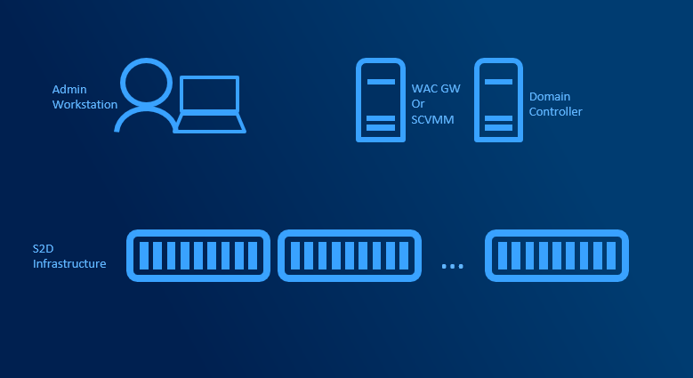
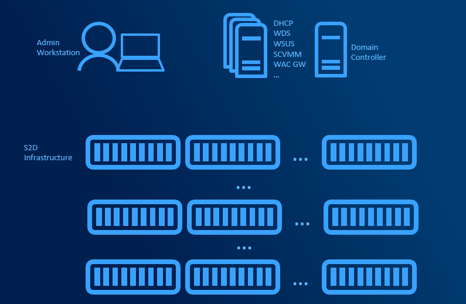

# Planning Supporting Infrastructure

There are several deployment sizes. Let's split it into three main categories. While all three categories can be managed just with one management machine and PowerShell, with more clusters or racks, management of the infrastructure can be very complex task.

In many cases we hear, that due to security, DHCP is not allowed in server subnet. Limiting what server can receive IP address can be done with [MAC Address Filtering](https://docs.microsoft.com/en-us/powershell/module/dhcpserver/add-dhcpserverv4filter).

Management infrastructure can be deployed in separate domain from hosted virtual machines to further increase security.

Management machine can be also deployed as [Privileged Access Workstation](https://docs.microsoft.com/en-us/windows-server/identity/securing-privileged-access/privileged-access-workstations).

## Minimum infrastructure

The minimum components are Domain Controller and Management machine. Management machine can be Windows 10 or Windows Server at least the same version as the managed server (for example Windows 10 1809 and newer can manage Windows Server 2019). DHCP server can significantly help as managed servers can receive IP address. That means you can manage them remotely without logging into servers to configure static IP, but it's not mandatory.

Windows Admin Center can be installed on Admin Workstation. From there, infrastructure can be managed using Windows Admin Center, PowerShell or legacy remote management tools (such as mmc).

## Medium infrastructure

Medium infrastructure assumes you have multiple administrators and/or multiple clusters in your environment. Another servers dedicated for management can be introduced to help with management centralization or automating management.

- [Installing Windows Admin Center in Gateway Mode](https://docs.microsoft.com/en-us/windows-server/manage/windows-admin-center/deploy/install#install-on-server-core)
- [Planning SCVMM Installation](https://docs.microsoft.com/en-us/system-center/vmm/plan-install?view=sc-vmm-2019)

## Large Scale infrastructure

Large Infrastructure assumes that you have more clusters spanning multiple racks or even sites. To help with bare-metal deployment, network management, patch management is SCVMM essential. Supporting roles (WSUS, WDS, Library servers) managed by SCVMM can be deployed across multiple servers. SCVMM supports deployment in HA Mode (Active-Passive) with SQL server Always On. DHCP is mandatory for bare-metal deployment as during PXE boot, server needs to obtain IP Address.

- [Planning HA SCVMM Installation](https://docs.microsoft.com/en-us/system-center/vmm/plan-ha-install?view=sc-vmm-2019)

