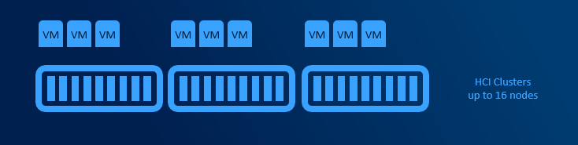
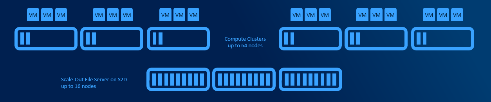
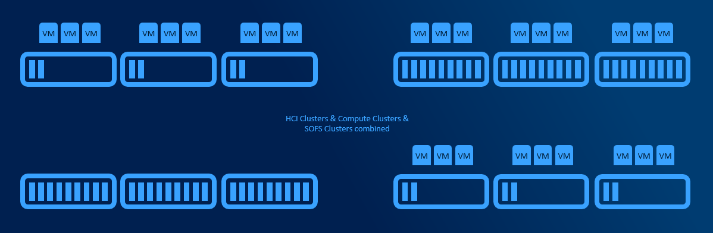

# Planning Deployment models and Workloads

Depending on size, usage and complexity of the environment you need to design what deployment model for Azure Stack HCI you want to choose. HyperConvered deployment is the simplest. It's great for it's simplicity, however for specialized tasks (like CPU/RAM consuming Virtual Machines) with moderate/high storage workload it might be more effective to split CPU/RAM intensive workload and storage into Converged deployment.

## HyperConverged deployments

HyperConverged deployments can be small as 2 nodes connected directly with network cable and grow to multi-PB 16 node clusters (unlike traditional clusters, where limit is 64 nodes). Minimum requirements are described in [hardware requirements doc](https://docs.microsoft.com/en-us/windows-server/storage/storage-spaces/storage-spaces-direct-hardware-requirements).

Simplicity is the main benefit in this deployment model. All hardware is standardized and from one vendor, therefore there is a high chance that there are hundreds of customers with exact same configuration. This significantly helps with troubleshooting. There are no extra hops compared to SAN, where some IOs are going over FC infrastructure and some over LAN (CSV redirection).

## Converged deployments (Windows Server Only)

Converged deployments have separate AzSHCI cluster with Scale-Out File Server role installed. Multiple compute clusters (up to 64 nodes each) can access single Scale-Out File Server. This design allows to use both Datacenter and Standard licenses for Compute Clusters. Also free Hyper-V server can be used for compute hosts.

This design adds some complexity as Virtual Machines are accessing its storage over network. Main benefit is, that one VM consuming all CPU cycles will not affect other VMs because of degraded storage performance. This design allows higher density, better deduplication job schedule and decreased east-west traffic (as VMs are pointed to it's CSV owner node using Witness Service or new [SMB Connections move on connect](https://techcommunity.microsoft.com/t5/failover-clustering/scale-out-file-server-improvements-in-windows-server-2019/ba-p/372156)).

## Cluster Sets (Windows Server Only)

If multiple clusters are using multiple Scale-Out FileServers or even if multiple HyperConverged clusters are present, cluster sets helps putting all clusters under one namespace and allows to define fault domains. When VM is created, fault domain can be used (instead of pointing VM to specific node/cluster).

Technically all VMs are located on SOFS share that is presented using DFS-N namespace. This namespace is hosted on Management cluster that does not need any shared storage as all configuration data are in registry.

## User Profile Disks host (Windows Server Only)

Azure Stack HCI can also host user profile disks (UPDs). Since UPD is VHD (both native Windows Server functionality and [FSLogix](https://github.com/microsoft/WSLab/tree/master/Scenarios/FSLogix)), Scale-Out File Server can be used as workload pattern is the same as for Virtual Machines.

## SQL

<TBD>

## Kubernetes

<TBD>

## VDI

<TBD>