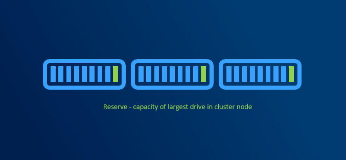
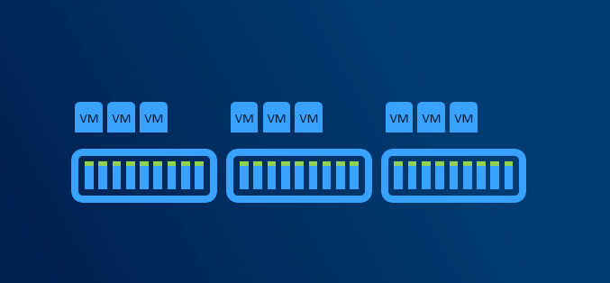
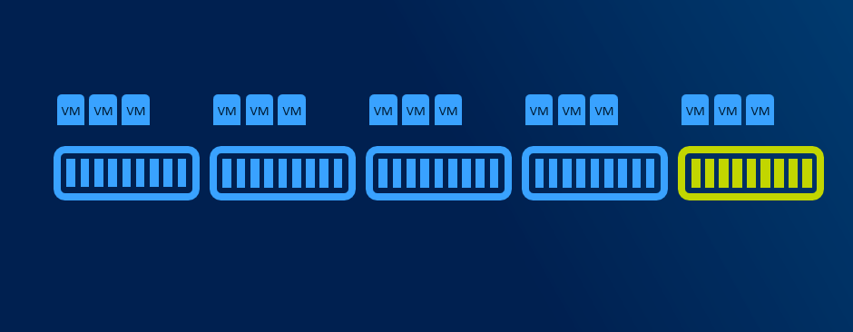
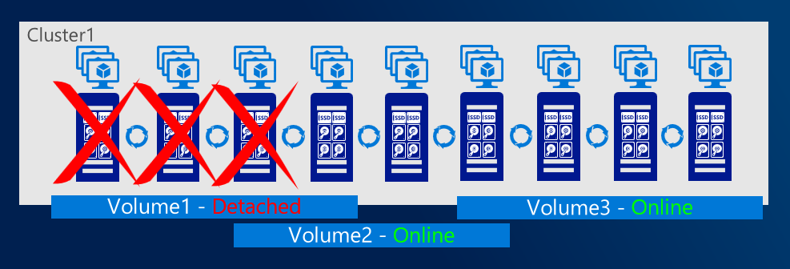

# Planning capacity

## Capacity reserve

When disk failure happens, it is necessary to have some capacity reserve to have immediate capacity to rebuild to. So for example if one disk in one node disconnects, there will be reserved capacity to have required number of copies (2 copies in 2-way mirror, 3 copies in 3-way mirror).

It is recommended to have largest disk capacity in each node not occupied - reserved. For calculation you can use http://aka.ms/s2dcalc. It is not necessary to mark disk as "reserved" or anything like that as it all about not consuming capacity of one disk.

Since we regular maintenance is required (security patches), reboot might be necessary. Or for example if any hardware upgrade is done (for example increasing RAM), node might need to be put into maintenance mode or even shut down. If VMs are required to run, then there has to be capacity (RAM) to keep VMs running on rest of the nodes.  

With more than 5 nodes it might make sense to reserve entire node. You will have capacity for VMs when node in maintenance, and you will be also able to rebuild if one node is completely lost - assuming all disks damaged (which is usually unlikely to happen as usually just one component fails and can be replaced withing service agreement).

## Resiliency options

### Mirror (two-way and three-way)

Two-way mirroring writes two copies of everything. Its storage efficiency is 50% - to write 1TB of data, you need at least 2TB of physical storage capacity. Likewise, you need at least two fault domains. By default, fault domain is Storage Scale Unit (which translates into server node). Fault domain can be also Chassis or Rack. Therefore if you have two node cluster, two-way mirroring will be used.

With three-way mirror, the storage efficiency is 33.3% - to write 1TB of data, you need at least 3TB of physical storage capacity. Likewise you need to have at least three fault domains. If you have 3 nodes, by default three-way mirror will be used.

### Dual-parity

Dual parity implements Reed-Solomon error-correcting codes to keep two bitwise parity symbols, thereby providing the same fault tolerance as three-way mirroring (i.e. up to two failures at once), but with better storage efficiency. It most closely resembles RAID-6. 
To use dual parity, you need at least four hardware fault domains – with Storage Spaces Direct, that means four servers. At that scale, the storage efficiency is 50% – to store 2 TB of data, you need 4 TB of physical storage capacity.

With increasing number of fault domains (nodes), local reconstruction codes, or LRC can be used. LRC can decrease rebuild times as only local (local group) parity can be used to rebuild data (there is one local and one global parity in dataset).

### Mirror-Accelerated Parity

Spaces Direct volume can be part mirror and part parity. Writes land first in the mirrored portion and are gradually moved into the parity portion later. Effectively, this is using mirroring to accelerate erasure coding.

To mix three-way mirror and dual parity, you need at least four fault domains, meaning four servers.

The storage efficiency of mirror-accelerated parity is in between what you'd get from using all mirror or all parity, and depends on the proportions you choose

### Recommended reading

https://docs.microsoft.com/en-us/windows-server/storage/storage-spaces/storage-spaces-fault-tolerance

## Scoped volumes

With increasing number of nodes it might be useful to put data only on selected nodes to better control what data will be accessible in case of failure of certain nodes. With scoped volumes, volumes can system tolerate more than 2 nodes failure while keeping volumes online.

## Cache drives

Faster media can be used as cache. If HDDs are used, cache devices are mandatory. Cache drives do not contribute to capacity.

For more information about cache visit [docs](https://docs.microsoft.com/en-us/windows-server/storage/storage-spaces/understand-the-cache)
