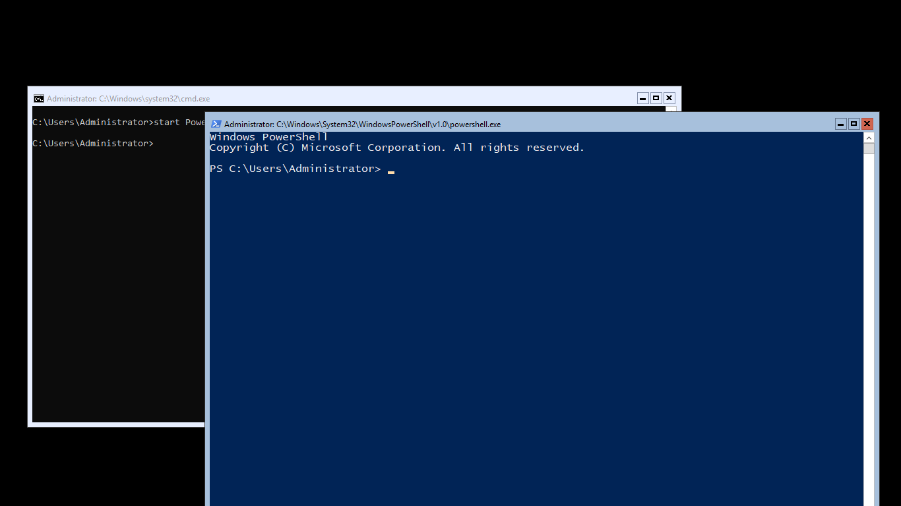
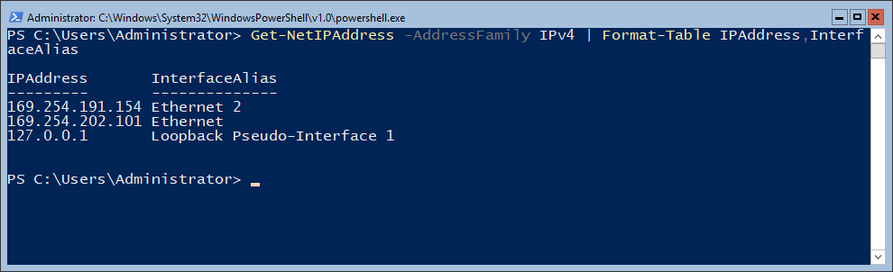
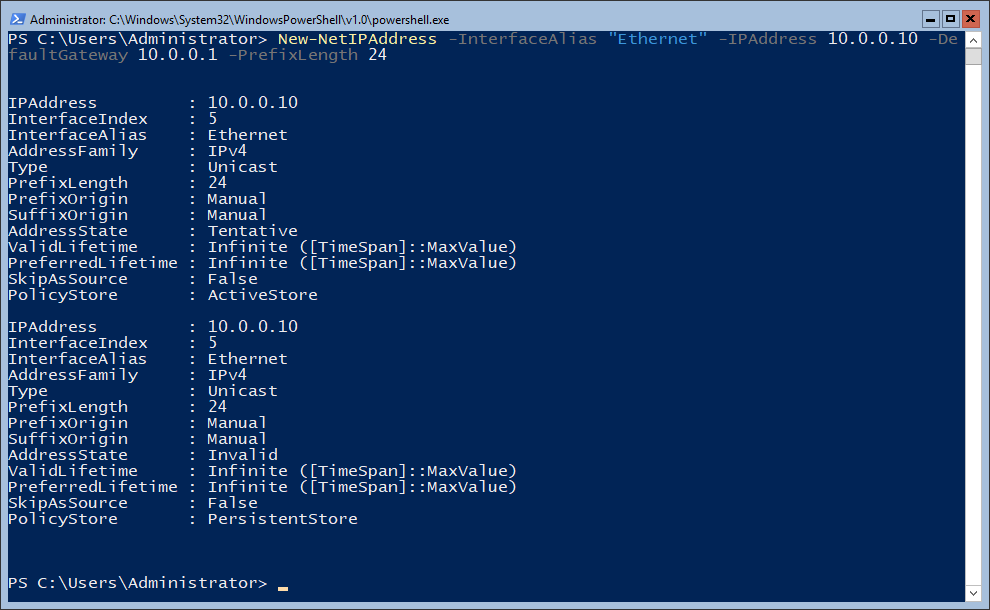
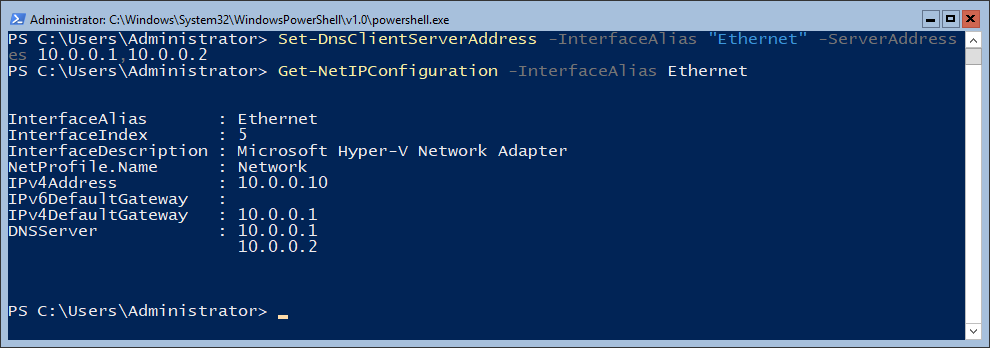
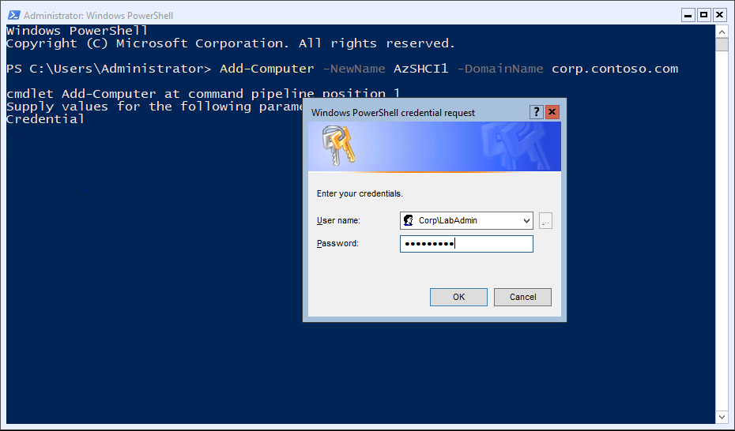
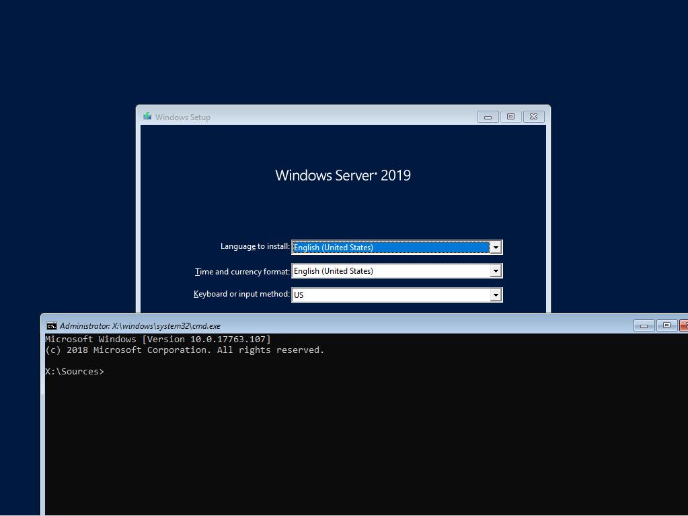
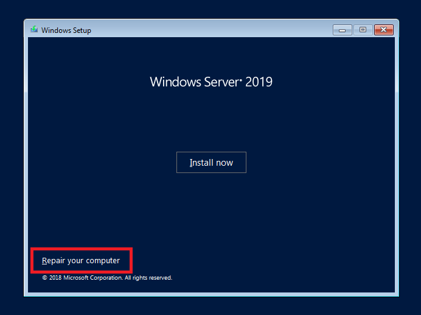
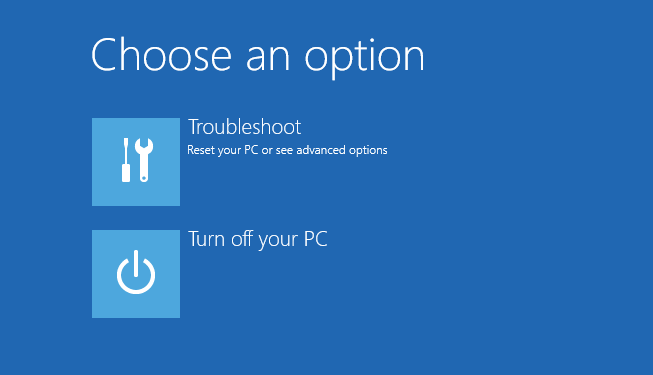
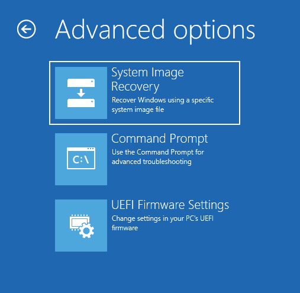
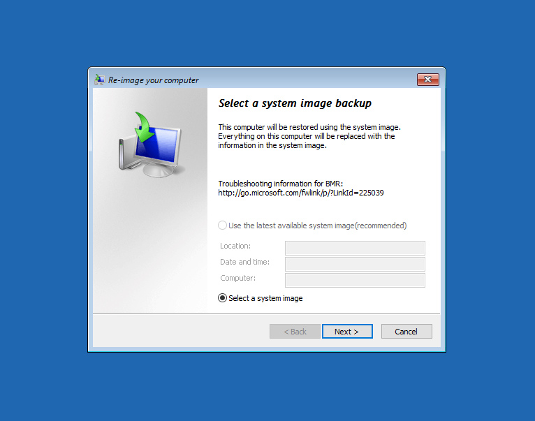

# OS Deployment

## Interactive setup

In this method, a user must select where to install Windows, read and accept the Microsoft Software License Terms, and apply a product key.

This method is useful for small-scale rollouts or individual installations. By using the default image from Microsoft, interactive Windows Setup does not require any preparatory work, such as creating answer files or capturing Windows images. It is possible to use interactive Windows Setup in conjunction with creating and capturing custom Windows images.

You can interactively install or upgrade Windows by using the Windows product media or from a network location after you store and share the installation files from the Windows product media. Interactive setup requires input from users, including destination drive, user names, and time zones.

### Manual steps needed after interactive setup

> [!TIP]
> You can test this in [MSLab](https://aka.ms/MSLab) with following VMs in labconfig:
>
> 1..4 | ForEach-Object {$VMNames="S2D"; $LABConfig.VMs += @{ VMName = "$VMNames$_" ; Configuration = 'S2D' ; ParentVHD = 'Win2019Core_G2.vhdx'; HDDNumber = 12; HDDSize= 4TB ; **Unattend="None"**}}
>
>To test environment without dhcp, just stop dhcp server with **Stop-Service DHCPServer** on MSLab DC

if DHCP is not enabled, it's necessary to configure IP and domain join machines. The easiest is to run sconfig that will pop up wizard. Following are powershell examples to configure the same

Once logged into server, run "start PowerShell" to open new PowerShell window



In PowerShell window check if IP addresses are configured.

```PowerShell
Get-NetIPAddress -AddressFamily IPv4 | Format-Table IPAddress,InterfaceAlias
 
```



To configure IP Address on adapter "Ethernet" you can run following command

```powershell
New-NetIPAddress -InterfaceAlias "Ethernet" -IPAddress 10.0.0.10 -DefaultGateway 10.0.0.1 -PrefixLength 24
```



The next step is to configure DNS server.

```powershell
Set-DnsClientServerAddress -InterfaceAlias "Ethernet" -ServerAddresses 10.0.0.1,10.0.0.2
Get-NetIPConfiguration -InterfaceAlias Ethernet
 
```



The last step is to domain join the machine, rename it, and reboot

```powershell
Add-Computer -NewName AzSHCI1 -DomainName corp.contoso.com
Restart-Computer
 
```



## Automated setup using install media

There are (different ways)[https://docs.microsoft.com/en-us/previous-versions/windows/it-pro/windows-vista/cc749415(v=ws.10)?redirectedfrom=MSDN#unattended-windows-setup] to provide unattend file. OEMs can also have their own setup that injects and install drivers and will ask for answer file. Following example demonstrates how to script create one. It will read data from csv and create answer files that contain domain join information using offline domain join blob.

Example CSV that is used using PowerShell code below

```ini
Name;NICIdentifier;IP;Subnet;Gateway;DNS1;DNS2;OU
Server1;Ethernet;10.0.0.11;255.255.255.0;10.0.0.1;10.0.0.1;10.0.0.2;OU=Workshop,DC=corp,DC=contoso,DC=com
Server2;Ethernet;10.0.0.12;255.255.255.0;10.0.0.1;10.0.0.1;10.0.0.2;OU=Workshop,DC=corp,DC=contoso,DC=com
```

Example PowerShell to create answer files

```powershell
# Verify Running as Admin
$isAdmin = ([Security.Principal.WindowsPrincipal] [Security.Principal.WindowsIdentity]::GetCurrent()).IsInRole([Security.Principal.WindowsBuiltInRole] "Administrator")
If (!( $isAdmin )) {
    Write-Host "-- Restarting as Administrator" -ForegroundColor Cyan ; Start-Sleep -Seconds 1
    Start-Process powershell.exe "-NoProfile -ExecutionPolicy Bypass -File `"$PSCommandPath`"" -Verb RunAs
    exit
}

#ask for CSV File
Write-Host -ForegroundColor Cyan "Please select CSV file with computer information"
[reflection.assembly]::loadwithpartialname("System.Windows.Forms")
$CSV = New-Object System.Windows.Forms.OpenFileDialog -Property @{
    Multiselect = $false;
    Title="Please select CSV file"
}
$CSV.Filter = "CSV files (*.csv)|*.csv|All files (*.*)|*.*" 
If($CSV.ShowDialog() -eq "OK"){
    Write-Host -ForegroundColor Cyan  "Following patches selected:"
    Write-Host "`t $($CSV.filenames)"
}
$CSV=$CSV.FileNames

#Configure work dir variable
$Workdir=$PSscriptRoot
$DomainName="corp.contoso.com"
#Variables
#$WorkDir="c:\Temp\ "
#$CSVFile="c:\Temp\test.csv"

#load CSV
$CSVValues=Import-Csv -Path $CSV -Delimiter ";"

Function CreateUnattendFileBlob{
        #Create Unattend (parameter is Blob)
        param (
            [parameter(Mandatory=$true)]
            [string]
            $Blob,
            [parameter(Mandatory=$true)]
            [string]
            $IPAddress,
            [parameter(Mandatory=$true)]
            [string]
            $Subnet,
            [parameter(Mandatory=$false)]
            [string]
            $Gateway,
            [parameter(Mandatory=$false)]
            [string]
            $DNS1,
            [parameter(Mandatory=$false)]
            [string]
            $DNS2,
            [parameter(Mandatory=$false)]
            [string]
            $NICIdentifier
        )

        $fileContent = @"
<?xml version="1.0" encoding="utf-8"?>
<unattend xmlns="urn:schemas-microsoft-com:unattend">
    <servicing>
        <package action="configure">
            <assemblyIdentity name="Microsoft-Windows-Foundation-Package" version="10.0.17763.0" processorArchitecture="amd64" publicKeyToken="31bf3856ad364e35" language="" />
            <selection name="Microsoft-Hyper-V" state="true" />
            <selection name="Bitlocker" state="true" />
            <selection name="SMB1Protocol" state="false" />
        </package>
    </servicing>
    <settings pass="windowsPE">
        <component name="Microsoft-Windows-Setup" processorArchitecture="amd64" publicKeyToken="31bf3856ad364e35" language="neutral" versionScope="nonSxS" xmlns:wcm="http://schemas.microsoft.com/WMIConfig/2002/State" xmlns:xsi="http://www.w3.org/2001/XMLSchema-instance">
            <DiskConfiguration>
              <Disk wcm:action="add">
                <DiskID>0</DiskID> 
                <WillWipeDisk>true</WillWipeDisk> 
                <CreatePartitions>

                  <!-- Windows RE Tools partition -->
                  <CreatePartition wcm:action="add">
                    <Order>1</Order> 
                    <Type>Primary</Type> 
                    <Size>300</Size> 
                  </CreatePartition>

                  <!-- System partition (ESP) -->
                  <CreatePartition wcm:action="add">
                    <Order>2</Order> 
                    <Type>EFI</Type> 
                    <Size>100</Size> 
                    <!-- Note: for Advanced Format Generation One drives, change to size=260 -->
                  </CreatePartition>

                  <!-- Microsoft reserved partition (MSR) -->
                  <CreatePartition wcm:action="add">
                    <Order>3</Order> 
                    <Type>MSR</Type> 
                    <Size>128</Size> 
                  </CreatePartition>

                  <!-- Windows partition -->
                  <CreatePartition wcm:action="add">
                    <Order>4</Order> 
                    <Type>Primary</Type> 
                    <Extend>true</Extend> 
                  </CreatePartition>
                </CreatePartitions>

                <ModifyPartitions>
                  <!-- Windows RE Tools partition -->
                  <ModifyPartition wcm:action="add">
                    <Order>1</Order> 
                    <PartitionID>1</PartitionID> 
                    <Label>WINRE</Label> 
                    <Format>NTFS</Format> 
                    <TypeID>de94bba4-06d1-4d40-a16a-bfd50179d6ac</TypeID>
                  </ModifyPartition>

                  <!-- System partition (ESP) -->
                  <ModifyPartition wcm:action="add">
                    <Order>2</Order> 
                    <PartitionID>2</PartitionID> 
                    <Label>System</Label> 
                    <Format>FAT32</Format> 
                  </ModifyPartition>

                  <!-- MSR partition does not need to be modified -->
                  <ModifyPartition wcm:action="add">
                    <Order>3</Order> 
                    <PartitionID>3</PartitionID> 
                  </ModifyPartition>

                  <!-- Windows partition -->
                  <ModifyPartition wcm:action="add">
                    <Order>4</Order> 
                    <PartitionID>4</PartitionID> 
                    <Label>Windows</Label> 
                    <Letter>C</Letter> 
                    <Format>NTFS</Format> 
                  </ModifyPartition>
                </ModifyPartitions>
              </Disk>
              <WillShowUI>OnError</WillShowUI> 
            </DiskConfiguration>

            <UserData>
                <AcceptEula>true</AcceptEula>
            </UserData>
            <ImageInstall>
                <OSImage>
                    <InstallFrom>
                        <MetaData wcm:action="add">
                            <Key>/IMAGE/INDEX</Key>
                            <Value>2</Value>
                        </MetaData>
                    </InstallFrom>
                    <InstallTo>
                        <DiskID>0</DiskID>
                        <PartitionID>4</PartitionID>
                    </InstallTo>
                </OSImage>
            </ImageInstall>
        </component>
        <component name="Microsoft-Windows-International-Core-WinPE" processorArchitecture="amd64" publicKeyToken="31bf3856ad364e35" language="neutral" versionScope="nonSxS" xmlns:wcm="http://schemas.microsoft.com/WMIConfig/2002/State" xmlns:xsi="http://www.w3.org/2001/XMLSchema-instance">
            <SetupUILanguage>
                <UILanguage>en-US</UILanguage>
            </SetupUILanguage>
            <InputLocale>0409:00000409</InputLocale>
            <SystemLocale>en-US</SystemLocale>
            <UILanguage>en-US</UILanguage>
            <UILanguageFallback>en-US</UILanguageFallback>
            <UserLocale>en-US</UserLocale>
        </component>
    </settings>
    <settings pass="specialize">
        <component name="Microsoft-Windows-TerminalServices-LocalSessionManager" processorArchitecture="amd64" publicKeyToken="31bf3856ad364e35" language="neutral" versionScope="nonSxS" xmlns:wcm="http://schemas.microsoft.com/WMIConfig/2002/State" xmlns:xsi="http://www.w3.org/2001/XMLSchema-instance">
            <fDenyTSConnections>false</fDenyTSConnections>
        </component>
        <component name="Microsoft-Windows-Deployment" processorArchitecture="amd64" publicKeyToken="31bf3856ad364e35" language="neutral" versionScope="nonSxS" xmlns:wcm="http://schemas.microsoft.com/WMIConfig/2002/State" xmlns:xsi="http://www.w3.org/2001/XMLSchema-instance">
            <RunAsynchronous>
                <RunAsynchronousCommand wcm:action="add">
                    <Order>1</Order>
                    <Path>netsh advfirewall firewall set rule name=&quot;File and Printer Sharing (Echo Request - ICMPv4-In)&quot; new enable=yes profile=any</Path>
                    <Description>Enable Echo Reply</Description>
                </RunAsynchronousCommand>
            </RunAsynchronous>
        </component>
        <component name="Microsoft-Windows-ServerManager-SvrMgrNc" processorArchitecture="amd64" publicKeyToken="31bf3856ad364e35" language="neutral" versionScope="nonSxS" xmlns:wcm="http://schemas.microsoft.com/WMIConfig/2002/State" xmlns:xsi="http://www.w3.org/2001/XMLSchema-instance">
            <DoNotOpenServerManagerAtLogon>true</DoNotOpenServerManagerAtLogon>
        </component>
        <component name="Microsoft-Windows-Shell-Setup" processorArchitecture="amd64" publicKeyToken="31bf3856ad364e35" language="neutral" versionScope="nonSxS" xmlns:wcm="http://schemas.microsoft.com/WMIConfig/2002/State" xmlns:xsi="http://www.w3.org/2001/XMLSchema-instance">
            <ComputerName>$($CSVValue.Name)</ComputerName>
            <ProductKey>WC2BQ-8NRM3-FDDYY-2BFGV-KHKQY</ProductKey>
            <RegisteredOrganization />
            <RegisteredOwner />
        </component>
        <component name="Networking-MPSSVC-Svc" processorArchitecture="amd64" publicKeyToken="31bf3856ad364e35" language="neutral" versionScope="nonSxS" xmlns:wcm="http://schemas.microsoft.com/WMIConfig/2002/State" xmlns:xsi="http://www.w3.org/2001/XMLSchema-instance">
            <FirewallGroups>
                <FirewallGroup wcm:action="add" wcm:keyValue="RemoteDesktop">
                    <Active>true</Active>
                    <Group>Remote Desktop</Group>
                    <Profile>all</Profile>
                </FirewallGroup>
            </FirewallGroups>
        </component>
        <component name="Microsoft-Windows-TCPIP" processorArchitecture="amd64" publicKeyToken="31bf3856ad364e35" language="neutral" versionScope="nonSxS" xmlns:wcm="http://schemas.microsoft.com/WMIConfig/2002/State" xmlns:xsi="http://www.w3.org/2001/XMLSchema-instance">
            <Interfaces>
                <Interface wcm:action="add">
                    <Ipv4Settings>
                        <DhcpEnabled>false</DhcpEnabled>
                    </Ipv4Settings>
                    <Identifier>$NICIdentifier</Identifier>
                    <UnicastIpAddresses>
                        <IpAddress wcm:action="add" wcm:keyValue="1">$IPAddress/$Subnet</IpAddress>
                    </UnicastIpAddresses>
                    <Routes>
                        <Route wcm:action="add">
                            <Prefix>0.0.0.0/0</Prefix>
                            <NextHopAddress>$Gateway</NextHopAddress>
                            <Identifier>1</Identifier>
                        </Route>
                    </Routes>
                </Interface>
            </Interfaces>
        </component>
        <component name="Microsoft-Windows-DNS-Client" processorArchitecture="amd64" publicKeyToken="31bf3856ad364e35" language="neutral" versionScope="nonSxS" xmlns:wcm="http://schemas.microsoft.com/WMIConfig/2002/State" xmlns:xsi="http://www.w3.org/2001/XMLSchema-instance">
            <Interfaces>
                <Interface wcm:action="add">
                    <Identifier>NIC1</Identifier>
                    <DNSServerSearchOrder>
                        <IpAddress wcm:action="add" wcm:keyValue="1">$DNS1</IpAddress>
                        <IpAddress wcm:action="add" wcm:keyValue="2">$DNS2</IpAddress>
                    </DNSServerSearchOrder>
                </Interface>
            </Interfaces>
        </component>
    </settings>
    <settings pass="oobeSystem">
        <component name="Microsoft-Windows-Shell-Setup" processorArchitecture="amd64" publicKeyToken="31bf3856ad364e35" language="neutral" versionScope="nonSxS" xmlns:wcm="http://schemas.microsoft.com/WMIConfig/2002/State" xmlns:xsi="http://www.w3.org/2001/XMLSchema-instance">
            <UserAccounts>
                <AdministratorPassword>
                    <Value>Heslo123</Value>
                    <PlainText>true</PlainText>
                </AdministratorPassword>
            </UserAccounts>
            <TimeZone>Central Europe Standard Time</TimeZone>
            <OOBE>
                <HideEULAPage>true</HideEULAPage>
                <HideWirelessSetupInOOBE>true</HideWirelessSetupInOOBE>
                <ProtectYourPC>1</ProtectYourPC>
            </OOBE>
            <RegisteredOrganization />
            <RegisteredOwner />
        </component>
        <component name="Microsoft-Windows-International-Core" processorArchitecture="amd64" publicKeyToken="31bf3856ad364e35" language="neutral" versionScope="nonSxS" xmlns:wcm="http://schemas.microsoft.com/WMIConfig/2002/State" xmlns:xsi="http://www.w3.org/2001/XMLSchema-instance">
            <InputLocale>en-US</InputLocale>
            <SystemLocale>en-US</SystemLocale>
            <UserLocale>en-US</UserLocale>
            <UILanguage>en-US</UILanguage>
        </component>
    </settings>
    <settings pass="offlineServicing">
        <component name="Microsoft-Windows-UnattendedJoin" processorArchitecture="amd64" publicKeyToken="31bf3856ad364e35" language="neutral" versionScope="nonSxS" xmlns:wcm="http://schemas.microsoft.com/WMIConfig/2002/State" xmlns:xsi="http://www.w3.org/2001/XMLSchema-instance">
            <OfflineIdentification>
                <Provisioning>
                    <AccountData>$Blob</AccountData>
                </Provisioning>
            </OfflineIdentification>
        </component>
    </settings>
    <cpi:offlineImage cpi:source="wim:e:/temp/install.wim#Windows Server 2016 SERVERSTANDARD" xmlns:cpi="urn:schemas-microsoft-com:cpi" />
</unattend>

"@

        #return the filecontent
        $fileContent
    }

foreach($CSVValue in $CSVValues){
    New-Item -Path "$Workdir\$($CSVValue.Name)\" -ItemType Directory -ErrorAction Ignore
    $blobfilepath="$Workdir\$($CSVValue.Name)\Blob.txt"
    djoin.exe /provision /domain $DomainName /machine $CSVValue.Name /savefile $blobfilepath /machineou $CSVValue.OU
    $blob=(get-content $blobfilepath)
    $blob=$blob.Substring(0,$blob.Length-1)
    $unattendcontent=CreateUnattendFileBlob -Blob $blob -IPAddress $CSVValue.IP -Subnet $CSVValue.subnet -Gateway $CSVValue.gateway -DNS1 $CSVValue.DNS1 -DNS2 $CSVValue.DNS2 -NICIdentifier $CSVValue.NICIdentifier
    Set-Content "$workdir\$($CSVValue.Name)\AutoUnattend.xml" $unattendcontent
}

Write-Host -ForegroundColor Green "Job finished, press enter to exit"
Read-Host
```

## SCVMM

Since deploying operating system with SCVMM is bit complex task, it's well explained within [MSLab scenario](https://github.com/microsoft/MSLab/tree/master/Scenarios/S2D%20and%20Bare%20Metal%20with%20SCVMM).

## MDT

Unlike SCVMM, Microsoft Deployment toolkit is a free tool. Together with SQL Express with database of your asset, you can perform Zero Touch Installation. See more in [MSLab scenario](https://github.com/microsoft/MSLab/tree/master/Scenarios/AzSHCI%20and%20MDT).

## Useful tools in install media

### shift+F10

Combination of keys Shift+F10 will pop up command line. This is very useful for example if disk cleanup needs to be performed using diskpart.



### Image Recovery tools








