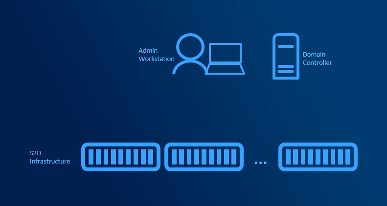
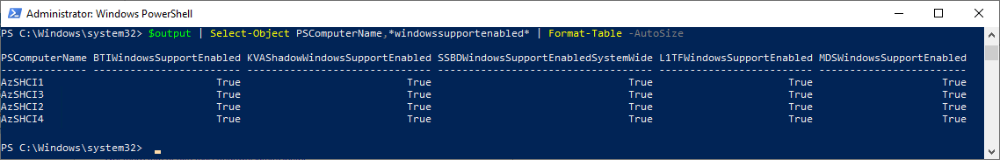
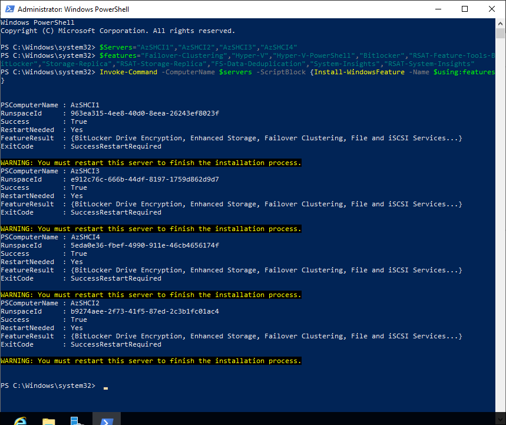
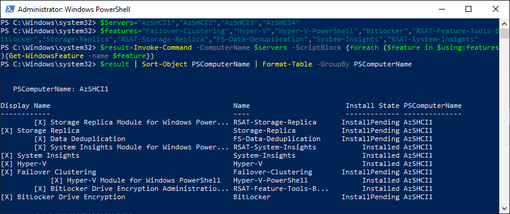
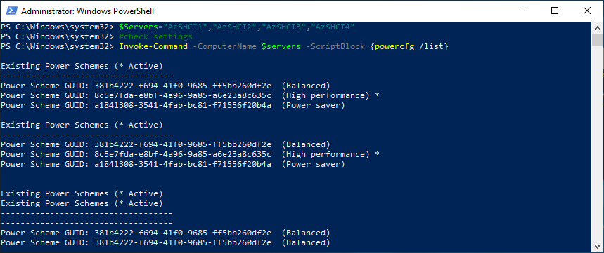

# OS Configuration

## Prerequisites

To complete following steps it is necessary, that servers are domain joined and reachable from management machine where configuration scripts will be executed. Following guidance assumes you have simple, minimum infrastructure with just a Management machine.



> [!TIP]
> You can test OS Configuration in [MSLab](https://aka.ms/MSLab) with following VMs in labconfig:
> 1..4 | ForEach-Object {$VMNames="S2D"; $LABConfig.VMs += @{ VMName = "$VMNames$_" ; Configuration = 'S2D' ; ParentVHD = 'Win2019Core_G2.vhdx'; HDDNumber = 12; HDDSize= 4TB }}

## Install management tools on management machine

This PowerShell script will just check what OS is installed on Management machine and then it decides what Remote Server Administration tools will be installed. In case of Server, it will install RSAT Optional Features. In Client SKU (depending what version) it will install either KB package or a Capability.

```powershell
$InstallationType=Get-ItemPropertyValue -Path 'HKLM:\SOFTWARE\Microsoft\Windows NT\CurrentVersion\' -Name InstallationType
$CurrentBuildNumber=Get-ItemPropertyValue -Path 'HKLM:\SOFTWARE\Microsoft\Windows NT\CurrentVersion\' -Name CurrentBuildNumber
if ($InstallationType -eq "Server"){
    Install-WindowsFeature -Name RSAT-Clustering,RSAT-Clustering-Mgmt,RSAT-Clustering-PowerShell,RSAT-Hyper-V-Tools,RSAT-Feature-Tools-BitLocker-BdeAducExt,RSAT-Storage-Replica
}elseif ($InstallationType -eq "Server Core"){
    Install-WindowsFeature -Name RSAT-Clustering,RSAT-Clustering-PowerShell,RSAT-Hyper-V-Tools,RSAT-Storage-Replica
}elseif (($InstallationType -eq "Client") -and ($CurrentBuildNumber -lt 17763)){
    #Validate RSAT Installed
        if (!((Get-HotFix).hotfixid -contains "KB2693643") ){
            Write-Host "Please install RSAT, Exitting in 5s"
            Start-Sleep 5
            Exit
        }
}elseif (($InstallationType -eq "Client") -and ($CurrentBuildNumber -ge 17763)){
    #Install RSAT tools
        $Capabilities="Rsat.ServerManager.Tools~~~~0.0.1.0","Rsat.FailoverCluster.Management.Tools~~~~0.0.1.0","Rsat.ActiveDirectory.DS-LDS.Tools~~~~0.0.1.0"
        foreach ($Capability in $Capabilities){
            Add-WindowsCapability -Name $Capability -Online
        }
}
if ($InstallationType -eq "Client"){
    #Install Hyper-V Management features
        if ((Get-WindowsOptionalFeature -online -FeatureName Microsoft-Hyper-V-Management-PowerShell).state -ne "Enabled"){
            #Install all features and then remove all except Management (fails when installing just management)
            Enable-WindowsOptionalFeature -online -FeatureName Microsoft-Hyper-V-All -NoRestart
            Disable-WindowsOptionalFeature -Online -FeatureName Microsoft-Hyper-V -NoRestart
            $Q=Read-Host -Prompt "Restart is needed. Do you want to restart now? Y/N"
            If ($Q -eq "Y"){
                Write-Host "Restarting Computer"
                Start-Sleep 3
                Restart-Computer
            }else{
                Write-Host "You did not type Y, please restart Computer. Exitting"
                Start-Sleep 3
                Exit
            }
        }elseif((Get-command -Module Hyper-V) -eq $null){
            $Q=Read-Host -Prompt "Restart is needed to load Hyper-V Management. Do you want to restart now? Y/N"
            If ($Q -eq "Y"){
                Write-Host "Restarting Computer"
                Start-Sleep 3
                Restart-Computer
            }else{
                Write-Host "You did not type Y, please restart Computer. Exitting"
                Start-Sleep 3
                Exit
            }
        }
}
 
```

## Perform Windows Update on Servers

Assuming Server Names are S2D1,S2D2,S2D3 and S2D4 (defined in variable $Servers). In MSLab is one [scenario](https://github.com/microsoft/MSLab/tree/master/Scenarios/Windows%20Update), that explains how to invoke Windows Update using WMI/CIM methods. There are different classes in Windows Server 2016 and Windows Server 2019. Therefore in following code is releaseID checked and then depending on that different CIM namespace used. In Deep Dive Scenario you can see, that slightly different argument is used (with AutoSelectOnWebSites=1). [AutoSelectOnWebSites = 1](https://docs.microsoft.com/en-us/windows/win32/api/wuapi/nf-wuapi-iupdatesearcher-search) will also find updates that are flagged to be automatically selected by windows update.

### Configure

```powershell
$Servers="AzSHCI1","AzSHCI2","AzSHCI3","AzSHCI4"
Invoke-Command -ComputerName $servers -ScriptBlock {
    $releaseid=(Get-ItemProperty -Path 'HKLM:\SOFTWARE\Microsoft\Windows NT\CurrentVersion\' -Name ReleaseId).ReleaseID
    if ($releaseid -eq 1607){
        $Instance = New-CimInstance -Namespace root/Microsoft/Windows/WindowsUpdate -ClassName MSFT_WUOperationsSession
        #find updates
        $ScanResult=$instance | Invoke-CimMethod -MethodName ScanForUpdates -Arguments @{SearchCriteria="IsInstalled=0";OnlineScan=$true}
        #apply updates (if not empty)
        $CriticalUpdates= $ScanResult.updates | Where-Object MsrcSeverity -eq Critical
        if ($CriticalUpdates){
            $instance | Invoke-CimMethod -MethodName DownloadUpdates -Arguments @{Updates=[ciminstance[]]$CriticalUpdates}
            $instance | Invoke-CimMethod -MethodName InstallUpdates  -Arguments @{Updates=[ciminstance[]]$CriticalUpdates}
        }
    }else{
        #Grab updates
        $ScanResult=Invoke-CimMethod -Namespace "root/Microsoft/Windows/WindowsUpdate" -ClassName "MSFT_WUOperations" -MethodName ScanForUpdates -Arguments @{SearchCriteria="IsInstalled=0"}
        #apply updates (if not empty)
        if ($ScanResult.Updates){
            Invoke-CimMethod -Namespace "root/Microsoft/Windows/WindowsUpdate" -ClassName "MSFT_WUOperations" -MethodName InstallUpdates -Arguments @{Updates=$ScanResult.Updates}
        }
    }
}
 
```

### Validate

To validate if updates were successfully installed, you can run following code. It will display update version that you can compare to [Windows Update History](https://support.microsoft.com/en-us/help/4464619/windows-10-update-history)

```powershell
$Servers="AzSHCI1","AzSHCI2","AzSHCI3","AzSHCI4"
Invoke-Command -ComputerName $servers -ScriptBlock {
    $Package=Get-WindowsPackage -Online -PackageName * | Where-Object -FilterScript {
        $PSItem.ProductName  -eq 'Package_for_RollupFix' -and
        $PSItem.PackageState -eq 'Installed'
    }

    $Property = $Package.CustomProperties | Where-Object -FilterScript {
        $PSItem.Name -eq 'Version'
    }

    if ($Property){
        [System.Version]$Property.Value
    }else{
        #if no package is installed, UBR is queried from registry
        Get-ItemProperty -Path 'HKLM:\SOFTWARE\Microsoft\Windows NT\CurrentVersion\' | Select-Object CurrentBuild,UBR
    }
}
 
```


## Configure Spectre/Meltdown mitigations

It is recommended to review [settings](https://support.microsoft.com/en-us/help/4072698/windows-server-speculative-execution-side-channel-vulnerabilities) that will prevent exploiting Speculative Execution Side Channel vulnerabilities. Settings configuration can be validated using [Speculation Control Module](https://aka.ms/SpeculationControlPS) that is also described in [dedicated MSLab Scenario](https://github.com/microsoft/MSLab/tree/master/Scenarios/Exploring%20SpeculationControlSettings)

Following guidance is applicable to Intel processors.

### Configure

```powershell
$Servers="AzSHCI1","AzSHCI2","AzSHCI3","AzSHCI4"
#enable Microarchitectural Data Sampling mitigation
Invoke-Command -ComputerName $servers -ScriptBlock {
    #Detect HT
    $processor=Get-WmiObject win32_processor | Select-Object -First 1
    if ($processor.NumberOfCores -eq $processor.NumberOfLogicalProcessors/2){
        $HT=$True
    }
    if ($HT -eq $True){
        Set-ItemProperty -Path "HKLM:\SYSTEM\CurrentControlSet\Control\Session Manager\Memory Management" -Name FeatureSettingsOverride -value 72
    }else{
        Set-ItemProperty -Path "HKLM:\SYSTEM\CurrentControlSet\Control\Session Manager\Memory Management" -Name FeatureSettingsOverride -value 8264
    }
    Set-ItemProperty -Path "HKLM:\SYSTEM\CurrentControlSet\Control\Session Manager\Memory Management" -Name FeatureSettingsOverrideMask -value 3
}

#Configure MinVmVersionForCpuBasedMitigations (only needed if you are running VM versions prior 8.0)
Invoke-Command -ComputerName $servers -ScriptBlock {
    if (-not (Test-Path "HKLM:\SOFTWARE\Microsoft\Windows NT\CurrentVersion\Virtualization")){
        New-Item -Path "HKLM:\SOFTWARE\Microsoft\Windows NT\CurrentVersion" -Name Virtualization -Force
    }
    Set-ItemProperty -Path "HKLM:\SOFTWARE\Microsoft\Windows NT\CurrentVersion\Virtualization" -Name MinVmVersionForCpuBasedMitigations -value "1.0"
}

#Configure Processor Machine Check Error vulnerability mitigation https://support.microsoft.com/en-us/help/4530989/guidance-for-protecting-against-intel-processor-machine-check-error-vu
Invoke-Command -ComputerName $servers -ScriptBlock {
    if (-not (Test-Path "HKLM:\SOFTWARE\Microsoft\Windows NT\CurrentVersion\Virtualization")){
        New-Item -Path "HKLM:\SOFTWARE\Microsoft\Windows NT\CurrentVersion" -Name Virtualization -Force
    }
    Set-ItemProperty -Path "HKLM:\SOFTWARE\Microsoft\Windows NT\CurrentVersion\Virtualization" -Name IfuErrataMitigations -value 1
}

#Enable core scheduler on Windows Server 2016 (Default on 2019 and newer)
$RevisionNumber=Invoke-Command -ComputerName $servers[0] -ScriptBlock {
    Get-ItemPropertyValue -Path 'HKLM:\SOFTWARE\Microsoft\Windows NT\CurrentVersion\' -Name UBR
}
$CurrentBuildNumber=Invoke-Command -ComputerName $servers[0] -ScriptBlock {
    Get-ItemPropertyValue -Path 'HKLM:\SOFTWARE\Microsoft\Windows NT\CurrentVersion\' -Name CurrentBuildNumber
}
if ($CurrentBuildNumber -eq 14393 -and $RevisionNumber -ge 2395){
    Invoke-Command -ComputerName $Servers {
        bcdedit /set hypervisorschedulertype Core
    }
}
 
```

### Validate

To validate settings you can run following code. Expected results will be displayed after reboot (performed at the end of OS configuration part). If running in lab, some results might be false.

```powershell
$Servers="AzSHCI1","AzSHCI2","AzSHCI3","AzSHCI4"
$content=(Invoke-WebRequest -Uri https://raw.githubusercontent.com/microsoft/SpeculationControl/master/SpeculationControl.psm1 -UseBasicParsing).Content

#remove signature
$content=$content.substring(0,$content.IndexOf("# SIG # Begin signature block"))

#save it as file
$content | Out-File -FilePath $env:USERPROFILE\Downloads\SpeculationControlScript.ps1 -Force

#since in script is just a function, let's add there a line that will execute the function
Add-Content -Value "Get-SpeculationControlSettings -Quiet" -Path $env:USERPROFILE\Downloads\SpeculationControlScript.ps1

#and now we are able to execute against servers
$output=Invoke-Command -ComputerName $Servers -FilePath $env:USERPROFILE\Downloads\SpeculationControlScript.ps1

#to display output you can send it to Out-GridView
$output | Select-Object PSComputerName,*windowssupportenabled* | Format-Table -AutoSize
 
```



## Install Features

Following example will install required and some optional features for Azure Stack HCI. Required:Failover Clustering, Hyper-V. Optional: Bitlocker, Storage Replica, Deduplication and respective PowerShell modules.

### Configure

```PowerShell
$Servers="AzSHCI1","AzSHCI2","AzSHCI3","AzSHCI4"
$features="Failover-Clustering","Hyper-V","Hyper-V-PowerShell","Bitlocker","RSAT-Feature-Tools-BitLocker","Storage-Replica","RSAT-Storage-Replica","FS-Data-Deduplication","System-Insights","RSAT-System-Insights"
Invoke-Command -ComputerName $servers -ScriptBlock {Install-WindowsFeature -Name $using:features}
 
```



### Validate

Validate if features were installed. Notice InstallPending as some features requires reboot.

```powershell
$Servers="AzSHCI1","AzSHCI2","AzSHCI3","AzSHCI4"
$features="Failover-Clustering","Hyper-V","Hyper-V-PowerShell","Bitlocker","RSAT-Feature-Tools-BitLocker","Storage-Replica","RSAT-Storage-Replica","FS-Data-Deduplication","System-Insights","RSAT-System-Insights"
$result=Invoke-Command -ComputerName $servers -ScriptBlock {foreach ($feature in $using:features){Get-WindowsFeature -name $feature}}
$result | Sort-Object PSComputerName | Format-Table -GroupBy PSComputerName
 
```



## Install Agents

This part will just demonstrate how to push and install Local Admin Password Solution (LAPS). Other agents can be installed similar way using PowerShell. Full MSLab scenario is located [here](https://github.com/microsoft/MSLab/tree/master/Scenarios/LAPS).

```powershell
$Servers="AzSHCI1","AzSHCI2","AzSHCI3","AzSHCI4"
#download LAPS install file x64
Invoke-WebRequest -UseBasicParsing -Uri https://download.microsoft.com/download/C/7/A/C7AAD914-A8A6-4904-88A1-29E657445D03/LAPS.x64.msi -OutFile "$env:UserProfile\Downloads\LAPS.x64.msi"

#Increase MaxEnvelopeSize size to be able to copy larger files
Invoke-Command -ComputerName $Servers -ScriptBlock {Set-Item -Path WSMan:\localhost\MaxEnvelopeSizekb -Value 4096}

#create powershell sessions
$Sessions=New-PSSession -ComputerName $servers

#Copy LAPS install file to servers
foreach ($session in $sessions){
    Copy-Item -Path $env:UserProfile\Downloads\LAPS.x64.msi -ToSession $session -Destination $env:temp
}

#Install LAPS
Invoke-Command -Session $Sessions -ScriptBlock {
    Start-Process -Wait -Filepath msiexec.exe -Argumentlist "/i $env:temp\LAPS.x64.msi /q"
}
 
```

## Configure High Performance Power Plan

### Configure

```powershell
$Servers="AzSHCI1","AzSHCI2","AzSHCI3","AzSHCI4"
#set high performance
Invoke-Command -ComputerName $servers -ScriptBlock {powercfg /SetActive 8c5e7fda-e8bf-4a96-9a85-a6e23a8c635c}
 
```

### Validate

```powershell
$Servers="AzSHCI1","AzSHCI2","AzSHCI3","AzSHCI4"
#check settings
Invoke-Command -ComputerName $servers -ScriptBlock {powercfg /list}
 
```



## Reboot machines

```powershell
$Servers="AzSHCI1","AzSHCI2","AzSHCI3","AzSHCI4"
Restart-Computer -ComputerName $Servers -Protocol WSMan -Wait -For PowerShell
 
```