# Network Configuration

## Prerequisites

To complete following steps it is necessary, that servers are [domain joined](\02-os-deployment.md), and [necessary features are installed](\03-os-configuration).

It is also necessary to configure physical switches correctly. In general there should be multiple VLANs configured on ports (for Management,Storage and Virtual Machines) with one access VLAN (management). It is also mandatory to configure PfC/ETS when RoCE RDMA is used (DCB Priority Flow Control with priorities 0,3 and 7 with ETS enabled). See [network architecture part](/AzureStackHCI/01-AzSHCI-Planning/04-network-architecture.md). Great switch configuration examples were published by PFE Jan Mortensen at [s2d.dk](http://www.s2d.dk).

There are multiple ways to deploy networking in Azure Stack HCI clusters. Following guidance is for converged setup with one or two SMB subnets. Additional scenarios are covered in MSLab in [S2D and Network Deep Dive scenario](https://github.com/microsoft/MSLab/tree/master/Scenarios/S2D%20and%20Networks%20deep%20dive) and [S2D and Direct Connectivity Scenario](https://github.com/microsoft/MSLab/tree/master/Scenarios/S2D%20and%20Direct%20Connectivity)

## Disable unused adapters

Following example demonstrates different ways to identify unused adapters.

### Configure

```powershell
$Servers="AzSHCI1","AzSHCI2","AzSHCI3","AzSHCI4"
#list Disconnected adapters​
Get-NetAdapter -CimSession $Servers | Where-Object Status -eq Disconnected

#alternatively you can get all adapters except those you want to use​
Get-NetAdapter -CimSession $Servers | Where-Object Interfacedescription​ -NotLike Mellanox*
#or
Get-NetAdapter -CimSession $Servers | Where-Object Interfacedescription​ -NotLike -NotLike Qlogic*

#Disable these adapters​
Get-NetAdapter -CimSession $Servers | Where-Object Status -eq Disconnected | Disable-NetAdapter -Confirm:$False
 
```

### Validate

```powershell
$Servers="AzSHCI1","AzSHCI2","AzSHCI3","AzSHCI4"
Get-NetAdapter -CimSession $Servers
 
```

## Create Virtual Switches

In following example, virtual switch with SR-IOV capability is created out of network adapters that are connected (Status is UP). SR-IOV enabled might be useful as it's required for RDMA enabled vmNICs (vNICs for VMs). In Windows Server 2019 is Hyper-V port load balancing default, however in 2016 was dynamic. Script will configure Hyper-v port load balancing on Windows Server 2016

### Configure

```powershell
$Servers="AzSHCI1","AzSHCI2","AzSHCI3","AzSHCI4"
$vSwitchName="vSwitch"

#Create virtual switch
Invoke-Command -ComputerName $Servers -ScriptBlock {New-VMSwitch -Name $using:vSwitchName -EnableEmbeddedTeaming $TRUE -EnableIov $true -NetAdapterName (Get-NetAdapter | Where-Object Status -eq Up ).InterfaceAlias}

#Configure Hyper-V Port Load Balancing algorithm (in 1709 its already Hyper-V, therefore setting only for Windows Server 2016)
Invoke-Command -ComputerName $Servers -ScriptBlock {
    if ((Get-ItemPropertyValue -Path 'HKLM:\SOFTWARE\Microsoft\Windows NT\CurrentVersion\' -Name CurrentBuildNumber) -eq 14393){
        Set-VMSwitchTeam -Name $using:vSwitchName -LoadBalancingAlgorithm HyperVPort
    }
}
 
```

### Validate

Note: following example is inside VMs (MSLab), therefore IOV does not work.

```powershell
$Servers="AzSHCI1","AzSHCI2","AzSHCI3","AzSHCI4"
Get-VMSwitch -CimSession $Servers | Select-Object Name,IOVEnabled,IOVS*
Get-VMSwitchTeam -CimSession $Servers
 
```

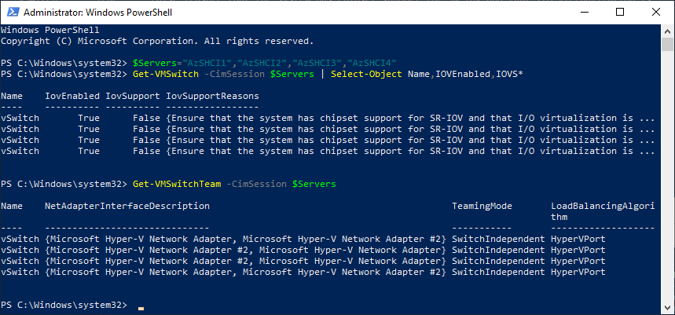

## Rename Management vNIC and add another vNICs (for SMB traffic)

### Configure

```powershell
$Servers="AzSHCI1","AzSHCI2","AzSHCI3","AzSHCI4"
$vSwitchName="vSwitch"
Rename-VMNetworkAdapter -ManagementOS -Name $vSwitchName -NewName Management -ComputerName $Servers
Add-VMNetworkAdapter -ManagementOS -Name SMB01 -SwitchName $vSwitchName -CimSession $Servers
Add-VMNetworkAdapter -ManagementOS -Name SMB02 -SwitchName $vSwitchName -Cimsession $Servers
 
```

### Validate

```powershell
$Servers="AzSHCI1","AzSHCI2","AzSHCI3","AzSHCI4"
Get-VMNetworkAdapter -CimSession $Servers -ManagementOS
 
```

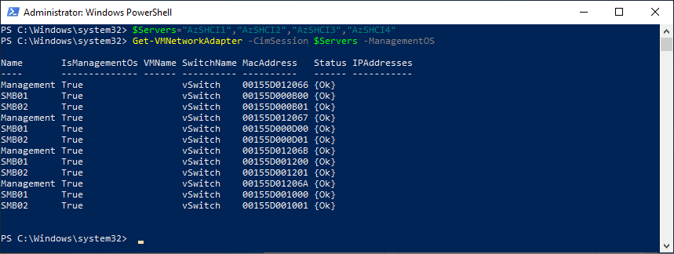

## Configure VLANs and static IP Addresses for SMB adapters

There are two options - either to have one subnet or two subnets. Two subnets are preferred if you want to prevent overloading switch interconnect (smb traffic will not leave one subnet, that's dedicated to one physical switch only).

### Configure (one Subnet)

```powershell
$Servers="AzSHCI1","AzSHCI2","AzSHCI3","AzSHCI4"
$StorNet="172.16.1."
$StorVLAN=1
$IP=1 #starting IP Address

#Configure IP Addresses
foreach ($Server in $Servers){
    New-NetIPAddress -IPAddress ($StorNet+$IP.ToString()) -InterfaceAlias "vEthernet (SMB01)" -CimSession $Server -PrefixLength 24
    $IP++
    New-NetIPAddress -IPAddress ($StorNet+$IP.ToString()) -InterfaceAlias "vEthernet (SMB02)" -CimSession $Server -PrefixLength 24
    $IP++
}

#Configure VLANs
Set-VMNetworkAdapterVlan -VMNetworkAdapterName SMB01 -VlanId $StorVLAN -Access -ManagementOS -CimSession $Servers
Set-VMNetworkAdapterVlan -VMNetworkAdapterName SMB02 -VlanId $StorVLAN -Access -ManagementOS -CimSession $Servers
#Restart each host vNIC adapter so that the Vlan is active.
Restart-NetAdapter "vEthernet (SMB01)" -CimSession $Servers
Restart-NetAdapter "vEthernet (SMB02)" -CimSession $Servers
 
```

### Configure (two Subnets)

```powershell
$Servers="AzSHCI1","AzSHCI2","AzSHCI3","AzSHCI4"
$StorNet1="172.16.1."
$StorNet2="172.16.2."
$StorVLAN1=1
$StorVLAN2=2
$IP=1 #starting IP Address

#Configure IP Addresses
foreach ($Server in $Servers){
    New-NetIPAddress -IPAddress ($StorNet1+$IP.ToString()) -InterfaceAlias "vEthernet (SMB01)" -CimSession $Server -PrefixLength 24
    New-NetIPAddress -IPAddress ($StorNet2+$IP.ToString()) -InterfaceAlias "vEthernet (SMB02)" -CimSession $Server -PrefixLength 24
    $IP++
}

#Configure VLANs
Set-VMNetworkAdapterVlan -VMNetworkAdapterName SMB01 -VlanId $StorVLAN1 -Access -ManagementOS -CimSession $Servers
Set-VMNetworkAdapterVlan -VMNetworkAdapterName SMB02 -VlanId $StorVLAN2 -Access -ManagementOS -CimSession $Servers
#Restart each host vNIC adapter so that the Vlan is active.
Restart-NetAdapter "vEthernet (SMB01)" -CimSession $Servers
Restart-NetAdapter "vEthernet (SMB02)" -CimSession $Servers
 
```

### Validate

```powershell
$Servers="AzSHCI1","AzSHCI2","AzSHCI3","AzSHCI4"
#verify ip config
Get-NetIPAddress -CimSession $servers -InterfaceAlias vEthernet* -AddressFamily IPv4 | Sort-Object -Property PSComputername | ft pscomputername,interfacealias,ipaddress -AutoSize -GroupBy PSComputerName

#Verify that the VlanID is set
Get-VMNetworkAdapterVlan -ManagementOS -CimSession $servers | Sort-Object -Property Computername | Format-Table ComputerName,AccessVlanID,ParentAdapter -AutoSize -GroupBy ComputerName
 
```

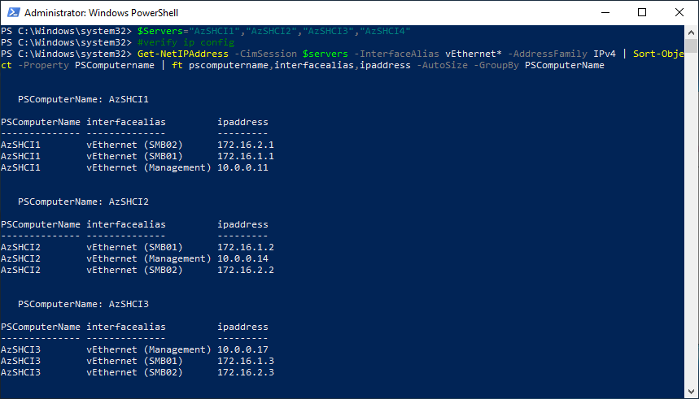

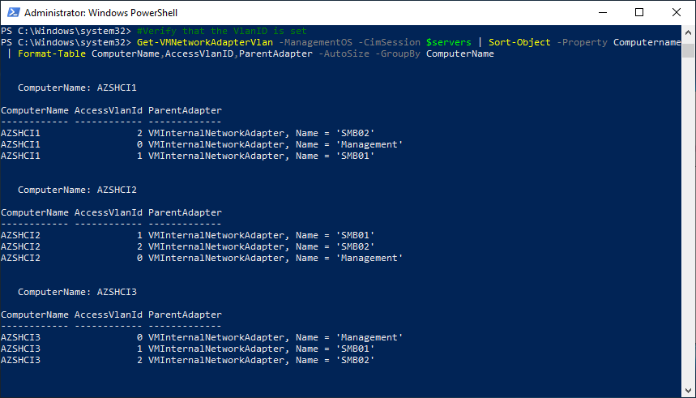

## Configure RDMA

Following script will enable RDMA for SMB01 and SMB02 vNICs and then it will associate SMB01 to first and SMB02 to second physical NIC (NICs connected to vSwitch and sorted by MAC Address).

### Configure

```powershell
$Servers="AzSHCI1","AzSHCI2","AzSHCI3","AzSHCI4"
$vSwitchName="vSwitch"

#Enable RDMA on the host vNIC adapters
Enable-NetAdapterRDMA "vEthernet (SMB01)","vEthernet (SMB02)" -CimSession $Servers

#Associate each of the vNICs configured for RDMA to a physical adapter that is up and is not virtual (to be sure that each RDMA enabled ManagementOS vNIC is mapped to separate RDMA pNIC)
Invoke-Command -ComputerName $servers -ScriptBlock {
    $physicaladapters=(get-vmswitch $using:vSwitchName).NetAdapterInterfaceDescriptions | Sort-Object
    $netadapters=foreach ($physicaladapter in $physicaladapters){Get-NetAdapter -InterfaceDescription $physicaladapter}
    $i=1
    foreach ($netadapter in ($Netadapters | Sort-Object -Property MacAddress)){
        Set-VMNetworkAdapterTeamMapping -VMNetworkAdapterName "SMB0$i" -ManagementOS -PhysicalNetAdapterName $netadapter.Name
        $i++
    }
}
 
```

### Validate

```powershell
$Servers="AzSHCI1","AzSHCI2","AzSHCI3","AzSHCI4"
#verify RDMA
Get-NetAdapterRdma -CimSession $Servers | Sort-Object -Property SystemName | Format-Table SystemName,InterfaceDescription,Name,Enabled -AutoSize -GroupBy SystemName
#verify mapping
Get-VMNetworkAdapterTeamMapping -CimSession $Servers -ManagementOS | Format-Table ComputerName,NetAdapterName,ParentAdapter
 
```

As this is running in virtual lab, RDMA is enabled only on SMB01 and SMB02. In real systems is RDMA enabled also on physical adapters (by default).

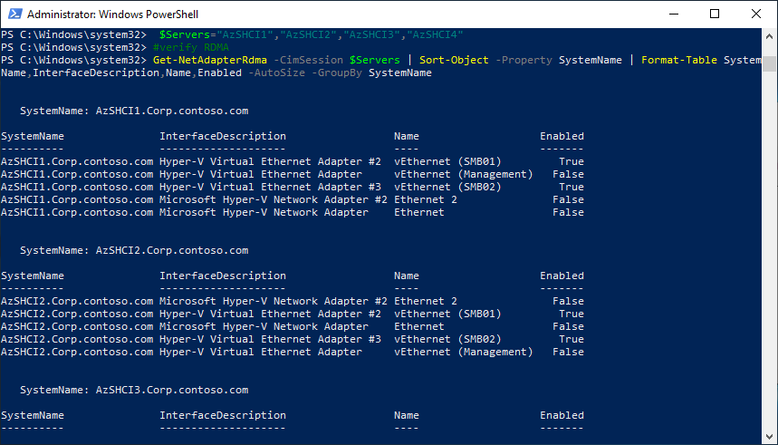

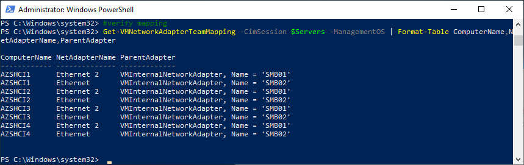

## Configure Jumbo Frames

Might be necessary to increase for iWARP. If not default, make sure all switches are configured end-to-end and (for example 9216). Also if non-default is set, you might run into various issues such as https://blog.workinghardinit.work/2019/09/05/fixing-slow-roce-rdma-performance-with-winof-2-to-winof/.
JumboSize can be 9014, 4088 or 1514 (default)

### Configure

```powershell
$Servers="AzSHCI1","AzSHCI2","AzSHCI3","AzSHCI4"
$JumboSize=9014
Set-NetAdapterAdvancedProperty -CimSession $Servers  -DisplayName "Jumbo Packet" -RegistryValue $JumboSize
 
```

### Validate

```powershell
$Servers="AzSHCI1","AzSHCI2","AzSHCI3","AzSHCI4"
Get-NetAdapterAdvancedProperty -CimSession $servers -DisplayName "Jumbo Packet"
 
```

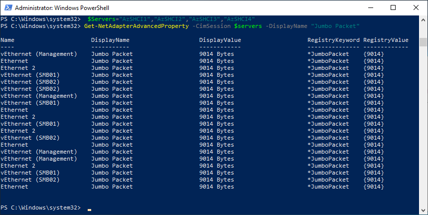

## Configure DCB

Datacenter Bridging is required for RoCE RDMA and recommended in some scenarios for iWARP (to prioritize traffic or to send pause frames). For more information you can refer to [official documentation](http://aka.ms/ConvergedRDMA).

### Configure

```powershell
$Servers="AzSHCI1","AzSHCI2","AzSHCI3","AzSHCI4"
$vSwitchName="vSwitch"
#install dcb feature
foreach ($server in $servers) {Install-WindowsFeature -Name "Data-Center-Bridging" -ComputerName $server}

#add qos Policies
New-NetQosPolicy "SMB"       -NetDirectPortMatchCondition 445 -PriorityValue8021Action 3 -CimSession $servers
New-NetQosPolicy "ClusterHB" -Cluster                         -PriorityValue8021Action 7 -CimSession $servers
New-NetQosPolicy "Default"   -Default                         -PriorityValue8021Action 0 -CimSession $servers

Invoke-Command -ComputerName $servers -ScriptBlock {
    #Turn on Flow Control for SMB
    Enable-NetQosFlowControl -Priority 3
    #Disable flow control for other traffic than 3 (pause frames should go only from priority 3
    Disable-NetQosFlowControl -Priority 0,1,2,4,5,6,7
    #Disable Data Center bridging exchange (disable accept data center bridging (DCB) configurations from a remote device via the DCBX protocol, which is specified in the IEEE data center bridging (DCB) standard.)
    Set-NetQosDcbxSetting -willing $false -confirm:$false
    #Configure IeeePriorityTag
    #IeePriorityTag needs to be On if you want tag your nonRDMA traffic for QoS. Can be off if traffic uses adapters that pass vSwitch (both SR-IOV and RDMA bypasses vSwitch)
    Set-VMNetworkAdapter -ManagementOS -Name "SMB*" -IeeePriorityTag on
    #Apply policy to the target adapters.  The target adapters are adapters connected to vSwitch
    Enable-NetAdapterQos -InterfaceDescription (Get-VMSwitch -Name $using:vSwitchName).NetAdapterInterfaceDescriptions
    #Create a Traffic class and give SMB Direct 60% of the bandwidth minimum. The name of the class will be "SMB".
    #This value needs to match physical switch configuration. Value might vary based on your needs.
    #If connected directly (in 2 node configuration) skip this step.
    New-NetQosTrafficClass "SMB"       -Priority 3 -BandwidthPercentage 60 -Algorithm ETS
    New-NetQosTrafficClass "ClusterHB" -Priority 7 -BandwidthPercentage 1 -Algorithm ETS
}
 
```

### Validate

```powershell
$Servers="AzSHCI1","AzSHCI2","AzSHCI3","AzSHCI4"
#validate QOS Policies
Get-NetQosPolicy -CimSession $servers | Select-Object Name,NetworkProfile,Template,NetDirectPort,PriorityValue8021Action,PSComputerName | Sort-Object PSComputerName | Format-Table -GroupBy PSComputerName

#validate Flow Control (enabled for Priority3, disabled for other priorities)
Invoke-Command -ComputerName $servers -ScriptBlock {get-netqosflowcontrol} | Select-Object Name,Enabled,PSComputerName

#validate Data Center bridging exchange
Invoke-Command -ComputerName $servers -ScriptBlock {Get-NetQosDcbxSetting} | Select-Object Willing,PSComputerName

#validate IEEEPriorityTag
Get-VMNetworkAdapter -CimSession $servers -ManagementOS -Name SMB* | Select-Object Name,IeeePriorityTag,ComputerName

#validate policy on physical adapters
Invoke-Command -ComputerName $servers -ScriptBlock {Get-NetAdapterQos -InterfaceDescription (Get-VMSwitch -Name $using:vSwitchName).NetAdapterInterfaceDescriptions}

#validate traffic classes
Invoke-Command -ComputerName $servers -ScriptBlock {Get-NetQosTrafficClass} | Select-Object Priority,BandwidthPercentage,Algorithm,PSComputerName
 
```

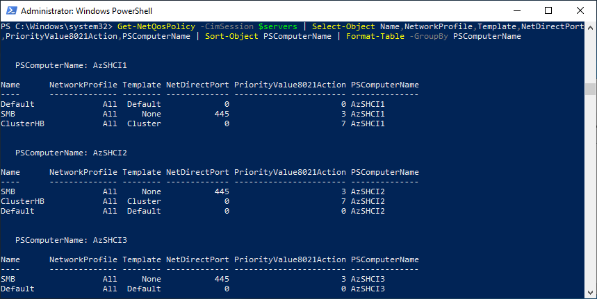

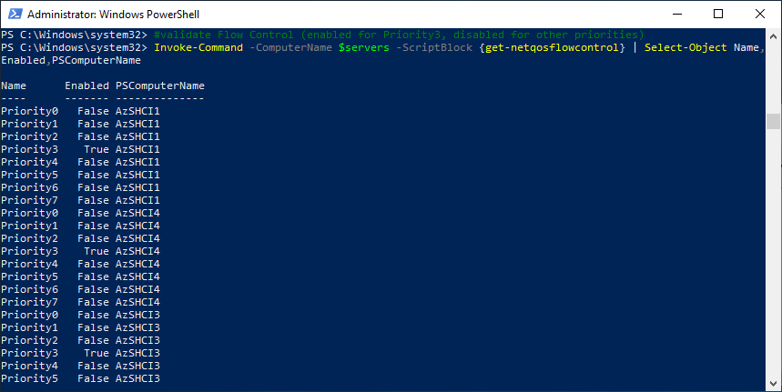

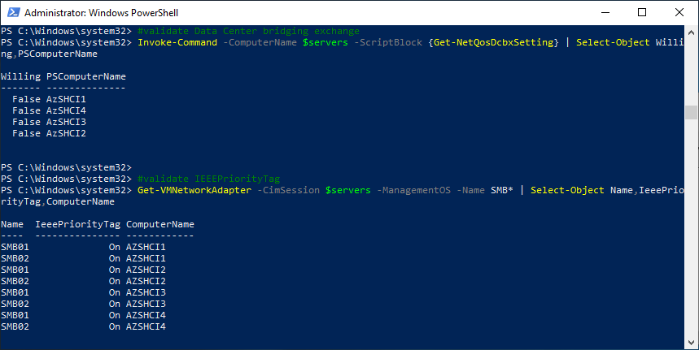

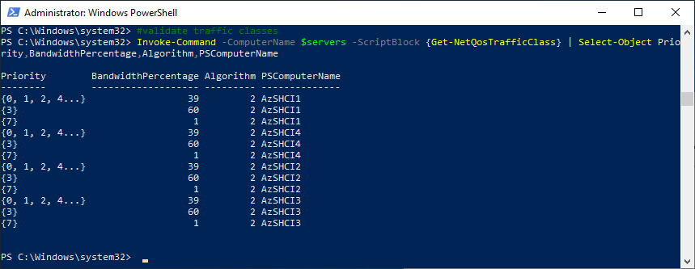

## Configure iWarp firewall rule

For iWarp RDMA to work, windows firewall rule needs to be enabled.

```powershell
$Servers="AzSHCI1","AzSHCI2","AzSHCI3","AzSHCI4"
Enable-NetFirewallRule -Name "FPSSMBD-iWARP-In-TCP" -CimSession $servers
 
```

And Validate

```powershell
$Servers="AzSHCI1","AzSHCI2","AzSHCI3","AzSHCI4"
Get-NetFirewallRule -Name "FPSSMBD-iWARP-In-TCP" -CimSession $servers | Select-Object Name,Enabled,Profile,PSComputerName
 
```

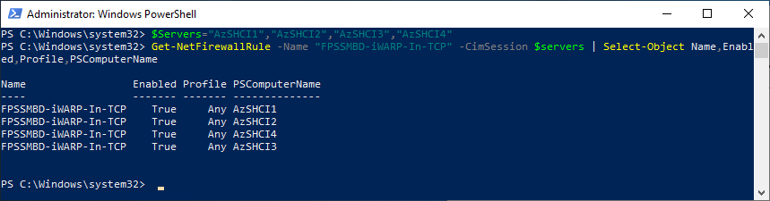