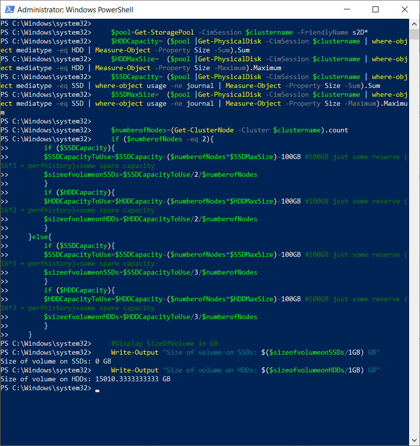
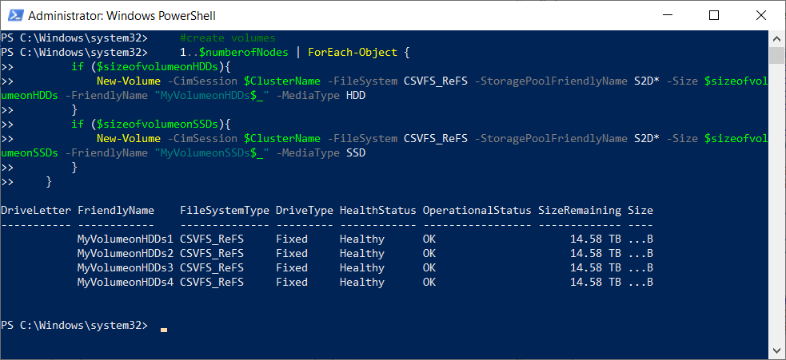

# Creating Volumes

## Some theory

When creating volumes, there are several factors to consider. One is, that due to overhead from [CSV redirection](https://github.com/microsoft/WSLab/tree/master/Scenarios/TestingCSVRedirection) (CSV is FileSystem redirected if REFS used and even if NTFS is used, Storage Spaces are File redirected). Therefore you want to have at least the same number of volumes as you have nodes (or multiple) to effectively distribute IOPS. Another factor is size of volume itself. While it is supported to create 64TB volume, it might be challenging to restore entire volume in reasonable time if something goes wrong.

Another aspect is if using [tiers](https://github.com/microsoft/WSLab/tree/master/Scenarios/S2D%20and%20Tiers%20deep%20dive) (templates) or not. Tiers are mandatory for Multi-Resilient volumes (Mirror-Accelerated Parity) - anytime you want to create a volume that consist of more than 1 kind (different tiers). If using system, where are both SSDs and HDDs for capacity, it is wise to either use tiers, or specify mediatype for created volume. For mor information about volumes see [Volume Deep Dive](https://github.com/Microsoft/WSLab/tree/master/Scenarios/S2D%20and%20Volumes%20deep%20dive)

## Create volumes

Following example is based on [AzSHCI Deployment Scenario](https://github.com/microsoft/WSLab/blob/master/Scenarios/AzSHCI%20Deployment/Scenario.ps1)

### Calculate reserve

To calculate reserve let's query pool and calculate capacity of each capacity drive. Depending on setup, let's calculate what reserve will be needed - assuming 2 node will have 2-way mirror, while 3+ node systems will use 3-way mirror. The script will grab the largest drive in pool and use it's capacity as reserve (adds also 100GB as a spare capacity)

```powershell
    $ClusterName="AzSHCI-Cluster"

    $pool=Get-StoragePool -CimSession $clustername -FriendlyName s2D*
    $HDDCapacity= ($pool |Get-PhysicalDisk -CimSession $clustername | where-object mediatype -eq HDD | Measure-Object -Property Size -Sum).Sum
    $HDDMaxSize=  ($pool |Get-PhysicalDisk -CimSession $clustername | where-object mediatype -eq HDD | Measure-Object -Property Size -Maximum).Maximum
    $SSDCapacity= ($pool |Get-PhysicalDisk -CimSession $clustername | where-object mediatype -eq SSD | where-object usage -ne journal | Measure-Object -Property Size -Sum).Sum
    $SSDMaxSize=  ($pool |Get-PhysicalDisk -CimSession $clustername | where-object mediatype -eq SSD | where-object usage -ne journal | Measure-Object -Property Size -Maximum).Maximum

    $numberofNodes=(Get-ClusterNode -Cluster $clustername).count
    if ($numberofNodes -eq 2){
        if ($SSDCapacity){
        $SSDCapacityToUse=$SSDCapacity-($numberofNodes*$SSDMaxSize)-100GB #100GB just some reserve (16*3 = perfhistory)+some spare capacity
        $sizeofvolumeonSSDs=$SSDCapacityToUse/2/$numberofNodes
        }
        if ($HDDCapacity){
        $HDDCapacityToUse=$HDDCapacity-($numberofNodes*$HDDMaxSize)-100GB #100GB just some reserve (16*3 = perfhistory)+some spare capacity
        $sizeofvolumeonHDDs=$HDDCapacityToUse/2/$numberofNodes
        }
    }else{
        if ($SSDCapacity){
        $SSDCapacityToUse=$SSDCapacity-($numberofNodes*$SSDMaxSize)-100GB #100GB just some reserve (16*3 = perfhistory)+some spare capacity
        $sizeofvolumeonSSDs=$SSDCapacityToUse/3/$numberofNodes
        }
        if ($HDDCapacity){
        $HDDCapacityToUse=$HDDCapacity-($numberofNodes*$HDDMaxSize)-100GB #100GB just some reserve (16*3 = perfhistory)+some spare capacity
        $sizeofvolumeonHDDs=$HDDCapacityToUse/3/$numberofNodes
        }
    }

    #Display SizeOfVolume in GB
    Write-Output "Size of volume on SSDs: $($sizeofvolumeonSSDs/1GB) GB"
    Write-Output "Size of volume on HDDs: $($sizeofvolumeonHDDs/1GB) GB"
 
```



### Create Volumes

Assuming there will be one volume per node, let's create volumes. You can notice, that volumes are created with explicit mediatype. This prevents spilling volume to different media type in case you have 2 different mediatypes in capacity volumes.

```powershell
    #create volumes
    1..$numberofNodes | ForEach-Object {
        if ($sizeofvolumeonHDDs){
            New-Volume -CimSession $ClusterName -FileSystem CSVFS_ReFS -StoragePoolFriendlyName S2D* -Size $sizeofvolumeonHDDs -FriendlyName "MyVolumeonHDDs$_" -MediaType HDD
        }
        if ($sizeofvolumeonSSDs){
            New-Volume -CimSession $ClusterName -FileSystem CSVFS_ReFS -StoragePoolFriendlyName S2D* -Size $sizeofvolumeonSSDs -FriendlyName "MyVolumeonSSDs$_" -MediaType SSD   
        }
    }
 
```

