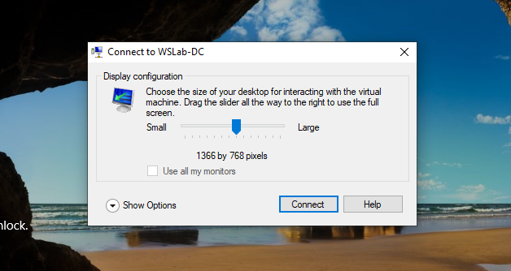
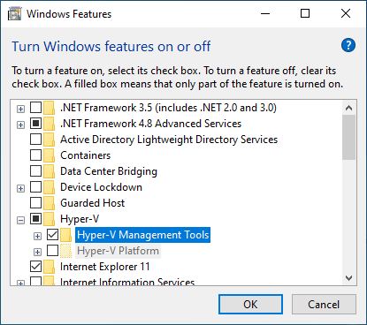
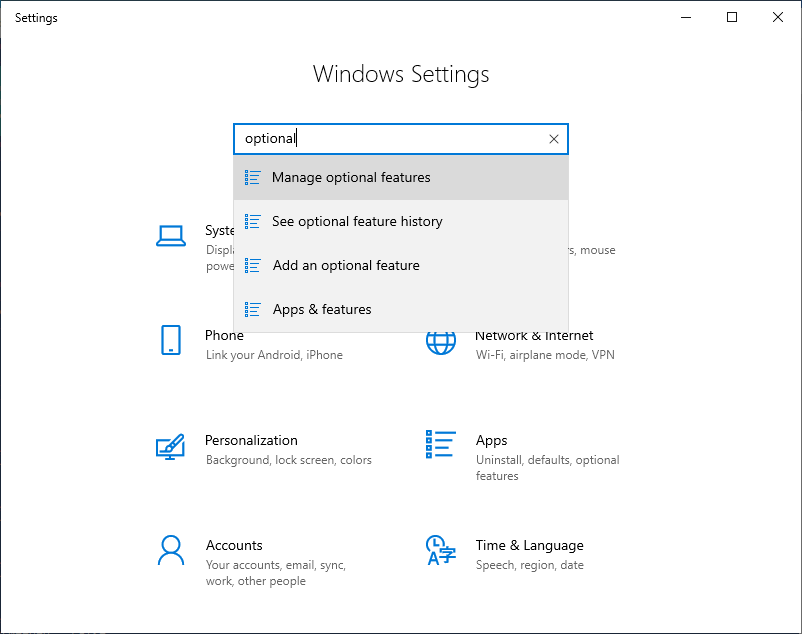

# Introduction to Remote Management

## Lab introduction

*In this lab, you will learn how to use remote management tools to deploy 2 node S2D Cluster. This deployment is simplified, just to illustrate how to perform operations using different remote management tools. It is important, as managing infrastructure at scale requires separate management machine that has access to all machines (Admin Workstation)*

>[!IMPORTANT]
> This lab uses WSLab to create virtual machines that will be used for simulation. Please [Hydrate your lab files](../../../WSLab-Intro/WSLab-Deployment/wslab-deployment.md) first. This lab also uses Windows 10. To hydrate Windows 10 image, you can use CreateParentDisk.ps1 script located in ParentDisks folder.

### LabConfig.ps1

```PowerShell
$LabConfig=@{ DomainAdminName='LabAdmin'; AdminPassword='LS1setup!'; Prefix = 'WSLab-'; SwitchName = 'LabSwitch'; DCEdition='4' ; PullServerDC=$false ; Internet=$true ;AdditionalNetworksConfig=@(); VMs=@(); ServerVHDs=@()}

$LabConfig.VMs += @{ VMName = 'S2D1' ; Configuration = 'S2D' ; ParentVHD = 'Win2019Core_G2.vhdx'; SSDNumber = 0; SSDSize="800GB" ; HDDNumber = 8; HDDSize= 4TB ; MemoryStartupBytes= 2GB ; NestedVirt=$True ; AdditionalNetworks=$true }
$LabConfig.VMs += @{ VMName = 'S2D2' ; Configuration = 'S2D' ; ParentVHD = 'Win2019Core_G2.vhdx'; SSDNumber = 0; SSDSize="800GB" ; HDDNumber = 4; HDDSize= 4TB ; MemoryStartupBytes= 2GB ; NestedVirt=$True ; AdditionalNetworks=$true }
$LabConfig.VMs += @{ VMName = 'Management' ; ParentVHD = 'Win1019H1_G2.vhdx' ; AddToolsVHD=$True ; DisableWCF=$True }
 
$LABConfig.AdditionalNetworksConfig += @{ NetName = 'SMB1'; NetAddress='172.16.1.'; NetVLAN='0'; Subnet='255.255.255.0'}
$LABConfig.AdditionalNetworksConfig += @{ NetName = 'SMB2'; NetAddress='172.16.2.'; NetVLAN='0'; Subnet='255.255.255.0'}
 
```

Above LabConfig will deploy 2 nodes for storage spaces direct, that simulates direct connection between nodes (SMB1,SMB2). It will also deploy Windows 10 machine, that will be used for management. Memory Demand for workshop is ~8GB.


## The Lab

### Task 1: Deploy the lab

1. Navigate to WSLab folder and edit LabConfig.ps1 with PowerShell ISE (right-click, edit). Replace content with LabConfig code)

2. In WSLab folder you hydrated using [Hydration steps](../../../WSLab-Intro/WSLab-Hydration/wslab-hydration.md), right-click on Deploy.ps1 and select run with PowerShell. Script will run. Allow it to elevate. Deployment will run for ~8 minutes.

3. Once Deployment will finish, open Hyper-V manager. In Hyper-V manager, select all virtual machines and start them.

    >[!TIP] You can also use following PowerShell command to start all VMs

    ```PowerShell
    Start-VM -VMName WSLab*
    ```

### Task 2: Login to Management VM and install management tools

1. In Hyper-V Manager, right-click on WSLab-Management and select connect.

    >[!TIP] You can also use following PowerShell command open VMConnect and connect to Management VM.

    ```PowerShell
    vmconnect $env:COMPUTERNAME WSLab-Management
    ```

2. In VMConnect, login into Management Machine with following credentials:

    User: **LabAdmin**

    Password: **LS1Setup!**

3. During the login, you will be asked to connect using enhanced session. Confirm it and insert your credentials again. It is important to be connected using Enhanced Session Mode as you will be able to copy/paste code to/from Virtual Machine.

    

4. Hyper-V Manager is not part of RSAT that is downloadable as Windows Capability. It is needed to add it from Windows Features. In WSLab-Management VM Open Windows Features by typing "Turn Windows Features" into start menu or OptionalFeatures.exe into PowerShell. Add **Hyper-V Management Tools**

    

5. To install Remote management tools, open Settings app. And type Optional. Open Manage Optional features and Install all RSAT tools.

    

    >[!TIP] You can also use following PowerShell to install all RSAT Features into Windows 10.

    ```PowerShell
    $Capabilities=Get-WindowsCapability -Name RSAT* -Online
    Foreach ($Capability in $Capabilities){
        $Capability | Add-WindowsCapability -Online
    }
    ```

6. To install Windows Admin Center, navigate to aka.ms/wacdownload for latest stable release. Download msi and proceed with default installation (Click-Next-Next)

    >[!TIP] You can also download and install Windows Admin Center using PowerShell

    ```PowerShell
    #Download Windows Admin Center if not present
    if (-not (Test-Path -Path "$env:USERPROFILE\Downloads\WindowsAdminCenter.msi")){
        $ProgressPreference='SilentlyContinue' #for faster download
        Invoke-WebRequest -UseBasicParsing -Uri https://aka.ms/WACDownload -OutFile "$env:USERPROFILE\Downloads\WindowsAdminCenter.msi"
        $ProgressPreference='Continue' #return progress preference back
    }

    #Install Windows Admin Center (https://docs.microsoft.com/en-us/windows-server/manage/windows-admin-center/deploy/install)
        Start-Process msiexec.exe -Wait -ArgumentList "/i $env:USERPROFILE\Downloads\WindowsAdminCenter.msi /qn /L*v log.txt SME_PORT=6516 SSL_CERTIFICATE_OPTION=generate"

    #Open Windows Admin Center
        Start-Process "C:\Program Files\Windows Admin Center\SmeDesktop.exe"
    ```


7. (Optional) Install Edge Browser by navigating to https://www.microsoft.com/en-us/edge/business/download. Download MSI and proceed with default installation (click-next-next).

    >[!TIP] You can also use to download and install Edge using following PowerShell

    ```PowerShell
    #Download MSI
    $ProgressPreference='SilentlyContinue' #for faster download
    Invoke-WebRequest -Uri "http://dl.delivery.mp.microsoft.com/filestreamingservice/files/07367ab9-ceee-4409-a22f-c50d77a8ae06/MicrosoftEdgeEnterpriseX64.msi" -UseBasicParsing -OutFile "$env:USERPROFILE\Downloads\MicrosoftEdgeEnterpriseX64.msi"
    #Install Edge Beta
    Start-Process -Wait -Filepath msiexec.exe -Argumentlist "/i $env:UserProfile\Downloads\MicrosoftEdgeEnterpriseX64.msi /q"
    #start Edge
    start-sleep 5
    & "C:\Program Files (x86)\Microsoft\Edge\Application\msedge.exe"
    ```

### Task 3: Install Server Roles with Server Manager

### Task 4: Install Server Roles with Windows Admin Center

### Task 5: Create virtual switch with Windows Admin Center

### Task 6: Test and Create Cluster