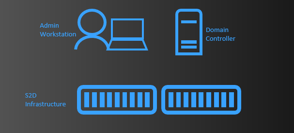
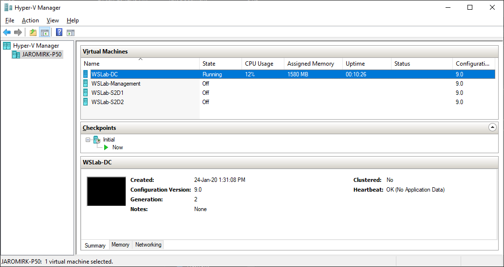

# Introduction to Remote Management

## Lab introduction

*In this lab, you will learn how to use remote management tools to deploy 2 node S2D Cluster. This deployment is simplified, just to illustrate how to perform operations using different remote management tools. It is important, as managing infrastructure at scale requires separate management machine that has access to all machines (Admin Workstation)*

>[!IMPORTANT]
> This lab uses WSLab to create virtual machines that will be used for simulation. Please [Hydrate your lab files](../../../WSLab-Intro/WSLab-Deployment/wslab-deployment.md) first. This lab also uses Windows 10. To hydrate Windows 10 image, you can use CreateParentDisk.ps1 script located in ParentDisks folder.

### LabConfig.ps1

```PowerShell
$LabConfig=@{ DomainAdminName='LabAdmin'; AdminPassword='LS1setup!'; Prefix = 'WSLab-'; SwitchName = 'LabSwitch'; DCEdition='4' ; PullServerDC=$false ; Internet=$true ;AdditionalNetworksConfig=@(); VMs=@(); ServerVHDs=@()}

$LabConfig.VMs += @{ VMName = 'S2D1' ; Configuration = 'S2D' ; ParentVHD = 'Win2019Core_G2.vhdx'; SSDNumber = 0; SSDSize="800GB" ; HDDNumber = 8; HDDSize= 4TB ; MemoryStartupBytes= 2GB ; NestedVirt=$True ; AdditionalNetworks=$true }
$LabConfig.VMs += @{ VMName = 'S2D2' ; Configuration = 'S2D' ; ParentVHD = 'Win2019Core_G2.vhdx'; SSDNumber = 0; SSDSize="800GB" ; HDDNumber = 4; HDDSize= 4TB ; MemoryStartupBytes= 2GB ; NestedVirt=$True ; AdditionalNetworks=$true }
$LabConfig.VMs += @{ VMName = 'Management' ; ParentVHD = 'Win1019H1_G2.vhdx' ; AddToolsVHD=$True ; DisableWCF=$True }
 
$LABConfig.AdditionalNetworksConfig += @{ NetName = 'SMB1'; NetAddress='172.16.1.'; NetVLAN='0'; Subnet='255.255.255.0'}
$LABConfig.AdditionalNetworksConfig += @{ NetName = 'SMB2'; NetAddress='172.16.2.'; NetVLAN='0'; Subnet='255.255.255.0'}
 
```

Above LabConfig will deploy 2 nodes for storage spaces direct, that simulates direct connection between nodes (SMB1,SMB2). It will also deploy Windows 10 machine, that will be used for management.





## The Lab

### Task 1: Deploy the lab

1. Navigate to WSLab folder and edit LabConfig.ps1 with PowerShell ISE (right-click,edit). Replace content with LabConfig code)

2. In WSLab folder, right-click on Deploy.ps1 and select run with PowerShell. Script will run. Allow it to elevate. Deployment will run for ~8 minutes.

3. Once Deployment will finish, open Hyper-V manager. In Hyper-V manager, select all virtual machines and start them.

    >[!TIP] You can also use following PowerShell command to start all VMs

    ```PowerShell
    Start-VM -VMName WSLab*
    ```

### Task 2: Login to Management VM and install management tools

### Task 3: Install Server Roles with Server Manager

### Task 4: Install Server Roles with Windows Admin Center

### Task 5: Create virtual switch with Windows Admin Center

### Task 6: Test and Create Cluster