# Introduction to Remote Management

## Lab introduction

*In this lab, you will learn how to use remote management tools to deploy 2 node S2D Cluster. This deployment is simplified, just to illustrate how to perform operations using different remote management tools. It is important, as managing infrastructure at scale requires separate management machine that has access to all machines (Admin Workstation)*

>[!IMPORTANT]
> This lab uses WSLab to create virtual machines that will be used for simulation. Please [Hydrate your lab files](../../../WSLab-Intro/WSLab-Deployment/wslab-deployment.md) first. This lab also uses Windows 10. To hydrate Windows 10 image, you can use CreateParentDisk.ps1 script located in ParentDisks folder.

### LabConfig.ps1

```PowerShell
$LabConfig=@{ DomainAdminName='LabAdmin'; AdminPassword='LS1setup!'; Prefix = 'WSLab-'; SwitchName = 'LabSwitch'; DCEdition='4' ; PullServerDC=$false ; Internet=$true ;AdditionalNetworksConfig=@(); VMs=@(); ServerVHDs=@()}

$LabConfig.VMs += @{ VMName = 'S2D1' ; Configuration = 'S2D' ; ParentVHD = 'Win2019Core_G2.vhdx'; SSDNumber = 0; SSDSize="800GB" ; HDDNumber = 8; HDDSize= 4TB ; MemoryStartupBytes= 2GB ; NestedVirt=$True ; AdditionalNetworks=$true }
$LabConfig.VMs += @{ VMName = 'S2D2' ; Configuration = 'S2D' ; ParentVHD = 'Win2019Core_G2.vhdx'; SSDNumber = 0; SSDSize="800GB" ; HDDNumber = 8; HDDSize= 4TB ; MemoryStartupBytes= 2GB ; NestedVirt=$True ; AdditionalNetworks=$true }
$LabConfig.VMs += @{ VMName = 'Management' ; ParentVHD = 'Win1019H1_G2.vhdx' ; AddToolsVHD=$True ; DisableWCF=$True }
 
$LABConfig.AdditionalNetworksConfig += @{ NetName = 'SMB1'; NetAddress='172.16.1.'; NetVLAN='0'; Subnet='255.255.255.0'}
$LABConfig.AdditionalNetworksConfig += @{ NetName = 'SMB2'; NetAddress='172.16.2.'; NetVLAN='0'; Subnet='255.255.255.0'}
 
```

Above LabConfig will deploy 2 nodes for storage spaces direct, that simulates direct connection between nodes (SMB1,SMB2). It will also deploy Windows 10 machine, that will be used for management. Memory Demand for workshop is ~8GB.


## The Lab

### Task 1: Deploy the lab

*In this task you will deploy lab using aka.ms/wslab. The script will provision vanilla computers that you will configure later in the lab.*

1. Navigate to WSLab folder and edit LabConfig.ps1 with PowerShell ISE (right-click, edit). Replace content with LabConfig code)

1. In WSLab folder you hydrated using [Hydration steps](../../../WSLab-Intro/WSLab-Hydration/wslab-hydration.md), right-click on Deploy.ps1 and select run with PowerShell. Script will run. Allow it to elevate. Deployment will run for ~8 minutes.

1. Once Deployment will finish, open Hyper-V manager. In Hyper-V manager, select all virtual machines and start them.

    >[!TIP] You can also use following PowerShell command to start all VMs:
    >
    >Start-VM -VMName WSLab*


### Task 2: Login to Management VM and install management tools

1. In Hyper-V Manager, right-click on WSLab-Management and select connect.

    >[!TIP] You can also use following PowerShell command open VMConnect and connect to Management VM.
    >
    >vmconnect $env:COMPUTERNAME WSLab-Management


1. In VMConnect, login into Management Machine with following credentials:

    User: **LabAdmin**

    Password: **LS1Setup!**

1. During the login, you will be asked to connect using enhanced session. Confirm it and insert your credentials again. It is important to be connected using Enhanced Session Mode as you will be able to copy/paste code to/from Virtual Machine.

    

1. Hyper-V Manager is not part of RSAT that is downloadable as Windows Capability. It is needed to add it from Windows Features. In WSLab-Management VM Open Windows Features by typing "Turn Windows Features" into start menu or OptionalFeatures.exe into PowerShell. Add **Hyper-V Management Tools**

    

1. To install Remote management tools, open Settings app. And type Optional. Open Manage Optional features and Install all RSAT tools.

    

    >[!TIP] You can also use following PowerShell to install all RSAT Features into Windows 10.

    ```PowerShell
    $Capabilities=Get-WindowsCapability -Name RSAT* -Online
    Foreach ($Capability in $Capabilities){
        $Capability | Add-WindowsCapability -Online
    }
    ```

1. To install Windows Admin Center, navigate to aka.ms/wacdownload for latest stable release. Download msi and proceed with default installation (Click-Next-Next). Once Windows Admin Center opens, make sure you select Windows Admin Center Client certificate to authenticate.

    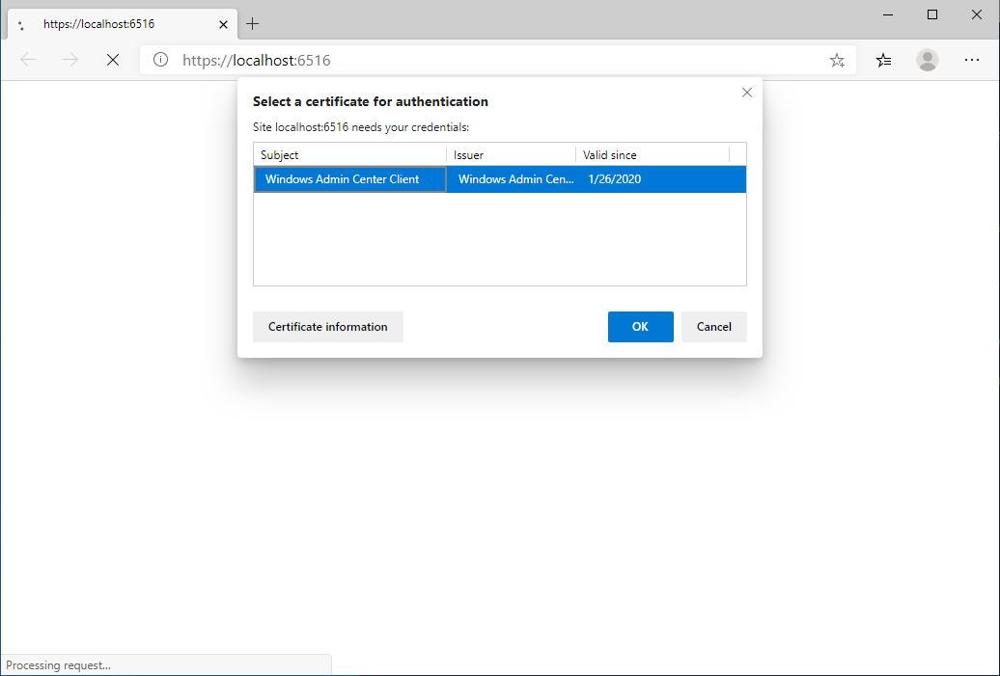

    >[!TIP] You can also download and install Windows Admin Center using PowerShell script

    ```PowerShell
    #Download Windows Admin Center if not present
    if (-not (Test-Path -Path "$env:USERPROFILE\Downloads\WindowsAdminCenter.msi")){
        $ProgressPreference='SilentlyContinue' #for faster download
        Invoke-WebRequest -UseBasicParsing -Uri https://aka.ms/WACDownload -OutFile "$env:USERPROFILE\Downloads\WindowsAdminCenter.msi"
        $ProgressPreference='Continue' #return progress preference back
    }

    #Install Windows Admin Center (https://docs.microsoft.com/en-us/windows-server/manage/windows-admin-center/deploy/install)
        Start-Process msiexec.exe -Wait -ArgumentList "/i $env:USERPROFILE\Downloads\WindowsAdminCenter.msi /qn /L*v log.txt SME_PORT=6516 SSL_CERTIFICATE_OPTION=generate"

    #Open Windows Admin Center
        Start-Process "C:\Program Files\Windows Admin Center\SmeDesktop.exe"
    ```

1. (Optional) Install Edge Browser by navigating to https://www.microsoft.com/en-us/edge/business/download. Download MSI and proceed with default installation (click-next-next).

    >[!TIP] You can also download and install Edge using following PowerShell script

    ```PowerShell
    #Download MSI
    $ProgressPreference='SilentlyContinue' #for faster download
    Invoke-WebRequest -Uri "http://dl.delivery.mp.microsoft.com/filestreamingservice/files/07367ab9-ceee-4409-a22f-c50d77a8ae06/MicrosoftEdgeEnterpriseX64.msi" -UseBasicParsing -OutFile "$env:USERPROFILE\Downloads\MicrosoftEdgeEnterpriseX64.msi"
    #Install Edge Beta
    Start-Process -Wait -Filepath msiexec.exe -Argumentlist "/i $env:UserProfile\Downloads\MicrosoftEdgeEnterpriseX64.msi /q"
    #start Edge
    start-sleep 5
    & "C:\Program Files (x86)\Microsoft\Edge\Application\msedge.exe"
    ```

### Task 3: Install Server Roles with Server Manager

*In this task, you will use Server Manager to install roles required for Azure Stack HCI to first server. This task demonstrates how to install roles and features using traditional tools.*

1. In Management machine, open Server Manager. In Server Manager, right-click on All Servers and select Add Servers. In Add Servers dialog, click on Find Now button and add S2D1 as managed server. Click OK to close Add Servers dialog.

    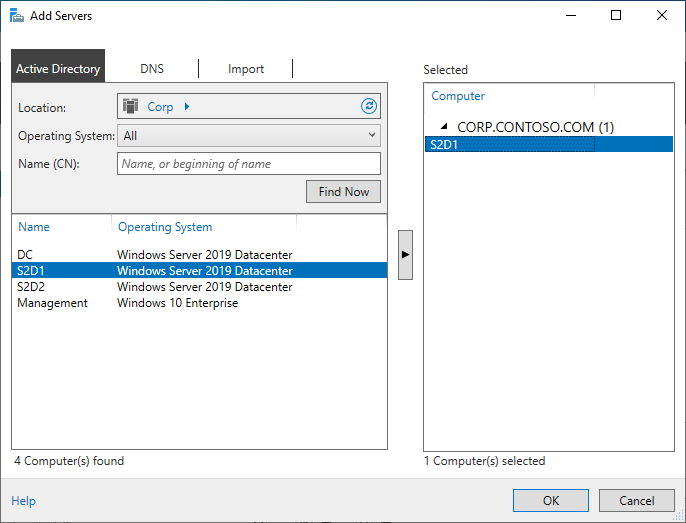

1. In Server Manager notice, that S2D1 has 4 IP addresses. It simulates one 2 Network Adapters for North/South traffic and 2 Network Adapters for East/West (direct connection)

    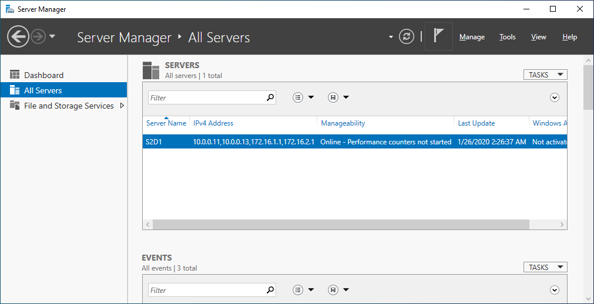

1. Right-Click on S2D1 and select Add Roles and Features. Wizard will open.

    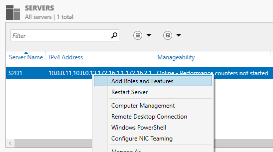

1. In Add Roles and Features wizard on Before you begin page click Next. In Installation Type page keep default and click Next. In Server Selection page keep default and click Next. In Server Roles select **Hyper-V** and confirm adding all management features. Click Next. In Features page select **Failover Clustering**. Confirm also all management features and click Next. In Hyper-V Page click Next. In Virtual Switches page click Next. In Migration page click Next. In Default Stores page click Next. In Confirmation page check "Restart the destination server automatically if required" and click on Install.

    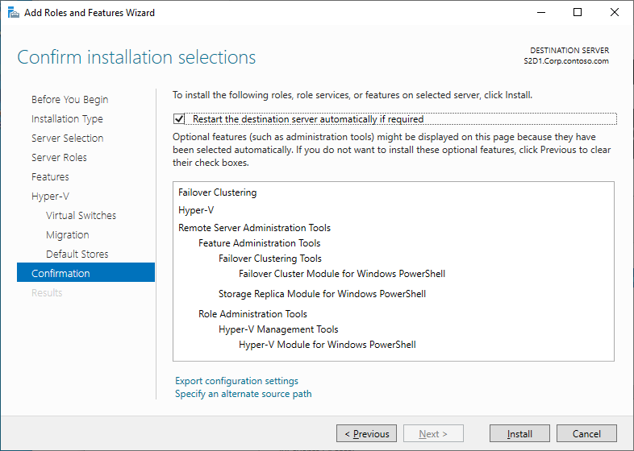

### Task 4: Install Server Roles with Windows Admin Center

*In this task, you will use Windows Admin Center to install roles required for Azure Stack HCI to second server. This task demonstrates how to install roles and features using modern management tools.*

1. On Management machine, from Start Menu, select Windows Admin Center. In Windows Admin Center click on Add and select Windows Server

    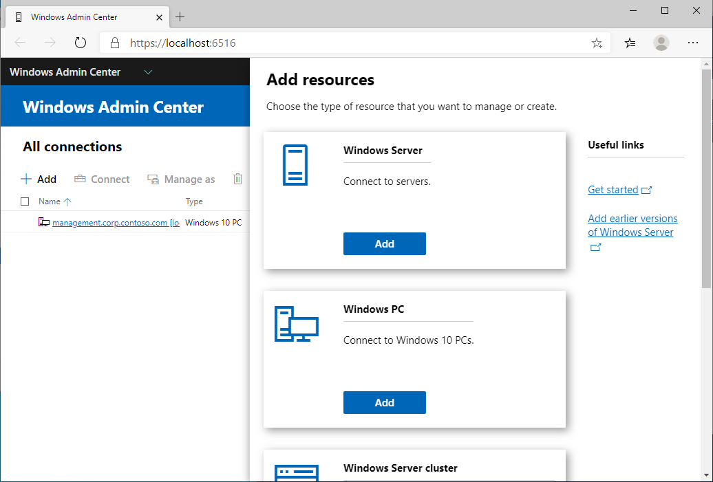

1. Click on Search Active Directory and in search field write asterisks. Select S2D2 and click Add.

    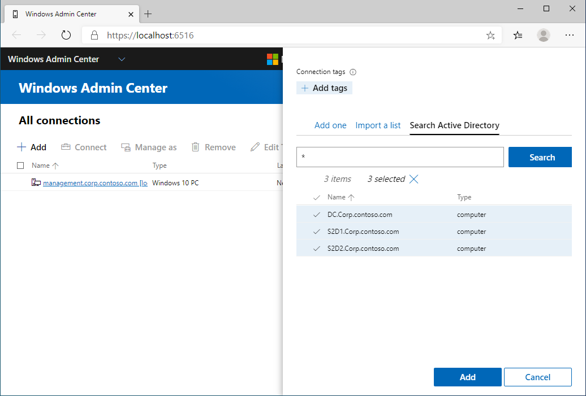

1. In Windows Admin Center click on S2D2.corp.contoso.com. In tools search type Roles. Roles & features tool will be displayed. Click on Roles & features tool to open it.

    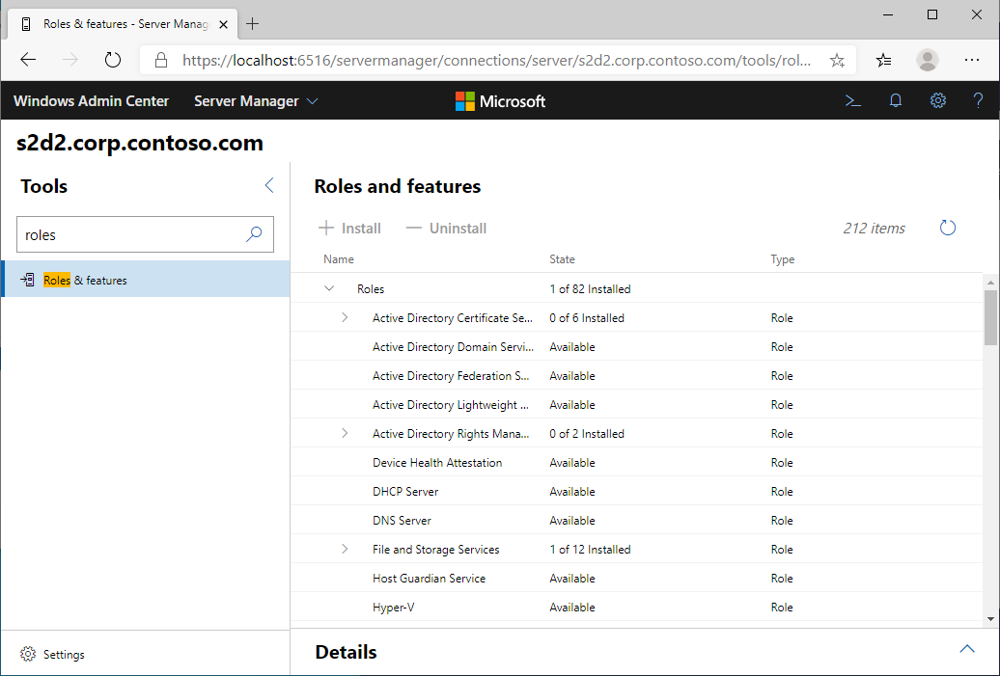

1. In Roles and features, Hyper-V in Roles and Failover Clustering in Features. In Remote Server Administration Tools, select Failover Clustering Module for Windows PowerShell in Feature Administration Tools/Failover Clustering Tools and Hyper-V Module for Windows PowerShell in Role Administration Tools/Hyper-V Management Tools. Once all 4 features are selected, click on +Install. Confirmation panel will appear. Click on Reboot the server automatically, if required and click Yes to install selected roles.

    

1. Validate if features were installed correctly with PowerShell

```PowerShell
$Servers = "S2D1","S2D2"
$Features="Hyper-V","Failover-Clustering","RSAT-Clustering-PowerShell","Hyper-V-PowerShell"

$Result=Invoke-Command -ComputerName $Servers -ScriptBlock {
    Install-WindowsFeature -Name $using:Features
}
$Result
#Restart Computers if needed
$ComputersToRestart=($result |where-object RestartNeeded -ne "No").PSComputerName
if ($ComputersToRestart){
    Restart-Computer -ComputerName $ComputersToRestart -Protocol WSMan -Wait -For PowerShell
}
```

### Task 5: Create virtual switch with Windows Admin Center

*This task will demonstrate how to create Switch Embedded Team using Windows Admin Center. All steps will be done from Management VM*

1. In Management Machine open Windows Admin Center and add S2D1 as managed server.

1. From Windows Admin Center open S2D1.corp.contoso.com and in tools open Virtual switches tool.

    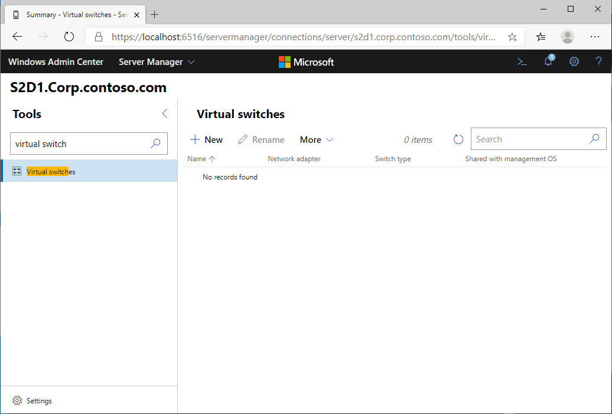

1. In Virtual switches tool click on + New. In Switch name type vSwitch and in Switch type select External. Select only adapters with IP Address starting with 10. In Load balancing algorithm select Hyper-V port and click on Save. Make sure Allow management OS to share these network adapters is checked.

    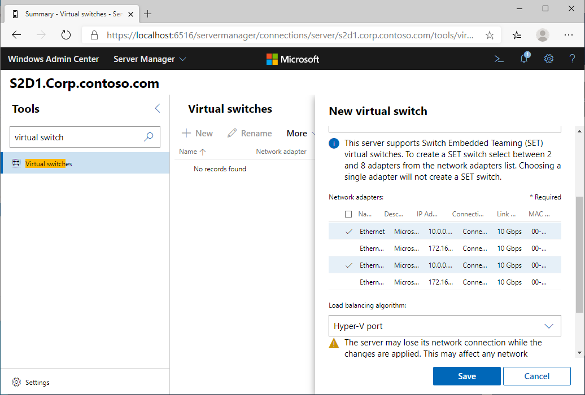

1. Repeat task 5 to create vSwitch on server S2D2. Alternatively, you can run following PowerShell command

```PowerShell
Invoke-Command -ComputerName "S2D2" -ScriptBlock {New-VMSwitch -Name vSwitch -EnableEmbeddedTeaming $TRUE -NetAdapterName (Get-NetIPAddress -IPAddress 10.* ).InterfaceAlias}
```

### Task 6: Test and Create Cluster

1. Open Server Manager from Start Menu. In Server Manager, click on Tools in top right corner and select Failover Cluster Manager. Alternatively you can just run cluadmin.msc.

1. To validate failover cluster configuration click on Validate Configuration... in Actions or right-click on Failover Cluster Manager and select Validate Configuration...

    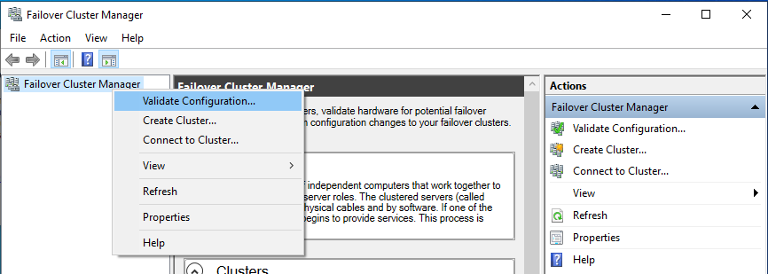

1. In Validate a Configuration wizard, In Before you begin page click Next. Add servers S2D1 and S2D2 and click on Next. In testing options page select Run only tests I select and click on Next. In test selection page select all except Storage and click Next twice to start validation. After validation finishes, click on View Report. All tests should pass. Keep the window open for next step.

    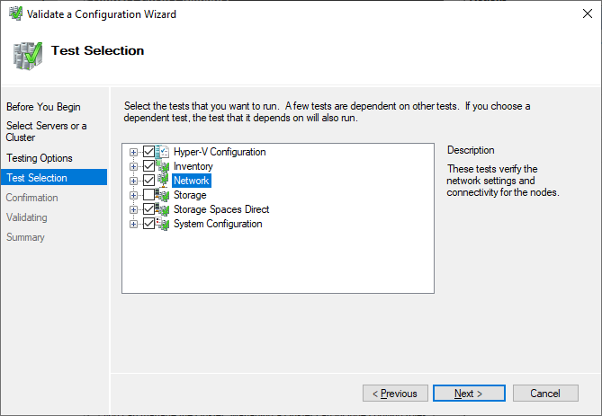

    >[!TIP] 
    >You can validate configuration using following PowerShell code: 
    >
    >Test-Cluster -Node "s2d1","s2d2" -Include "Storage Spaces Direct","Inventory","Network","System Configuration","Hyper-V Configuration"

1. In the same window from previous step check Create the cluster now using the validated nodes… and click on Finish. Create Cluster Wizard will open.

    

1. In Create Cluster Wizard on Before You Begin page click Next. Since DHCP is present, wizard will allow only name to be used. Type 2NodeCluster in Cluster Name and click Next
In Confirmation page click Next. Cluster will be created. Click on Finish to close wizard.

    >[!TIP] 
    >You can create cluster using following PowerShell code: 
    >
    >New-Cluster -Name "2NodeCluster" -Node "s2d1","s2d2"
    >
    >Or this command with static IP address:
    >
    >New-Cluster -Name "2NodeCluster" -Node "s2d1","s2d2" -StaticAddress "10.0.0.111"

### Task 7: Configure File Share Witness

*In this task you wil learn how to configure File Share Witness with GUI tools.*

1. Open Failover Cluster Manager from Start Menu or by running cluadmin.msc. In Failover Cluster Manager connect to 2NodeCluster. In Failover Cluster Manager, right-click on 2NodeCluster and select More Actions -> Configure Cluster Quorum Settings... Configure Cluster Quorum Wizard will run.

1. In Configure Quorum Wizard in Before You Begin page click Next. In Select Quorum Configuration Option page click on Select the quorum witness and click Next.

    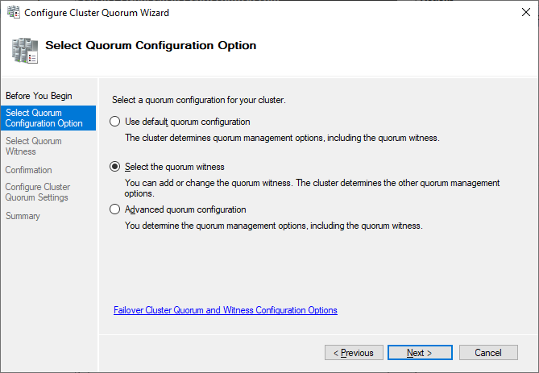

1. In Select Quorum Witness click on Configure a file share witness and click on Next. In Configure File Share Witness page click on Browse. Type DC in Browse for Shared Folders window and click on Show Shared Folders. Notice, that no shared folders were found. Click on New Shared Folder. For sake of complexity, choose that all users will have r/w permissions. Share Name is 2NodeClusterWitness and local path is c:\Shares\2NodeClusterWitness . Click OK twice to create and use the share. Click Next in Configure Cluster Quorum Wizard. In Confirmation page click Next and in Summary page click on finish. Notice, that Failover Cluster Manager will now show witness configured.

    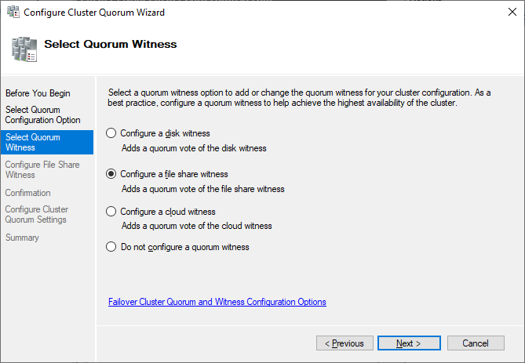

    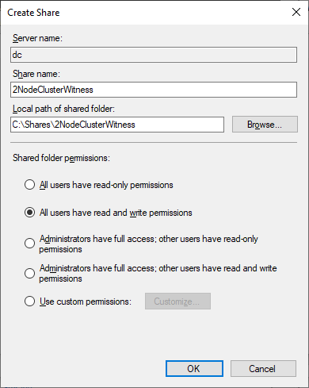

    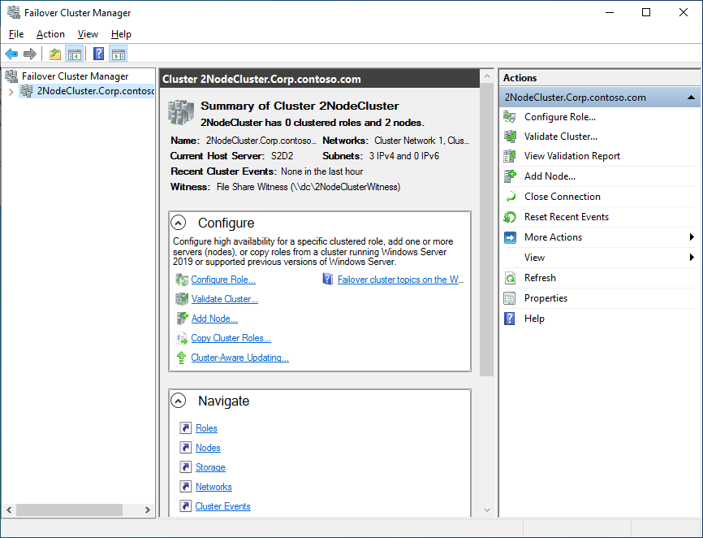

