# Creating first Lab

<!-- TOC -->

- [Creating first Lab](#creating-first-lab)
    - [Task 01: Prepare files](#task-01-prepare-files)
            - [Step 01: Download MSLab files](#step-01-download-mslab-files)
            - [Step 02: Unblock files and set execution policy](#step-02-unblock-files-and-set-execution-policy)
    - [Task 02: Download Required files](#task-02-download-required-files)
    - [Task 03: Build the lab Prerequisites](#task-03-build-the-lab-prerequisites)
            - [Step 01: Run first MSLab script](#step-01-run-first-mslab-script)
            - [Step 02: Create Parent Disks - second MSLab script](#step-02-create-parent-disks---second-mslab-script)
            - [Step 03: Create Azure Local Parent Disk](#step-03-create-azure-local-parent-disk)
    - [Task 03 - Deploy Azure Local Lab](#task-03---deploy-azure-local-lab)
            - [Step 01: Modify LabConfig.ps1](#step-01-modify-labconfigps1)
            - [Step 02: Deploy](#step-02-deploy)
            - [Step 03: Cleanup Optional](#step-03-cleanup-optional)
    - [Tips & Tricks](#tips--tricks)
        - [Add "Default" virtual switch in Windows Server 2025](#add-default-virtual-switch-in-windows-server-2025)

<!-- /TOC -->

## Task 01: Prepare files

#### Step 01: Download MSLab files

Note: MSLab files are available at https://aka.ms/mslab/download

Note: Since we want you to learn PowerShell a bit, steps - if possible - will be in PowerShell.

```PowerShell
#download mslab to Downloads
Invoke-WebRequest -Uri https://aka.ms/mslab/download -OutFile $env:UserProfile\Downloads\mslab.zip

#extract to c:\MSLab
Expand-Archive -Path $env:UserProfile\Downloads\mslab.zip -DestinationPath c:\MSLab\

```

#### Step 02: Unblock files and set execution policy

Note: Since PowerShell scripts are no longer signed (you can push @vladimir machv@microsoft.com to request that internally again, and yes, it's a lot of "paperwork"), files needs to be ublocked and execution policy configured

```PowerShell
$MSLabPath="C:\MSLab\"

#grab extracted files and unblock
Get-ChildItem -Path $MSLabPath | Unblock-File

#set execution policy to remote signed
Set-ExecutionPolicy -ExecutionPolicy RemoteSigned

```

## Task 02: Download Required files

Note: Personally I prefer MSDN images (or VL images if you have it available), but [eval images](https://www.microsoft.com/en-us/evalcenter/evaluate-windows-server-2025) are also fine. Why downloading ISO and not VHD? Because ISO contains all 4 versions (core/GUI,Standard and Datacenter) and VHD is only one. Plus VHD is sized 30GB (last time I checked). So it's more convenient to create image using MSLab scripts

Note: Start-BitsTransfer is used because invoke-webrequest is slow for big files (unless you configure different progresspreference)

```PowerShell
#ISO
$WindowsServerEvalURL="https://software-static.download.prss.microsoft.com/dbazure/888969d5-f34g-4e03-ac9d-1f9786c66749/26100.1742.240906-0331.ge_release_svc_refresh_SERVER_EVAL_x64FRE_en-us.iso"
$AzureLocal2505URL="http://aka.ms/hcireleaseimage/2505"

#download
Start-BitsTransfer -Source $WindowsServerEvalURL -Destination $env:userprofile\Downloads\
Start-BitsTransfer -Source $AzureLocal2505URL -Destination $env:userprofile\Downloads\AzureLocal2505.iso

```

## Task 03: Build the lab Prerequisites

In your MSLab folder you should be able to see following files

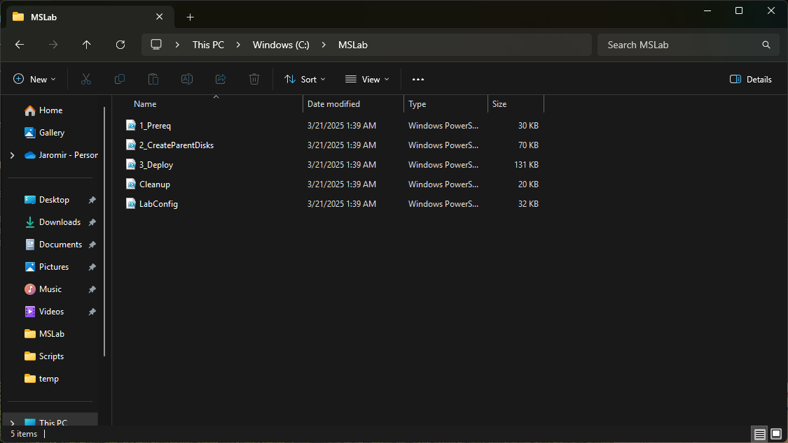

and ISO files should be downloaded in downloads folder

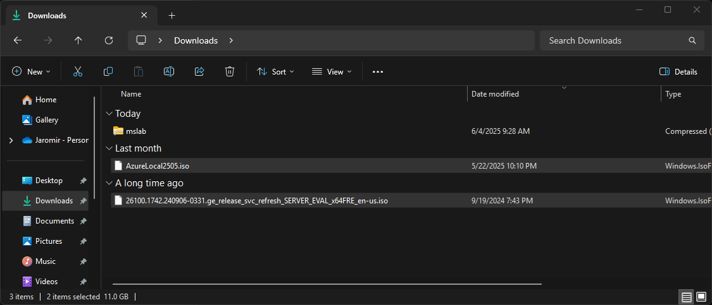


#### Step 01: Run first MSLab script

In your MSLab folder right-click at 1_Prereq.ps1 and run with PowerShell.

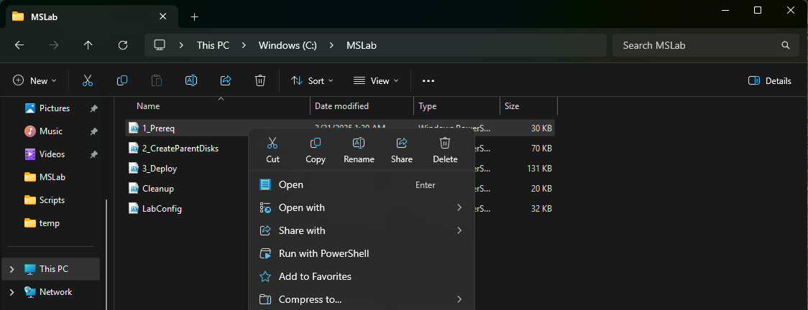

Note: this script will create folders, scripts. Will download all additional files from internet.

Tip: this is the only step that is needed to download files. After this step, you can distribute MSLab folder to offline environment and run 1_prereqs again.

Expected output:

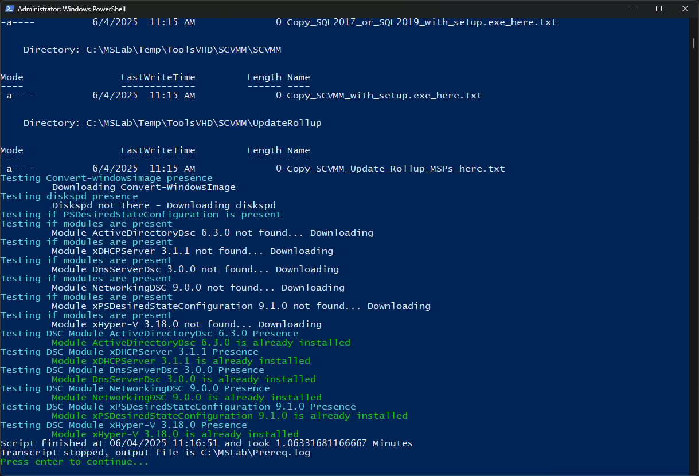

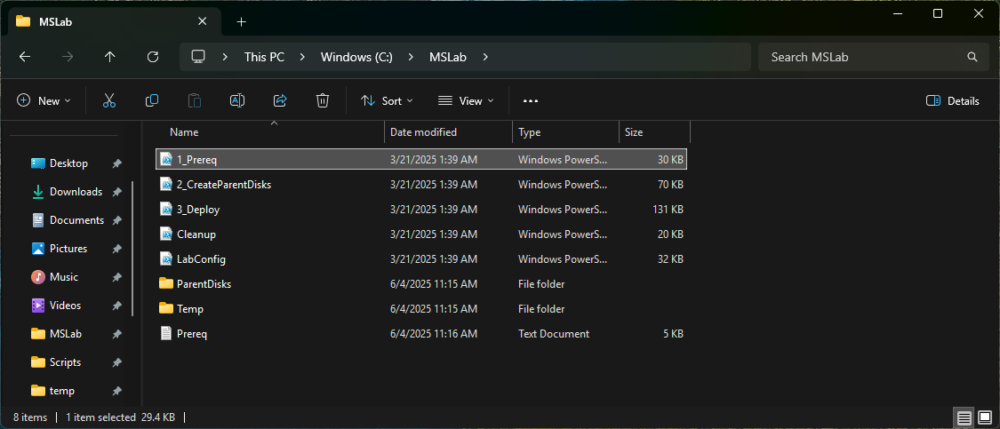


#### Step 02: Create Parent Disks - second MSLab script

In your MSLab folder right-click at 2_CreateParentDisks.ps1 and run with PowerShell.

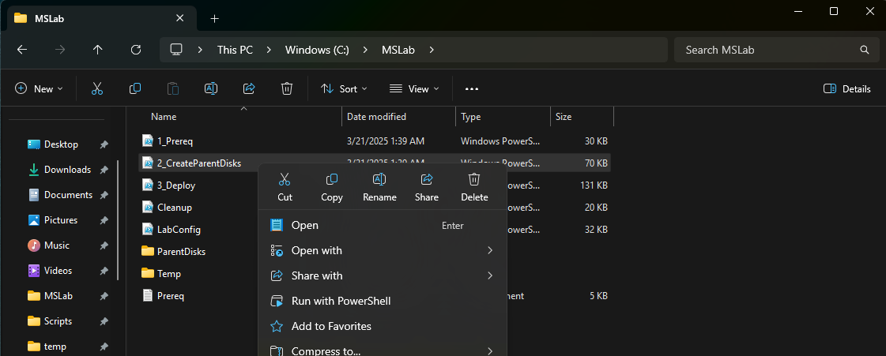

The script will ask you about telemetry level and will ask you for Windows Server 2025 ISO. Once asked for MSU, hit cancel.

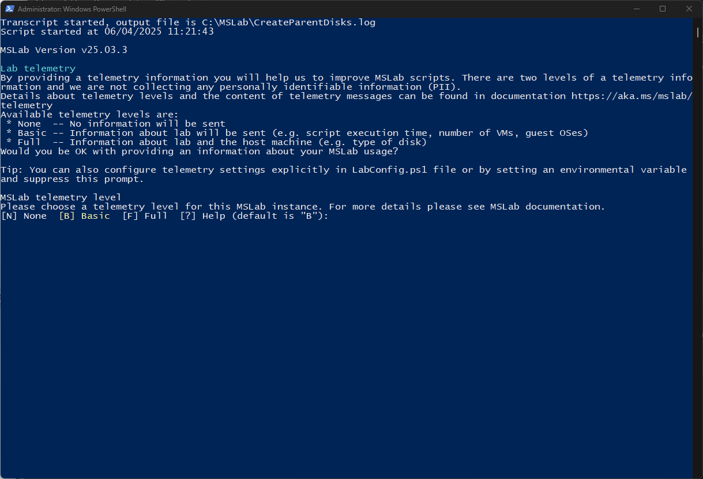

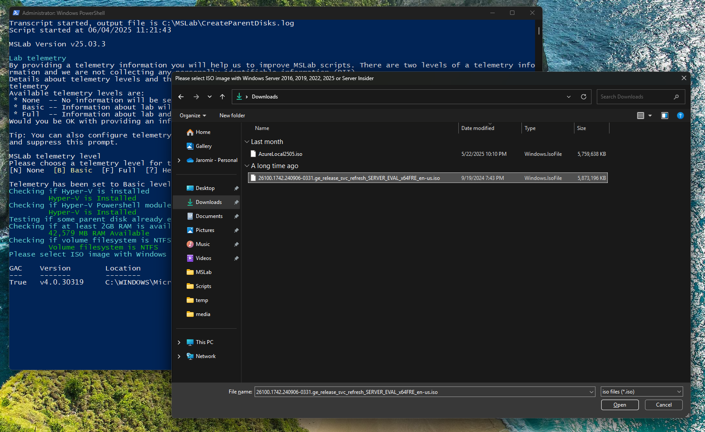

Note: this script will create Windows Server 2025 VHDs (GUI and Core) and will create domain controller. Once all is created, VMs are removed and files cleaned

Result:

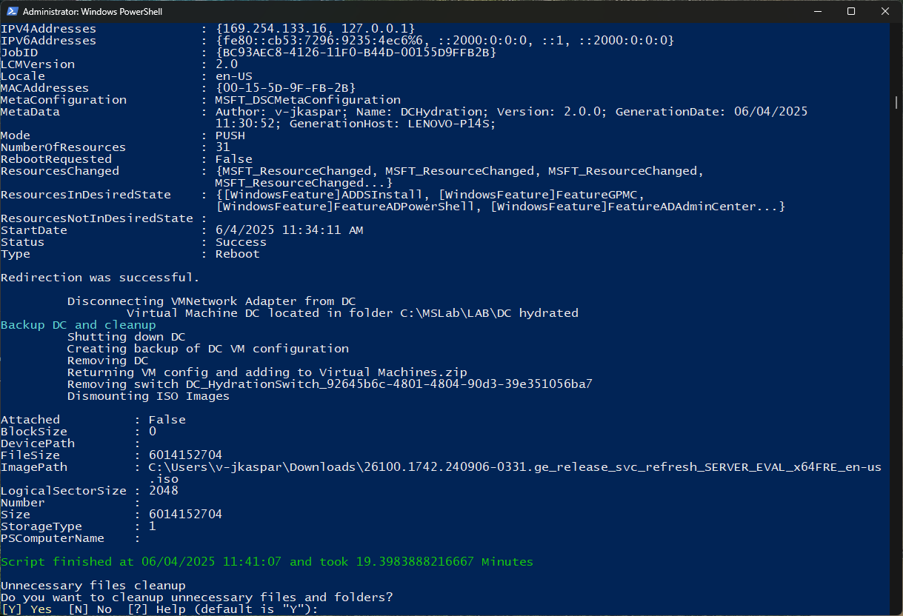

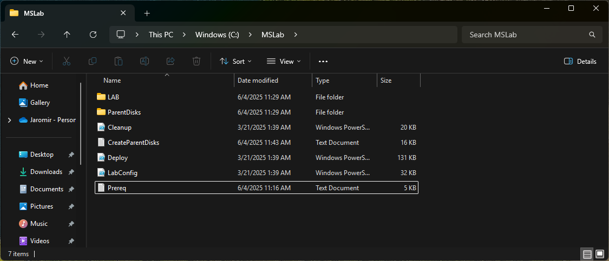

#### Step 03: Create Azure Local Parent Disk

In your MSLab folder navigate to ParentDisks folder. In ParentDisks folder right-click at CreateParentDisk.ps1 and select run with PowerShell

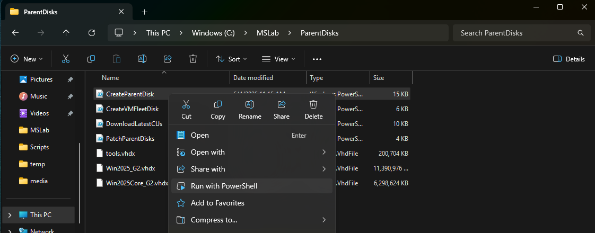

Script will ask you for ISO, so point it to downloaded Azure Local ISO. Once asked for MSU, click cancel.

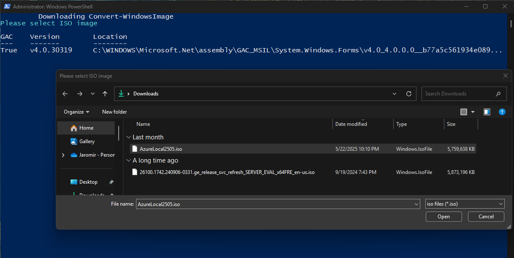

Note: this way you can create any VHD (Windows Server 2016-2025, Windows 11...)

You'll be asked for name and size, simply hit enter to accept default values.

Result:

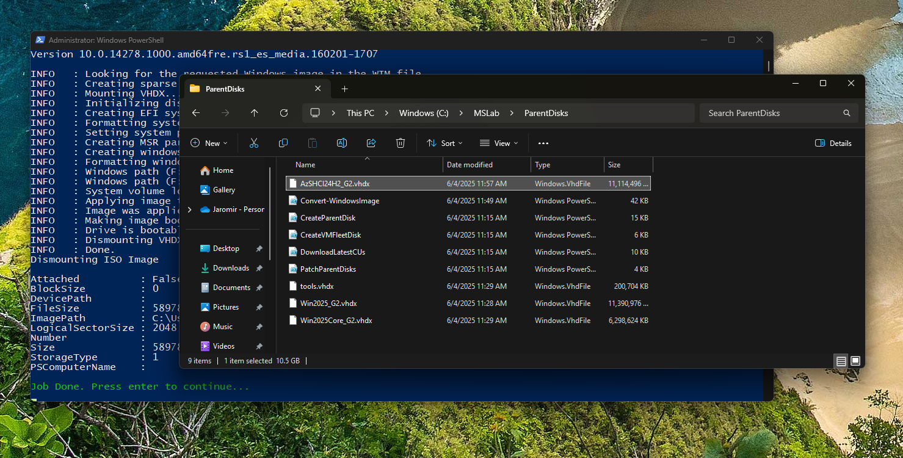

## Task 03 - Deploy Azure Local Lab

#### Step 01: Modify LabConfig.ps1

In your MSLab folder open LabConfig.ps1 and replace it with following text

Note: following config will use folder name as prefix (MSLab in this case). It will create 2 Azure Local VMs with maximum CPUs available and each with 24GB RAM.

```PowerShell
$LabConfig=@{AllowedVLANs="1-10,711-719" ; DomainAdminName='LabAdmin'; AdminPassword='LS1setup!' ; DCEdition='4'; Internet=$true; AdditionalNetworksConfig=@(); VMs=@()}

#Azure Local 24H2
#labconfig will not domain join VMs
1..2 | ForEach-Object {$LABConfig.VMs += @{ VMName = "ALNode$_" ; Configuration = 'S2D' ; ParentVHD = 'AzSHCI24H2_G2.vhdx' ; HDDNumber = 4 ; HDDSize= 1TB ; MemoryStartupBytes= 24GB; VMProcessorCount="MAX" ; vTPM=$true ; Unattend="NoDjoin" ; NestedVirt=$true }}

#VM for Windows Admin Center (optional)
#$LabConfig.VMs += @{ VMName = 'WACGW' ; ParentVHD = 'Win2025Core_G2.vhdx'; MGMTNICs=1}

#Management machine (Windows Server 2025 GUI)
$LabConfig.VMs += @{ VMName = 'Management' ; ParentVHD = 'Win2025_G2.vhdx'; MGMTNICs=1 ; AddToolsVHD=$True }
 
```

Result:

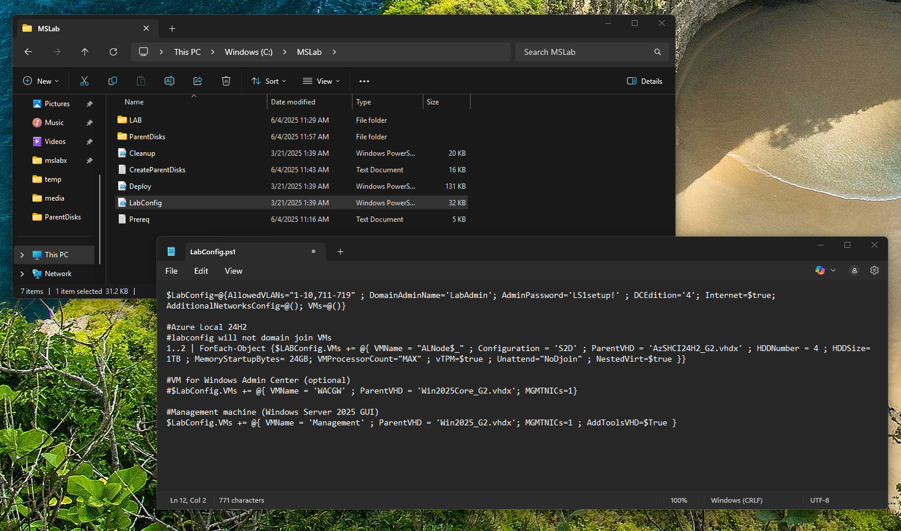

#### Step 02: Deploy

In your MSLab folder right-click at Deploy.ps1 and run with PowerShell. In ~5 minutes you should have your lab

Result:

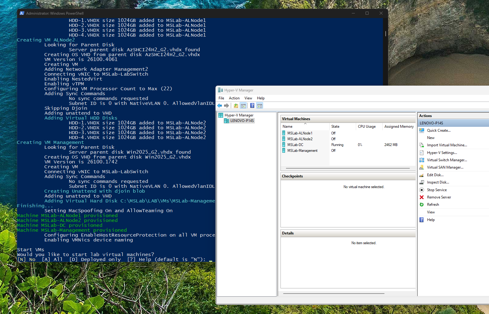

#### Step 03: Cleanup (Optional)

In your MSLab folder right-click at Cleanup.ps1 and run with PowerShell. In ~10 seconds your lab is gone and ready to deploy again.

## Tips & Tricks

### Add "Default" virtual switch in Windows Server 2025

In Windows 11 there's already "Default virtual switch" that provides internet connectivity to your lab. This script will add it to Windows Server. It's useful if your network does not have DHCP, so you dont have to assign DC IP manually.

```PowerShell
#install Containers feature to be able manage HNS networks (needs reboot)
Install-WindowsFeature -Name Containers

#install HNS powershell module
Install-PackageProvider -Name NuGet -MinimumVersion 2.8.5.201 -Force
Install-Module -Name HNS -Force -AllowClobber

#add default switch
New-HnsDefaultSwitchNetwork
```


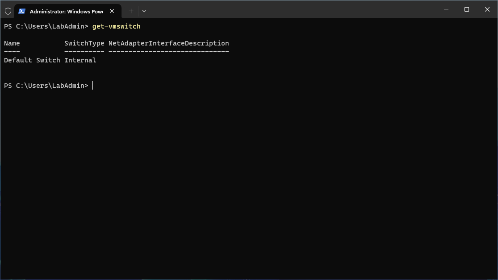