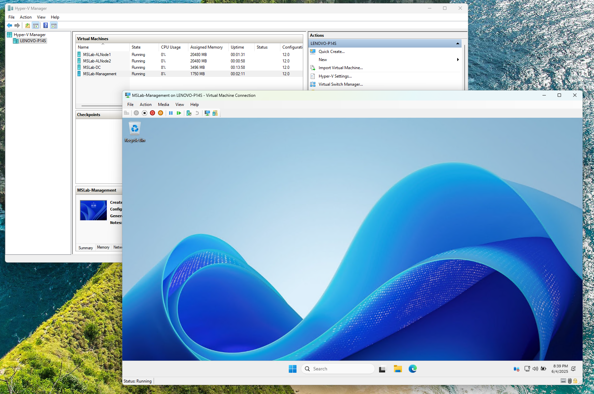
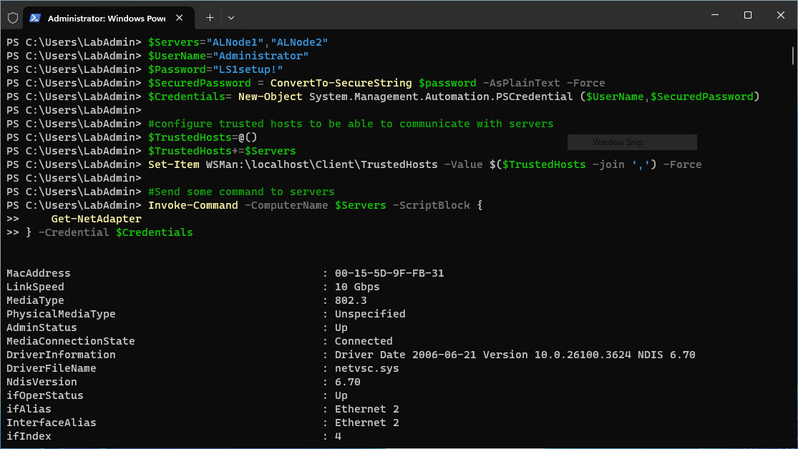
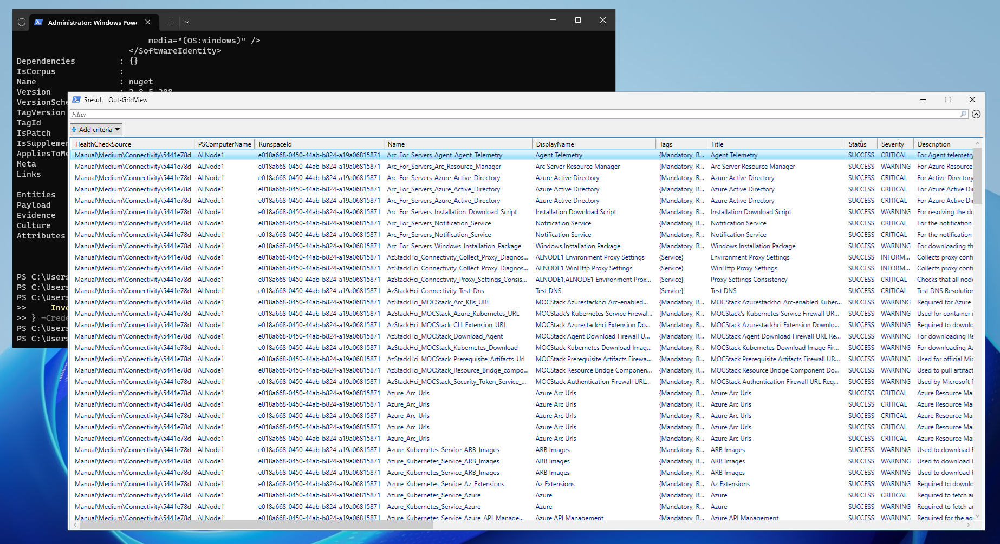
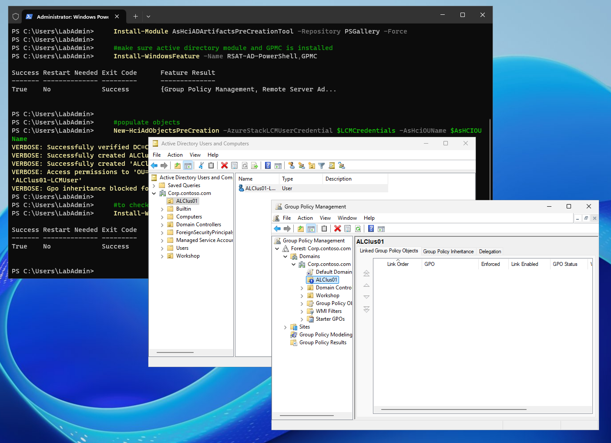
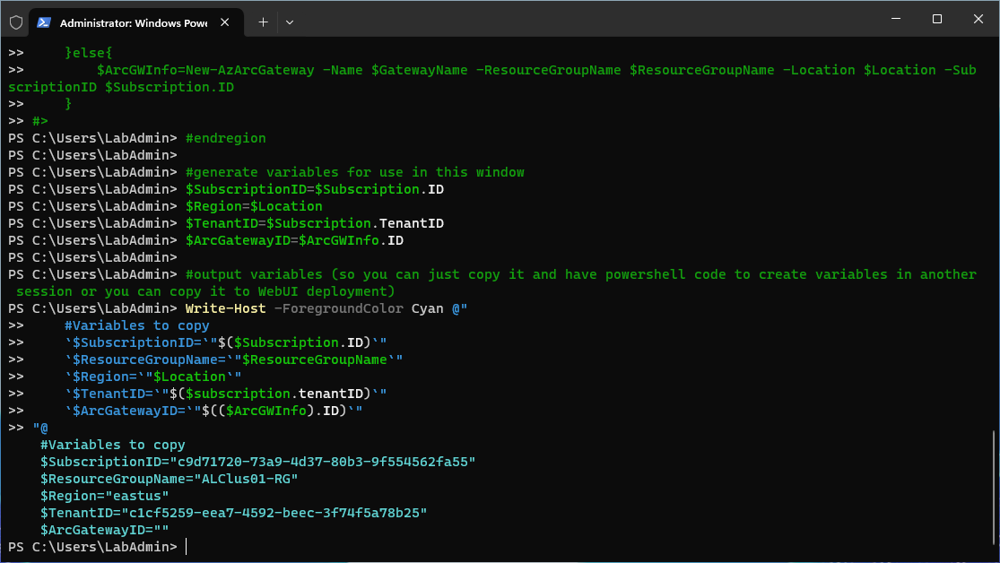
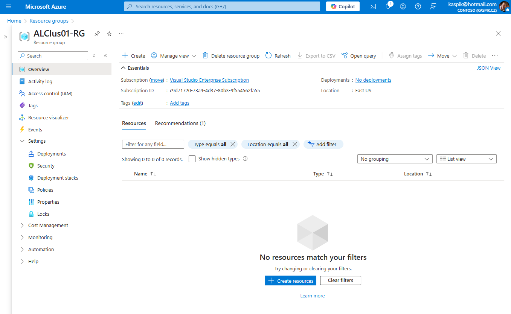
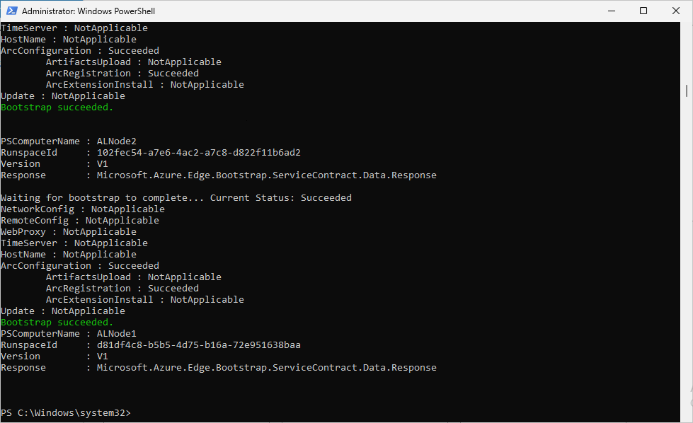
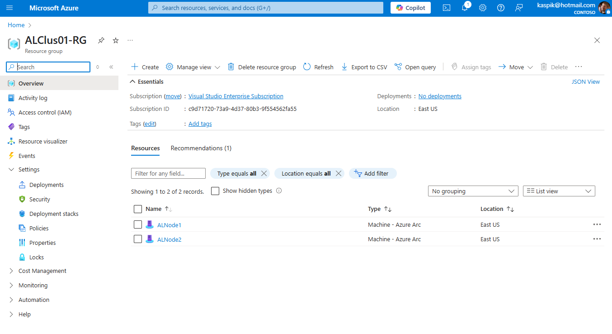
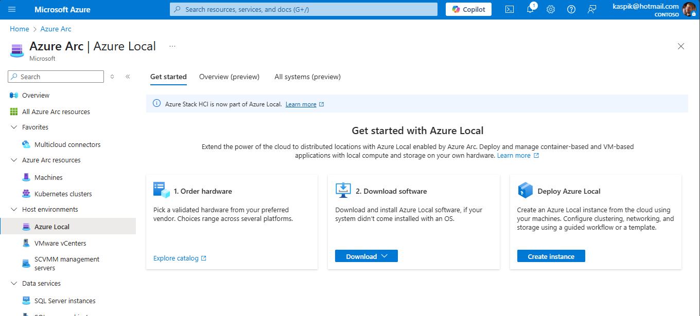

# Deploying Azure Local

<!-- TOC -->

- [Deploying Azure Local](#deploying-azure-local)
    - [About the lab](#about-the-lab)
    - [LabConfig](#labconfig)
    - [NTP Prerequisite](#ntp-prerequisite)
    - [The Lab](#the-lab)
        - [Task 01 - Connect to servers](#task-01---connect-to-servers)
            - [Step 01 Login to Management VM](#step-01-login-to-management-vm)
            - [Step 02 Connect to Servers using PowerShell Remoting](#step-02-connect-to-servers-using-powershell-remoting)
        - [Task 02 - Validate environment using Environment Checker tool](#task-02---validate-environment-using-environment-checker-tool)
        - [Task 03 - Create AD Prerequisites](#task-03---create-ad-prerequisites)
        - [Task 04 - Create Azure Resources](#task-04---create-azure-resources)
        - [Task 05 - Register with Arc](#task-05---register-with-arc)
        - [Task 07 - Validation prerequisites](#task-07---validation-prerequisites)
        - [Task 06 - Deploy via Azure Portal](#task-06---deploy-via-azure-portal)

<!-- /TOC -->

## About the lab

In this lab you will deploy 2 node Azure Local into virtual environment using [cloud deployment](https://learn.microsoft.com/en-us/azure-stack/hci/whats-new#cloud-based-deployment).

To setup lab, follow [01-Creating First Lab](../../HandsOnLabs/01-CreatingFirstLab/readme.md)

Lab consumes ~60GB RAM. You can modify number of VMs and get down to ~30GB

## LabConfig

```PowerShell
$LabConfig=@{AllowedVLANs="1-10,711-719" ; DomainAdminName='LabAdmin'; AdminPassword='LS1setup!' ; DCEdition='4'; Internet=$true; AdditionalNetworksConfig=@(); VMs=@()}

#Azure Local 24H2
#labconfig will not domain join VMs
1..2 | ForEach-Object {$LABConfig.VMs += @{ VMName = "ALNode$_" ; Configuration = 'S2D' ; ParentVHD = 'AzSHCI24H2_G2.vhdx' ; HDDNumber = 4 ; HDDSize= 1TB ; MemoryStartupBytes= 24GB; VMProcessorCount="MAX" ; vTPM=$true ; Unattend="NoDjoin" ; NestedVirt=$true }}

#VM for Windows Admin Center (optional)
#$LabConfig.VMs += @{ VMName = 'WACGW' ; ParentVHD = 'Win2025Core_G2.vhdx'; MGMTNICs=1}

#Management machine (Windows Server 2025 GUI)
$LabConfig.VMs += @{ VMName = 'Management' ; ParentVHD = 'Win2025_G2.vhdx'; MGMTNICs=1 ; AddToolsVHD=$True }
 
```

## NTP Prerequisite

To successfully configure NTP server it's necessary to disable time synchronization from Hyper-V host.

Run following code **from hyper-v host** to disable time sync

```PowerShell
Get-VM *ALNode* | Disable-VMIntegrationService -Name "Time Synchronization"

```

## The Lab

### Task 01 - Connect to servers

#### Step 01 Login to Management VM

Provide following credentials:

* Username: LabAdmin
* Password: LS1setup!




#### Step 02 Connect to Servers using PowerShell Remoting

In Management machine run following PowerShell command to configure Trusted Hosts and invoke command remotely

```PowerShell
$Servers="ALNode1","ALNode2"
$UserName="Administrator"
$Password="LS1setup!"
$SecuredPassword = ConvertTo-SecureString $password -AsPlainText -Force
$Credentials= New-Object System.Management.Automation.PSCredential ($UserName,$SecuredPassword)

#configure trusted hosts to be able to communicate with servers
$TrustedHosts=@()
$TrustedHosts+=$Servers
Set-Item WSMan:\localhost\Client\TrustedHosts -Value $($TrustedHosts -join ',') -Force

#Send some command to servers
Invoke-Command -ComputerName $Servers -ScriptBlock {
    Get-NetAdapter
} -Credential $Credentials

```



### Task 02 - Validate environment using Environment Checker tool

* https://learn.microsoft.com/en-in/azure/azure-local/manage/use-environment-checker?tabs=connectivity


```PowerShell
<# this breaks registration - recipe validation failed

#Install modules
Invoke-Command -ComputerName $Servers -Scriptblock {
    Install-PackageProvider -Name NuGet -MinimumVersion 2.8.5.201 -Force
    Install-Module PowerShellGet -AllowClobber -Force
    Install-Module -Name AzStackHci.EnvironmentChecker -Force
} -Credential $Credentials

#validate environment
$result=Invoke-Command -ComputerName $Servers -Scriptblock {
    Invoke-AzStackHciConnectivityValidation -PassThru
} -Credential $Credentials
$result | Out-GridView

#>
```



### Task 03 - Create AD Prerequisites

* https://learn.microsoft.com/en-us/azure/azure-local/deploy/deployment-prep-active-directory

```PowerShell
$AsHCIOUName="OU=ALClus01,DC=Corp,DC=contoso,DC=com"
$LCMUserName="ALClus01-LCMUser"
$LCMPassword="LS1setup!LS1setup!"
#Create LCM credentials
$SecuredPassword = ConvertTo-SecureString $LCMPassword -AsPlainText -Force
$LCMCredentials= New-Object System.Management.Automation.PSCredential ($LCMUserName,$SecuredPassword)

#create objects in Active Directory
    #install posh module for prestaging Active Directory
    Install-PackageProvider -Name NuGet -Force
    Install-Module AsHciADArtifactsPreCreationTool -Repository PSGallery -Force

    #make sure active directory module and GPMC is installed
    Install-WindowsFeature -Name RSAT-AD-PowerShell,GPMC

    #populate objects
    New-HciAdObjectsPreCreation -AzureStackLCMUserCredential $LCMCredentials -AsHciOUName $AsHCIOUName

    #to check OU (and future cluster) in GUI install management tools
    Install-WindowsFeature -Name "RSAT-ADDS","RSAT-Clustering"
 
```



### Task 04 - Create Azure Resources

As you can see, there's an optional code block that can create Arc Gateway. Simply uncomment if you want to deploy Azure Local with Arc Gw.

```PowerShell
$GatewayName="ALClus01-ArcGW"
$ResourceGroupName="ALClus01-RG"
$Location="eastus"

#login to azure
    #download Azure module
    Install-PackageProvider -Name NuGet -MinimumVersion 2.8.5.201 -Force
    if (!(Get-InstalledModule -Name az.accounts -ErrorAction Ignore)){
        Install-Module -Name Az.Accounts -Force 
    }
    #login using device authentication
    Connect-AzAccount -UseDeviceAuthentication

    #assuming new az.accounts module was used and it asked you what subscription to use - then correct subscription is selected for context
    $Subscription=(Get-AzContext).Subscription

    #install az resources module
        if (!(Get-InstalledModule -Name az.resources -ErrorAction Ignore)){
            Install-Module -Name az.resources -Force
        }

    #create resource group
        if (-not(Get-AzResourceGroup -Name $ResourceGroupName -ErrorAction Ignore)){
            New-AzResourceGroup -Name $ResourceGroupName -Location $location
        }
#region (Optional) configure Arc Gateway
<#
    #install az.arcgateway module
        if (!(Get-InstalledModule -Name az.arcgateway -ErrorAction Ignore)){
            Install-Module -Name az.arcgateway -Force
        }
    #make sure "Microsoft.HybridCompute" is registered (and possibly other RPs)
        Register-AzResourceProvider -ProviderNamespace "Microsoft.HybridCompute"
        Register-AzResourceProvider -ProviderNamespace "Microsoft.GuestConfiguration"
        Register-AzResourceProvider -ProviderNamespace "Microsoft.HybridConnectivity"
        Register-AzResourceProvider -ProviderNamespace "Microsoft.AzureStackHCI"

    #create GW
    if (Get-AzArcGateway -Name $gatewayname -ResourceGroupName $ResourceGroupName -ErrorAction Ignore){
        $ArcGWInfo=Get-AzArcGateway -Name $gatewayname -ResourceGroupName $ResourceGroupName
    }else{
        $ArcGWInfo=New-AzArcGateway -Name $GatewayName -ResourceGroupName $ResourceGroupName -Location $Location -SubscriptionID $Subscription.ID
    }
#>
#endregion

#generate variables for use in this window
$SubscriptionID=$Subscription.ID
$Region=$Location
$TenantID=$Subscription.TenantID
$ArcGatewayID=$ArcGWInfo.ID

#output variables (so you can just copy it and have powershell code to create variables in another session or you can copy it to WebUI deployment)
Write-Host -ForegroundColor Cyan @"
    #Variables to copy
    `$SubscriptionID=`"$($Subscription.ID)`"
    `$ResourceGroupName=`"$ResourceGroupName`"
    `$Region=`"$Location`"
    `$TenantID=`"$($subscription.tenantID)`"
    `$ArcGatewayID=`"$(($ArcGWInfo).ID)`"
"@

```

Script outputs code that you can copy and hand over to another window if needed to provide variables.





### Task 05 - Register with Arc

* https://learn.microsoft.com/en-us/azure/azure-local/deploy/deployment-arc-register-server-permissions?view=azloc-24112&tabs=powershell

As you can see, code contains few fixes that will be addressed in future releases (converting token to plaintext, starting scheduled task that fails in virtual environments...)

```PowerShell
#Make sure resource providers are registered
Register-AzResourceProvider -ProviderNamespace "Microsoft.HybridCompute" 
Register-AzResourceProvider -ProviderNamespace "Microsoft.GuestConfiguration" 
Register-AzResourceProvider -ProviderNamespace "Microsoft.HybridConnectivity" 
Register-AzResourceProvider -ProviderNamespace "Microsoft.AzureStackHCI" 
Register-AzResourceProvider -ProviderNamespace "Microsoft.Kubernetes" 
Register-AzResourceProvider -ProviderNamespace "Microsoft.KubernetesConfiguration" 
Register-AzResourceProvider -ProviderNamespace "Microsoft.ExtendedLocation" 
Register-AzResourceProvider -ProviderNamespace "Microsoft.ResourceConnector" 
Register-AzResourceProvider -ProviderNamespace "Microsoft.HybridContainerService"
Register-AzResourceProvider -ProviderNamespace "Microsoft.Attestation"
Register-AzResourceProvider -ProviderNamespace "Microsoft.Storage"

#deploy ARC Agent (with Arc Gateway, without proxy. For more examples visit https://learn.microsoft.com/en-us/azure/azure-local/deploy/deployment-arc-register-server-permissions?tabs=powershell)
    $armtoken = (Get-AzAccessToken).Token
    $id = (Get-AzContext).Account.Id
    $Cloud="AzureCloud"

    #check if token is plaintext (older module version outputs plaintext, version 5 outputs secure string) - will be fixed in 2506
    # Check if the token is a SecureString
    if ($armtoken -is [System.Security.SecureString]) {
        # Convert SecureString to plaintext
        $armtoken = [System.Runtime.InteropServices.Marshal]::PtrToStringAuto([System.Runtime.InteropServices.Marshal]::SecureStringToBSTR($armtoken))
    }else {
        Write-Output "Token is already plaintext."
    }

    #check if ImageCustomizationScheduledTask is not in disabled state (if it's "ready", run it) - will be fixed in 2506
    Invoke-Command -ComputerName $Servers -ScriptBlock {
        $task=Get-ScheduledTask -TaskName ImageCustomizationScheduledTask
        if ($task.State -ne "Disabled" -and $task.State -ne "Running"){
            Write-Output "Starting Scheduled task ImageCustomizationScheduledTask on $env:ComputerName"
            $task | Start-ScheduledTask
        }
    } -Credential $Credentials
    #wait until it's disabled
    Invoke-Command -ComputerName $Servers -ScriptBlock {
        $task=Get-ScheduledTask -TaskName ImageCustomizationScheduledTask
        if ($task.state -eq "running"){
            do {
                Write-Output "Waiting for ImageCustomizationScheduledTask on $env:computerName to finish"
                Start-Sleep 1
                $task=Get-ScheduledTask -TaskName ImageCustomizationScheduledTask
            } while ($task.state -ne "Disabled")
        }
    } -Credential $Credentials

    #register servers
    Invoke-Command -ComputerName $Servers -ScriptBlock {
        Invoke-AzStackHciArcInitialization -SubscriptionID $using:SubscriptionID -ResourceGroup $using:ResourceGroupName -TenantID $using:TenantID -Cloud $using:Cloud -Region $Using:Location -ArmAccessToken $using:ARMtoken -AccountID $using:id #-ArcGatewayID $using:ArcGatewayID
    } -Credential $Credentials
 
```

Result:





### Task 07 - Validation prerequisites

```PowerShell
#region to successfully validate you need make sure there's just one GW
    #make sure there is only one management NIC with IP address (setup is complaining about multiple gateways)
    Invoke-Command -ComputerName $servers -ScriptBlock {
        Get-NetIPConfiguration | Where-Object IPV4defaultGateway | Get-NetAdapter | Sort-Object Name | Select-Object -Skip 1 | Set-NetIPInterface -Dhcp Disabled
    } -Credential $Credentials
#endregion

#region Convert DHCP address to Static (since 2411 there's a check for static IP)
    Invoke-Command -ComputerName $Servers -ScriptBlock {
        $InterfaceAlias=(Get-NetIPAddress -AddressFamily IPv4 | Where-Object {$_.IPAddress -NotLike "169*" -and $_.PrefixOrigin -eq "DHCP"}).InterfaceAlias
        $IPConf=Get-NetIPConfiguration -InterfaceAlias $InterfaceAlias
        $IPAddress=Get-NetIPAddress -AddressFamily IPv4 -InterfaceAlias $InterfaceAlias
        $IP=$IPAddress.IPAddress
        $Index=$IPAddress.InterfaceIndex
        $GW=$IPConf.IPv4DefaultGateway.NextHop
        $Prefix=$IPAddress.PrefixLength
        $DNSServers=@()
        $ipconf.dnsserver | ForEach-Object {if ($_.addressfamily -eq 2){$DNSServers+=$_.ServerAddresses}}
        Set-NetIPInterface -InterfaceIndex $Index -Dhcp Disabled
        New-NetIPAddress -InterfaceIndex $Index -AddressFamily IPv4 -IPAddress $IP -PrefixLength $Prefix -DefaultGateway $GW -ErrorAction SilentlyContinue
        Set-DnsClientServerAddress -InterfaceIndex $index -ServerAddresses $DNSServers
    } -Credential $Credentials
#endregion
 
#region and make sure password is complex and long enough (12chars at least)
    $NewPassword="LS1setup!LS1setup!"
    Invoke-Command -ComputerName $servers -ScriptBlock {
        Set-LocalUser -Name Administrator -AccountNeverExpires -Password (ConvertTo-SecureString $Using:NewPassword -AsPlainText -Force)
    } -Credential $Credentials
    #create new credentials
    $UserName="Administrator"
    $SecuredPassword = ConvertTo-SecureString $NewPassword -AsPlainText -Force
    $Credentials= New-Object System.Management.Automation.PSCredential ($UserName,$SecuredPassword)
#endregion

```

### Task 06 - Deploy via Azure Portal

* https://learn.microsoft.com/en-us/azure/azure-local/deploy/deploy-via-portal

In Azure Portal navigate to Azure Arc and into Azure Local under Host environments. In Get started with Azure Local, click on **Create instance** under **Deploy Azure Local**.



Use values below for virtual cluster

```
Basics:
    Resource Group: ALClus01-RG
    ClusterName:    ALClus01
    Keyvaultname:   <Just generate new>

Configuration:
    New Configuration

Networking
    Network Switch for storage
    Group All traffic

    Network adapter 1:          Ethernet
    Network adapter 1 VLAN ID:  711 (default)
    Network adapter 2:          Ethernet 2
    Network adapter 2 VLAN ID:  712 (default)

    RDMA Protocol:              Disabled (in case you are running lab in VMs)
    Jumbo Frames:               1514 (in case you are running lab in VMs as hyper-v does not by default support Jumbo Frames)

    Starting IP:                10.0.0.111
    ENding IP:                  10.0.0.116
    Subnet mask:                255.255.255.0
    Default Gateway:            10.0.0.1
    DNS Server:                 10.0.0.1

Management
    Custom location name:       ALClus01CustomLocation (default)

    Azure storage account name: <just generate new>

    Domain:                     corp.contoso.com
    Computer name prefix:       ALClus01
    OU:                         OU=ALClus01,DC=Corp,DC=contoso,DC=com

    Deployment account:
        Username:               ALClus01-LCMUser
        Password:               LS1setup!LS1setup!

    Local Administrator
        Username:               Administrator
    Password:                   LS1setup!LS1setup!

Security:
    Customized security settings
        Unselect Bitlocker for data volumes (would consume too much space)

Advanced:
    Create workload volumes (Default)

Tags:
    <keep default>
```

