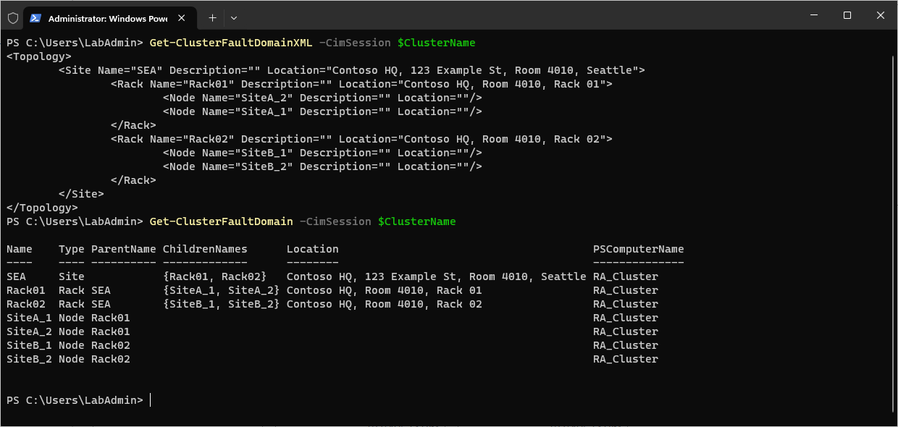
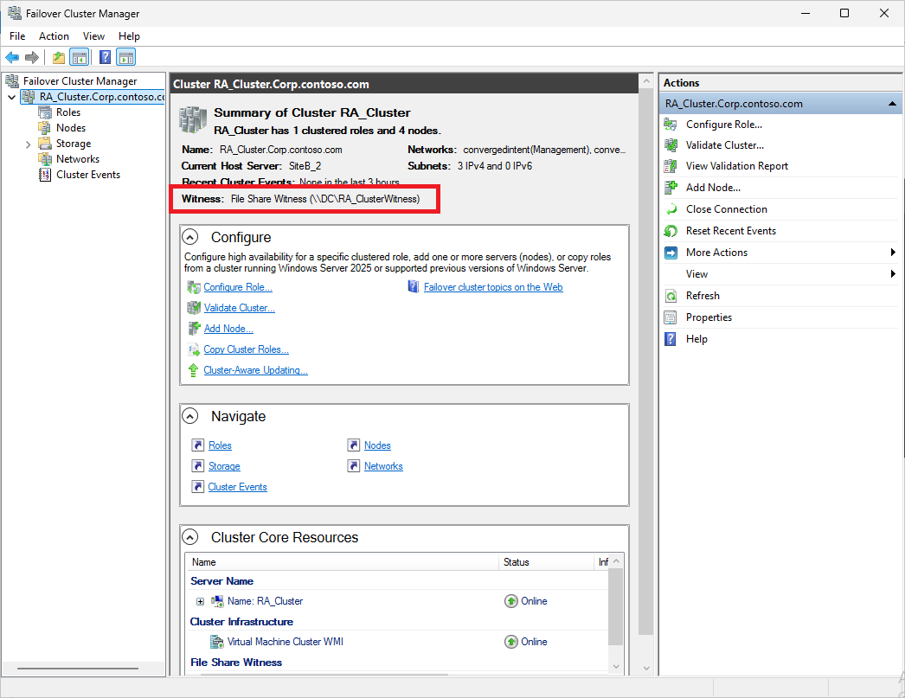
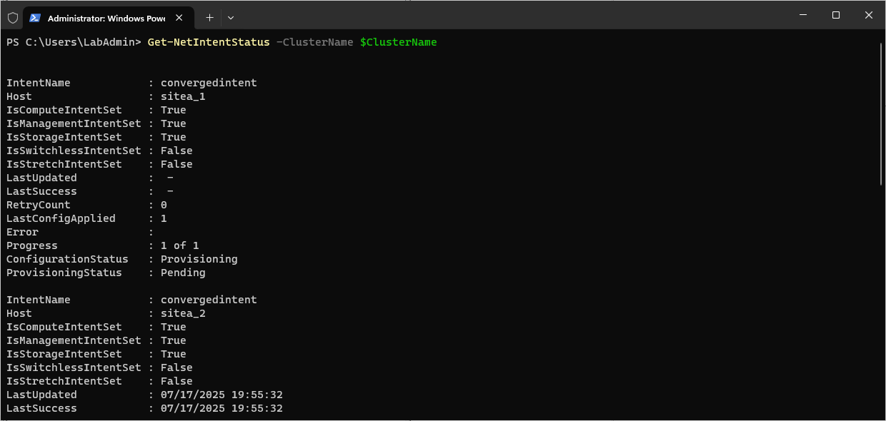
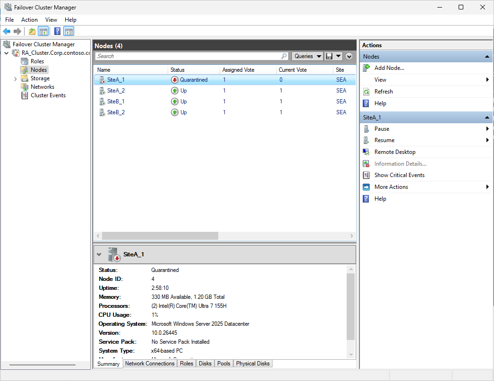
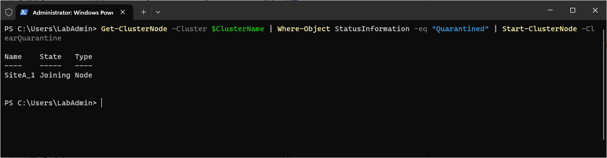
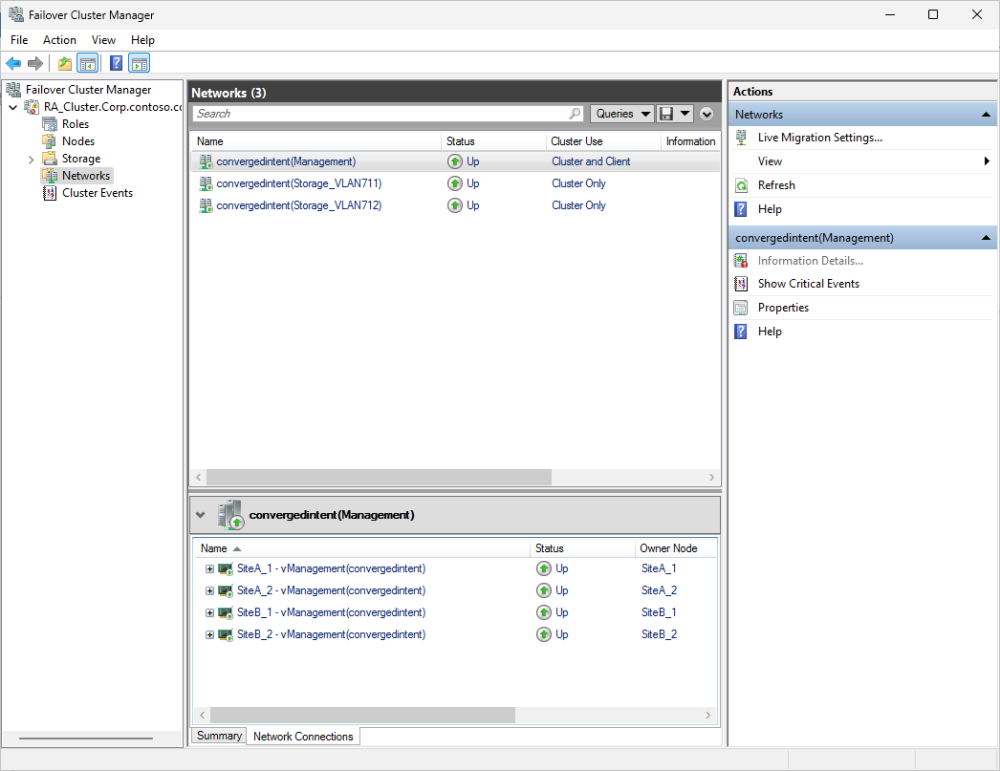
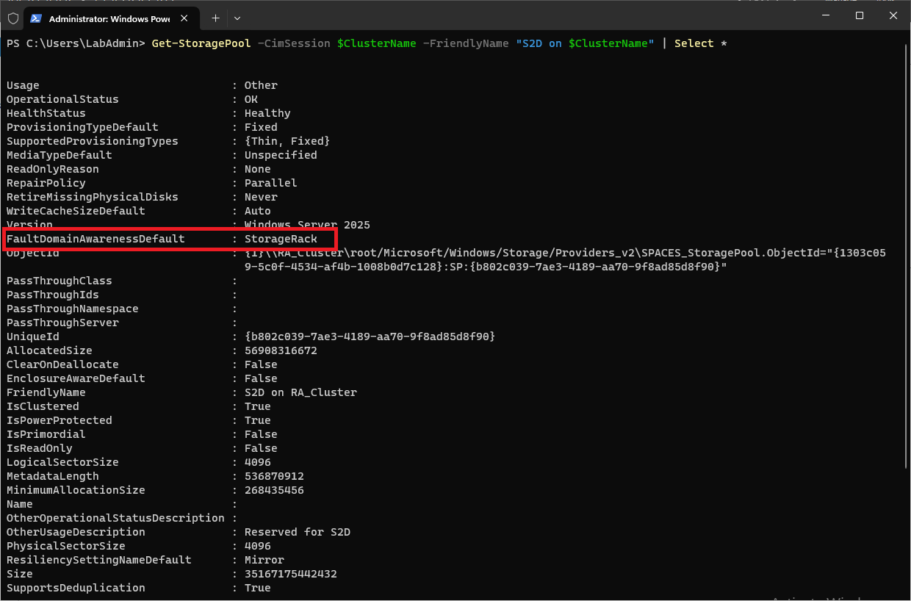
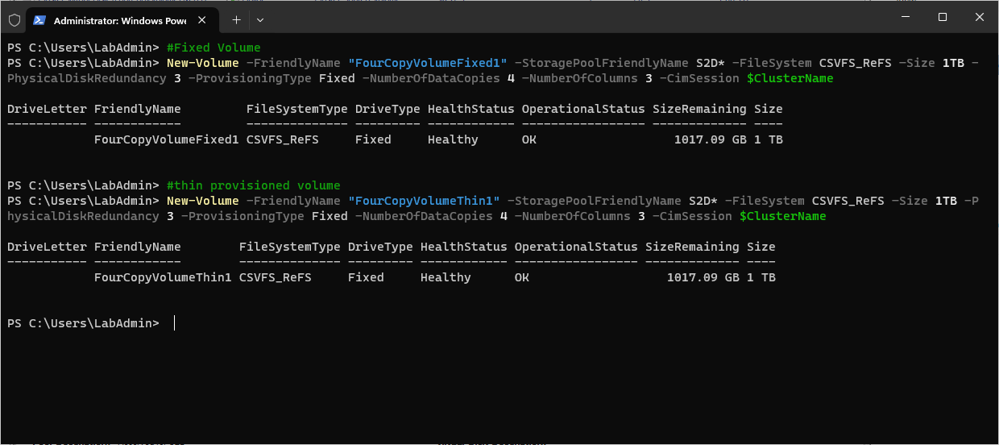
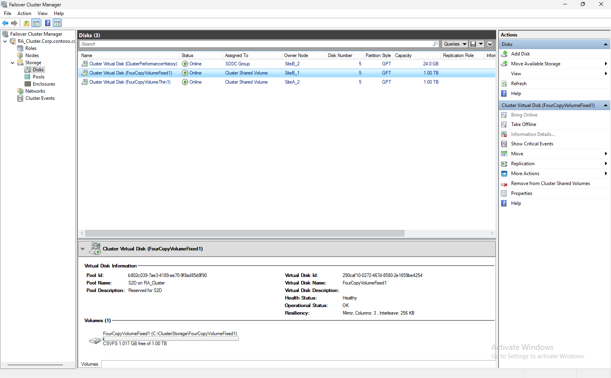

# Deploy S2D Campus Cluster
<!-- TOC -->
<!-- TOC -->

- [Deploy S2D Campus Cluster](#deploy-s2d-campus-cluster)
    - [About the lab](#about-the-lab)
    - [LabConfig](#labconfig)
    - [Task 1 - Configure all prerequisites](#task-1---configure-all-prerequisites)
    - [Task 2 - Configure fault domains and create cluster](#task-2---configure-fault-domains-and-create-cluster)
    - [Task 3 - Configure file share or Cloud Witness](#task-3---configure-file-share-or-cloud-witness)
    - [Task 4 - Configure networking](#task-4---configure-networking)
    - [Task 5 - Configure advanced settings in networking](#task-5---configure-advanced-settings-in-networking)
    - [Task 6 - Enable ClusterS2D and create Volumes](#task-6---enable-clusters2d-and-create-volumes)
        - [Step 1 - Enable Cluster S2D](#step-1---enable-cluster-s2d)
        - [Step 2 - Check Storage Pool](#step-2---check-storage-pool)
        - [Step 3 - Create Volumes](#step-3---create-volumes)

<!-- /TOC -->

## About the lab

In this lab you will deploy 4 node Windows Server Insider cluster.

To create Windows Server Insider parent disk, you can also use [CreateParentDisk.ps1](https://github.com/microsoft/MSLab/blob/master/Tools/CreateParentDisk.ps1) that you can find in ParentDisks folder in MSLab. It's easier to create your own image using ISO file as you are in control of what edition to create and how big vhd you want to create.

To setup lab, follow [01-Creating First Lab](../../HandsOnLabs/01-CreatingFirstLab/readme.md). If you will create lab from the scratch, DC will be also created with Windows Server Insider.

Rack Level Nested Mirror documentation: https://techcommunity.microsoft.com/discussions/windowsserverinsiders/announcing-windows-server-vnext-preview-build-26445/4432171

## LabConfig

```PowerShell
$LabConfig=@{AllowedVLANs="1-10,711-719" ; DomainAdminName='LabAdmin'; AdminPassword='LS1setup!' ; DCEdition='4'; Internet=$true; AdditionalNetworksConfig=@(); VMs=@()}

#S2D Nodes
1..2 | ForEach-Object {$LABConfig.VMs += @{ VMName="SiteA_$_" ; Configuration='S2D' ; ParentVHD='WinSrvInsiderCore_26445.vhdx' ; HDDNumber=4 ; HDDSize=2TB ; MemoryStartupBytes=1GB; VMProcessorCount=4 ; vTPM=$true}}
1..2 | ForEach-Object {$LABConfig.VMs += @{ VMName="SiteB_$_" ; Configuration='S2D' ; ParentVHD='WinSrvInsiderCore_26445.vhdx' ; HDDNumber=4 ; HDDSize=2TB ; MemoryStartupBytes=1GB; VMProcessorCount=4 ; vTPM=$true}}

#S2D Nodes (nested virt)
#1..2 | ForEach-Object {$LABConfig.VMs += @{ VMName="SiteA_$_" ; Configuration='S2D' ; ParentVHD='WinSrvInsiderCore_26445.vhdx' ; HDDNumber=4 ; HDDSize=2TB ; MemoryStartupBytes=8GB ; VMProcessorCount=4 ; vTPM=$true ; NestedVirt=$true}}
#1..2 | ForEach-Object {$LABConfig.VMs += @{ VMName="SiteB_$_" ; Configuration='S2D' ; ParentVHD='WinSrvInsiderCore_26445.vhdx' ; HDDNumber=4 ; HDDSize=2TB ; MemoryStartupBytes=8GB ; VMProcessorCount=4 ; vTPM=$true ; NestedVirt=$true}}

#Management machine
$LabConfig.VMs += @{ VMName = 'Management' ; ParentVHD = 'WinSrvInsider_26445.vhdx'; MGMTNICs=1 ; AddToolsVHD=$True }

#Windows Admin Center in GW mode
#$LabConfig.VMs += @{ VMName = 'WACGW' ; ParentVHD = 'WinSrvInsiderCore_26445.vhdx'; MGMTNICs=1}
 
```


## Task 1 - Configure all prerequisites

Following config is the same as you would configure physical servers.

Run the code from Management machine

```PowerShell
#region install features
    #install features for management (assuming you are running these commands on Windows Server with GUI)
    Install-WindowsFeature -Name NetworkATC,RSAT-Clustering,RSAT-Clustering-Mgmt,RSAT-Clustering-PowerShell,RSAT-Hyper-V-Tools,RSAT-Feature-Tools-BitLocker-BdeAducExt,RSAT-AD-PowerShell,RSAT-AD-AdminCenter,RSAT-DHCP,RSAT-DNS-Server
 

    #servers list
    $Servers="SiteA_1","SiteA_2","SiteB_1","SiteB_2"

    #install roles and features on servers
    #install Hyper-V using DISM if Install-WindowsFeature fails (if nested virtualization is not enabled install-windowsfeature fails)
    Invoke-Command -ComputerName $servers -ScriptBlock {
        $Result=Install-WindowsFeature -Name "Hyper-V" -ErrorAction SilentlyContinue
        if ($result.ExitCode -eq "failed"){
            Enable-WindowsOptionalFeature -FeatureName Microsoft-Hyper-V -Online -NoRestart 
        }
    }
    #define and install other features
    $features="Failover-Clustering","RSAT-Clustering-PowerShell","Hyper-V-PowerShell","NetworkATC","Data-Center-Bridging","RSAT-DataCenterBridging-LLDP-Tools","FS-SMBBW","System-Insights","RSAT-System-Insights"
    #optional - affects perf even if not enabled on volumes as filter driver is attached (SR,Dedup-the "old one") and also Bitlocker, that affects a little bit.
    #$features+="Storage-Replica","RSAT-Storage-Replica","BitLocker","RSAT-Feature-Tools-BitLocker"
    Invoke-Command -ComputerName $servers -ScriptBlock {Install-WindowsFeature -Name $using:features}
#endregion

#region configure OS settings
    #Configure Active memory dump https://docs.microsoft.com/en-us/windows-hardware/drivers/debugger/varieties-of-kernel-mode-dump-files
    Invoke-Command -ComputerName $servers -ScriptBlock {
        Set-ItemProperty -Path HKLM:\System\CurrentControlSet\Control\CrashControl -Name CrashDumpEnabled -value 1
        Set-ItemProperty -Path HKLM:\System\CurrentControlSet\Control\CrashControl -Name FilterPages -value 1
    }

    #Configure high performance power plan
    #set high performance if not VM
    Invoke-Command -ComputerName $servers -ScriptBlock {
        if ((Get-ComputerInfo).CsSystemFamily -ne "Virtual Machine"){
            powercfg /SetActive 8c5e7fda-e8bf-4a96-9a85-a6e23a8c635c
        }
    }
    #check settings
    Invoke-Command -ComputerName $servers -ScriptBlock {powercfg /list}
 
#endregion

Restart-Computer $servers -Protocol WSMan -Wait -For PowerShell -Force
Start-Sleep 20 #Failsafe as Hyper-V needs 2 reboots and sometimes it happens, that during the first reboot the restart-computer evaluates the machine is up
#make sure computers are restarted
Foreach ($Server in $Servers){
    do{$Test= Test-NetConnection -ComputerName $Server -CommonTCPPort WINRM}while ($test.TcpTestSucceeded -eq $False)
}
 
```

## Task 2 - Configure fault domains and create cluster

```PowerShell
#region Create Fault Domains (just an example) https://docs.microsoft.com/en-us/windows-server/failover-clustering/fault-domains

$ClusterName="RA_Cluster"
$Servers="SiteA_1","SiteA_2","SiteB_1","SiteB_2"

#Describe fault domain
$xml =  @"
<Topology>
<Site Name="SEA" Location="Contoso HQ, 123 Example St, Room 4010, Seattle">
    <Rack Name="Rack01" Location="Contoso HQ, Room 4010, Rack 01">
            <Node Name="SiteA_1"/>
            <Node Name="SiteA_2"/>
    </Rack>
    <Rack Name="Rack02" Location="Contoso HQ, Room 4010, Rack 02">
            <Node Name="SiteB_1"/>
            <Node Name="SiteB_2"/>
    </Rack>
</Site>
</Topology>
"@

#Create Cluster
New-Cluster -Name $ClusterName -Node $Servers -NoStorage

#add Fault Domain
Set-ClusterFaultDomainXML -XML $xml -CimSession $ClusterName

#check fault domains
Get-ClusterFaultDomainXML
Get-ClusterFaultDomain
 
```



## Task 3 - Configure file share or Cloud Witness

```PowerShell
    $WitnessType="FileShare" #or Cloud
    $WitnessServer="DC" #name of server where witness will be configured
    #if cloud then configure following (use your own, these are just examples)
    <#
    $CloudWitnessStorageAccountName="MyStorageAccountName"
    $CloudWitnessStorageKey="qi8QB/VSHHiA9lSvz1kEIEt0JxIucPL3l99nRHhkp+n1Lpabu4Ydi7Ih192A4VW42vccIgUnrXxxxxxxxxxxxx=="
    $CloudWitnessEndpoint="core.windows.net"
    #>

    #ConfigureWitness
    if ($WitnessType -eq "FileShare"){
        ##Configure Witness on WitnessServer
        #Create new directory
            $WitnessName=$Clustername+"Witness"
            Invoke-Command -ComputerName $WitnessServer -ScriptBlock {new-item -Path c:\Shares -Name $using:WitnessName -ItemType Directory -ErrorAction Ignore}
            $accounts=@()
            $accounts+="$env:userdomain\$ClusterName$"
            $accounts+="$env:userdomain\$env:USERNAME"
            #$accounts+="$env:userdomain\Domain Admins"
            New-SmbShare -Name $WitnessName -Path "c:\Shares\$WitnessName" -FullAccess $accounts -CimSession $WitnessServer
        #Set NTFS permissions 
            Invoke-Command -ComputerName $WitnessServer -ScriptBlock {(Get-SmbShare $using:WitnessName).PresetPathAcl | Set-Acl}
        #Set Quorum
            Set-ClusterQuorum -Cluster $ClusterName -FileShareWitness "\\$WitnessServer\$WitnessName"
    }elseif($WitnessType -eq $Cloud){
        Set-ClusterQuorum -Cluster $ClusterName -CloudWitness -AccountName $CloudWitnessStorageAccountName -AccessKey $CloudWitnessStorageKey -Endpoint $CloudWitnessEndpoint 
    }
#endregion
 
```



## Task 4 - Configure networking

Once Cluster is created, Network Intent (NetATC) can be created. Let's create it. If you want to learn more, there is a lab in Dell GEOS GitHub that goes deeper in NetATC https://github.com/DellGEOS/AzureLocalHOLs/tree/main/lab-guides/09-NetworkATCDeepDive.

```PowerShell

$ClusterName="RA_Cluster"
$Servers="SiteA_1","SiteA_2","SiteB_1","SiteB_2"

#make sure NetATC,FS-SMBBW and other required features are installed on servers
Invoke-Command -ComputerName $Servers -ScriptBlock {
    Install-WindowsFeature -Name NetworkATC,Data-Center-Bridging,RSAT-Clustering-PowerShell,RSAT-Hyper-V-Tools,FS-SMBBW
}
#make sure NetATC (and other management tools) is installed on Management Machine (note: DCB does not have separate RSAT, therefore it needs to be installed to have posh module)
Install-WindowsFeature -Name NetworkATC,Data-Center-Bridging,RSAT-Clustering-PowerShell,RSAT-Hyper-V-Tools,FS-SMBBW

#if virtual environment, then skip RDMA config
if ((Get-CimInstance -ClassName win32_computersystem -CimSession $servers[0]).Model -eq "Virtual Machine"){
    #virtual environment (skipping RDMA config)
    $AdapterOverride = New-NetIntentAdapterPropertyOverrides
    $AdapterOverride.NetworkDirect = 0
    Add-NetIntent -ClusterName $ClusterName -Name ConvergedIntent -Management -Compute -Storage -AdapterName "Ethernet","Ethernet 2" -AdapterPropertyOverrides $AdapterOverride -Verbose #-StorageVlans 1,2
}else{
#on real hardware you can configure RDMA
    #grab fastest adapters names (assuming that we are deploying converged intent with just Mellanox or Intel E810)
    $FastestLinkSpeed=(get-netadapter -CimSession $Servers | Where-Object {$_.Status -eq "up" -and $_.HardwareInterface -eq $True}).Speed | Sort-Object -Descending | Select-Object -First 1
    #grab adapters
    $AdapterNames=(Get-NetAdapter -CimSession $Servers[0] | Where-Object {$_.Status -eq "up" -and $_.HardwareInterface -eq $True} | where-object Speed -eq $FastestLinkSpeed | Sort-Object Name).Name
    #$AdapterNames="SLOT 3 Port 1","SLOT 3 Port 2"
    Add-NetIntent -ClusterName $ClusterName -Name ConvergedIntent -Management -Compute -Storage -AdapterName $AdapterNames -Verbose #-StorageVlans 1,2
}

    #wait until finished
    Start-Sleep 20 #let intent propagate a bit
    Write-Output "applying intent"
    do {
        $status=Get-NetIntentStatus -ClusterName $ClusterName
        Write-Host "." -NoNewline
        Start-Sleep 5
    } while ($status.ConfigurationStatus -contains "Provisioning" -or $status.ConfigurationStatus -contains "Retrying")
 
    #check intent status
    Get-NetIntentStatus -ClusterName $ClusterName
 
```




Note: it might happen, that one node will end up in Quarantine (as network was flapping). Simply remove with following PowerShell



```PowerShell
Get-ClusterNode -Cluster $ClusterName | Where-Object StatusInformation -eq "Quarantined" | Start-ClusterNode -ClearQuarantine

```




Once all is up, networks should look like this:




## Task 5 - Configure advanced settings in networking

Following code explains what other values can be adjusted to fine tune NetATC global intent settings. It might be valuable increasing number of live migrations (default 1), allow Management network for Live Migration (to allow cluster to cluster LM)...

```PowerShell
        #region Check settings before applying NetATC
            #Check what networks were excluded from Live Migration
            $Networks=(Get-ClusterResourceType -Cluster $clustername -Name "Virtual Machine" | Get-ClusterParameter -Name MigrationExcludeNetworks).Value -split ";"
            foreach ($Network in $Networks){Get-ClusterNetwork -Cluster $ClusterName | Where-Object ID -Match $Network}

            #check Live Migration option (probably bug, because it should default to SMB - version tested 1366)
            Get-VMHost -CimSession $Servers | Select-Object *Migration*

            #Check smbbandwith limit cluster settings (notice for some reason is SetSMBBandwidthLimit=1)
            Get-Cluster -Name $ClusterName | Select-Object *SMB*

            #check SMBBandwidthLimit settings (should be pouplated already with defaults on physical cluster - it calculated 1562500000 bytes per second on 2x25Gbps NICs)
            Get-SmbBandwidthLimit -CimSession $Servers

            #check VLAN settings (notice it's using Adapter Isolation, not VLAN)
            Get-VMNetworkAdapterIsolation -CimSession $Servers -ManagementOS

            #check number of live migrations (default is 1)
            get-vmhost -CimSession $Servers | Select-Object Name,MaximumVirtualMachineMigrations
        #endregion

        #region Adjust NetATC global overrides (assuming there is one vSwitch) (just an example, default settings are fine)
            $vSwitchNics=(Get-VMSwitch -CimSession $Servers[0]).NetAdapterInterfaceDescriptions
            $LinkCapacityInGbps=(Get-NetAdapter -CimSession $Servers[0] -InterfaceDescription $vSwitchNics | Measure-Object Speed -Sum).sum/1000000000

            $overrides=New-NetIntentGlobalClusterOverrides
            $overrides.MaximumVirtualMachineMigrations=4
            $overrides.MaximumSMBMigrationBandwidthInGbps=$LinkCapacityInGbps*0.4 #40%, if one switch is down, LM will not saturate bandwidth
            $overrides.VirtualMachineMigrationPerformanceOption="SMB" #in VMs is Compression selected.
            Set-NetIntent -GlobalClusterOverrides $overrides -Cluster $CLusterName

            Start-Sleep 20 #let intent propagate a bit
            Write-Output "applying overrides intent"
            do {
                $status=Get-NetIntentStatus -Globaloverrides -Cluster $CLusterName
                Write-Host "." -NoNewline
                Start-Sleep 5
            } while ($status.ConfigurationStatus -contains "Provisioning" -or $status.ConfigurationStatus -contains "Retrying")
        #endregion

        #region verify settings again
            #Check Cluster Global overrides
            $GlobalOverrides=Get-Netintent -GlobalOverrides -Cluster $CLusterName
            $GlobalOverrides.ClusterOverride

            #check Live Migration option
            Get-VMHost -CimSession $Servers | Select-Object *Migration*

            #Check LiveMigrationPerf option and Limit (SetSMBBandwidthLimit was 1, now is 0)
            Get-Cluster -Name $ClusterName | Select-Object *SMB*

            #check SMBBandwidthLimit settings
            Get-SmbBandwidthLimit -CimSession $Servers

            #check number of live migrations
            get-vmhost -CimSession $Servers | Select-Object Name,MaximumVirtualMachineMigrations

            #check it in cluster (is only 1 - expected)
            get-cluster -Name $ClusterName | Select-Object Name,MaximumParallelMigrations

        #endregion
 
```

## Task 6 - Enable ClusterS2D and create Volumes


### Step 1 - Enable Cluster S2D

```PowerShell
    #Enable-ClusterS2D
    Enable-ClusterS2D -CimSession $ClusterName -confirm:0 -Verbose
 
```

Note: During Enable-ClusterS2D you can notice that multiple racks were detected and rack fault domain was created. We can check it in the pool


### Step 2 - Check Storage Pool

```PowerShell
Get-StoragePool -CimSession $ClusterName

```

Note: you can see that FaultDomainAwarenessDefault is StorageRack (as we configured multiple racks)



### Step 3 - Create Volumes

```PowerShell
#Fixed Volume
New-Volume -FriendlyName "FourCopyVolumeFixed1" -StoragePoolFriendlyName S2D* -FileSystem CSVFS_ReFS –Size 1TB -PhysicalDiskRedundancy 3 -ProvisioningType Fixed -NumberOfDataCopies 4 –NumberOfColumns 3 -CimSession $ClusterName
#thin provisioned volume
New-Volume -FriendlyName "FourCopyVolumeThin1" -StoragePoolFriendlyName S2D* -FileSystem CSVFS_ReFS –Size 1TB -PhysicalDiskRedundancy 3 -ProvisioningType Fixed -NumberOfDataCopies 4 –NumberOfColumns 3 -CimSession $ClusterName
 
```




