# Volumes Deep Dive

<!-- TOC -->

- [Volumes Deep Dive](#volumes-deep-dive)
    - [About the lab](#about-the-lab)
    - [Theory: Default Workload volumes Size](#theory-default-workload-volumes-size)
    - [Theory: Column size, Extent and Slabs](#theory-column-size-extent-and-slabs)
    - [Column/Extent/Slab deep dive](#columnextentslab-deep-dive)
        - [column, 2-way mirror, 2 nodes](#column-2-way-mirror-2-nodes)
        - [columns, 2-way mirror, 2 nodes](#columns-2-way-mirror-2-nodes)
        - [columns, 2-way mirror, 2 nodes](#columns-2-way-mirror-2-nodes)
    - [Are default volumes "correct"?](#are-default-volumes-correct)
    - [Delete Default Volumes](#delete-default-volumes)
    - [Create Custom Volumes with reserve](#create-custom-volumes-with-reserve)

<!-- /TOC -->

## About the lab

In this lab you will learn everything about Storage Spaces virtual disks (Volumes in Azure Local).

You can create Azure Local cluster as a prerequisite [02-DeployingAzureLocal](../../HandsOnLabs/02-DeployingAzureLocal/readme.md)

## Theory: Default Workload volumes Size

If you let the deployment wizard create volumes, it will create Workload volumes (one per server). In MSLab default configuration (4x1TB disk per node) it created 2x 2.5TB virtual disks.

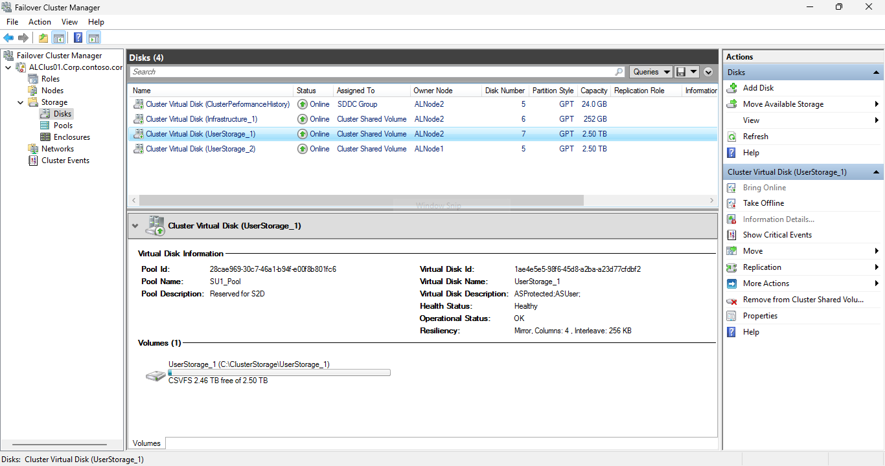

With this configuration, if you would try to fill the virtual disks, you would need 10TB capacity (two 2.5TB volumes with 2-way mirror = 2 x 2.5 x 2 = 10). But in current configuration Pool capacity is just 8TB.

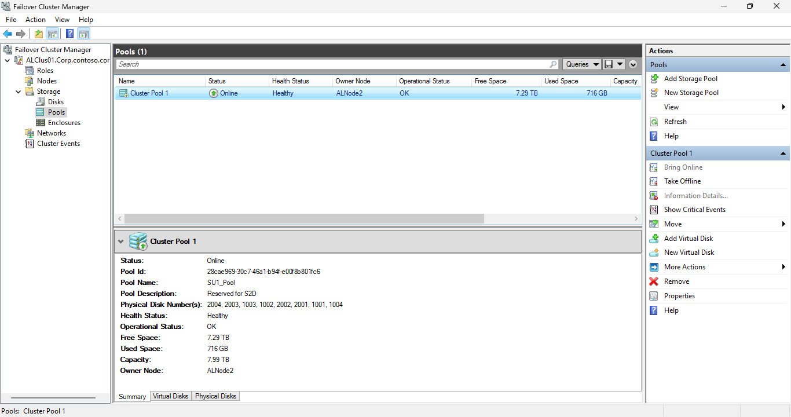

Interestingly in Portal you can see 3 TB available size (as Azure Portal rounds up)

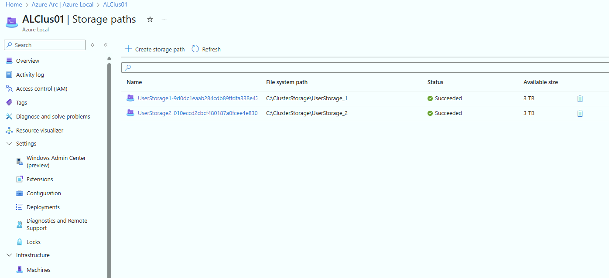

And cluster performance metrics numbers are weird as well

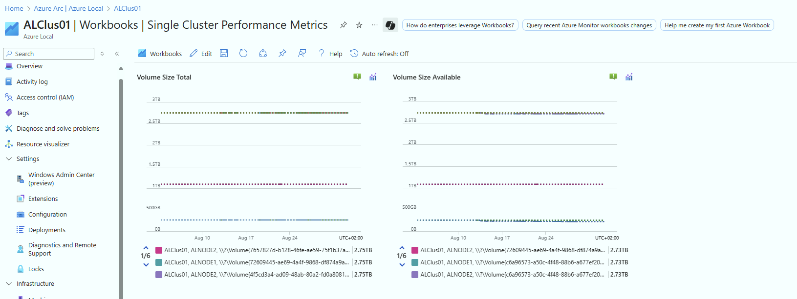

Let's explore volumes with PowerShell to see exact numbers

```PowerShell
$ClusterName="ALClus01"
Get-VirtualDisk -CimSession $ClusterName | Sort-Object FriendlyName

```

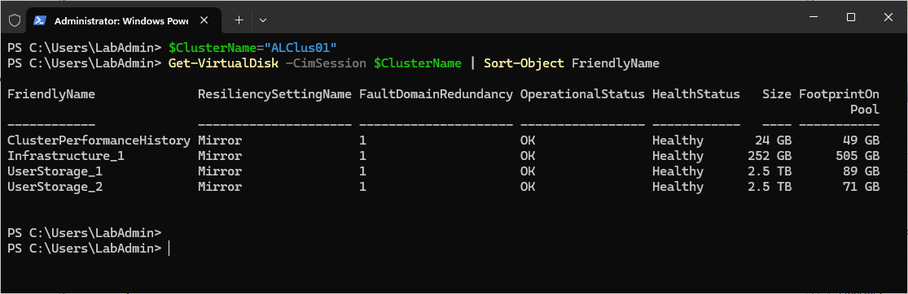


Resume:  

As you can see, numbers in portal are way off, and cannot be trusted.

To control volume size (and consumption) it's worth calculating size "manually" and creating your own volumes.

## Theory: Column size, Extent and Slabs

```PowerShell
#Exploring columns, extents and slabs

$ClusterName="ALClus01"
#let's create fixed volume with 1 and 2 columns

Enter-PSSession $ClusterName #as we would need to increase MaxEvenlopeSize to transfer extents in variable...

New-VirtualDisk -FriendlyName 1ColumnFixed -StoragePoolFriendlyName SU* -ResiliencySettingName Mirror -Size 1TB -ProvisioningType Fixed -NumberOfColumns 1 -NumberOfDataCopies 2
New-VirtualDisk -FriendlyName 2ColumnsFixed -StoragePoolFriendlyName SU* -ResiliencySettingName Mirror -Size 1TB -ProvisioningType Fixed -NumberOfColumns 2 -NumberOfDataCopies 2
New-VirtualDisk -FriendlyName 4ColumnsFixed -StoragePoolFriendlyName SU* -ResiliencySettingName Mirror -Size 1TB -ProvisioningType Fixed -NumberOfColumns 4 -NumberOfDataCopies 2

#explore extents
$VirtualDisk = Get-VirtualDisk -FriendlyName 1ColumnFixed
$Extents=$VirtualDisk | Get-PhysicalExtent -CimSession $ClusterName | Where-Object VirtualDiskUniqueID -eq $VirtualDisk.UniqueId

#explore extent properties
$extents[0]

#extent size is 1GB
$extents[0].Size/1GB

#group different copies (2 copies, 1024*1GB*2=2TB consumed)
$Extents | group Copynumber -NoElement

#explore first few extents
$Extents[0..11] | Ft ColumnNumber,CopyNumber,PhysicalDiskUniqueID,VirtualDiskOffset

#let's explore extents on volume with 2 columns
$VirtualDisk = Get-VirtualDisk -FriendlyName 2ColumnsFixed
$Extents=$VirtualDisk | Get-PhysicalExtent -CimSession $ClusterName | Where-Object VirtualDiskUniqueID -eq $VirtualDisk.UniqueId
$Extents[0..11] | Ft ColumnNumber,CopyNumber,PhysicalDiskUniqueID,VirtualDiskOffset

#let's explore extents on volume with 4 columns
$VirtualDisk = Get-VirtualDisk -FriendlyName 4ColumnsFixed
$Extents=$VirtualDisk | Get-PhysicalExtent -CimSession $ClusterName | Where-Object VirtualDiskUniqueID -eq $VirtualDisk.UniqueId
$Extents[0..11] | Ft ColumnNumber,CopyNumber,PhysicalDiskUniqueID,VirtualDiskOffset

Exit-PSSession
```

Let's summarize what you can learn from above:

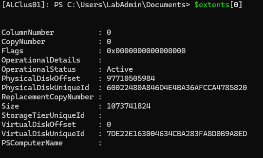

* Extent size is 1GB (Size)
* Each extent has ColumnNumber and CopyNumber
* You can learn which slab is it by looking at VirtualDiskOffset

## Column/Extent/Slab deep dive

### column, 2-way mirror, 2 nodes
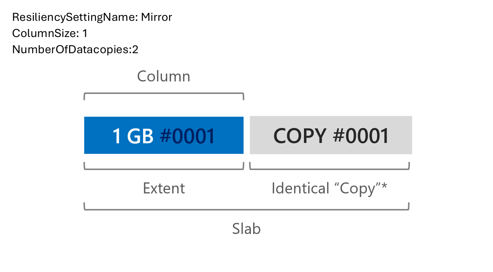

```PowerShell
$ClusterName="ALClus01"

Invoke-Command -ComputerName $ClusterName {
    $VirtualDisk = Get-VirtualDisk -FriendlyName 1ColumnFixed
    $Extents=$VirtualDisk | Get-PhysicalExtent -CimSession $ClusterName | Where-Object VirtualDiskUniqueID -eq $VirtualDisk.UniqueId
    $Extents[0..5]| Ft ColumnNumber,CopyNumber,PhysicalDiskUniqueID,VirtualDiskOffset
}

```

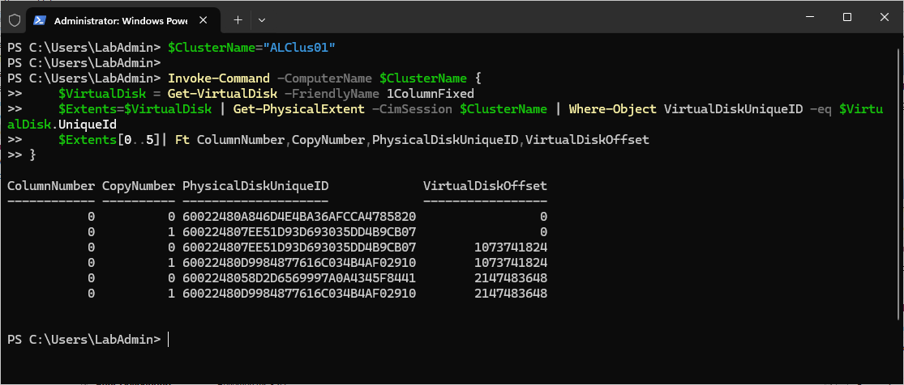

### columns, 2-way mirror, 2 nodes

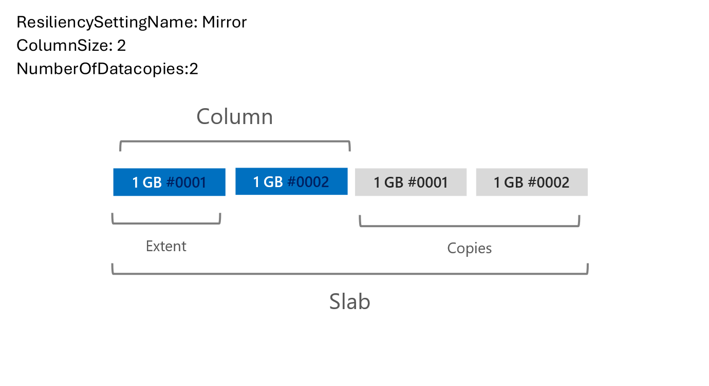

```PowerShell
$ClusterName="ALClus01"

Invoke-Command -ComputerName $ClusterName {
    $VirtualDisk = Get-VirtualDisk -FriendlyName 2ColumnsFixed
    $Extents=$VirtualDisk | Get-PhysicalExtent -CimSession $ClusterName | Where-Object VirtualDiskUniqueID -eq $VirtualDisk.UniqueId
    $Extents[0..11]| Ft ColumnNumber,CopyNumber,PhysicalDiskUniqueID,VirtualDiskOffset
}

```

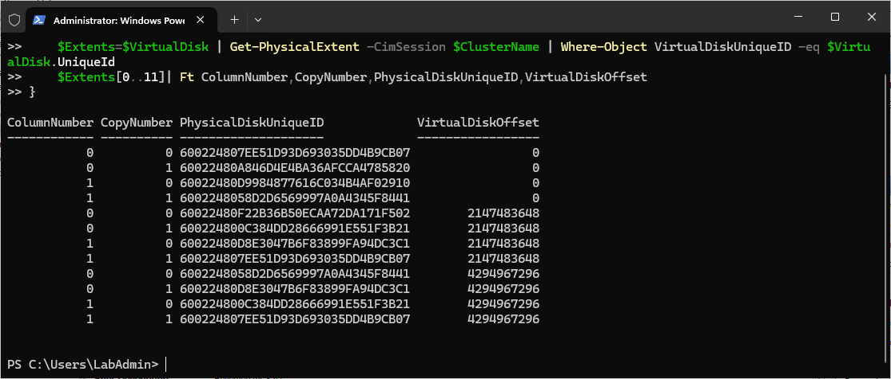

### columns, 2-way mirror, 2 nodes

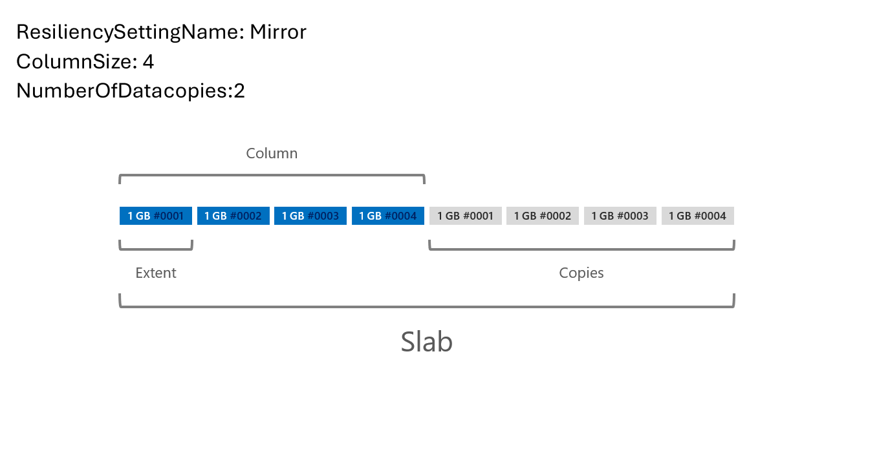

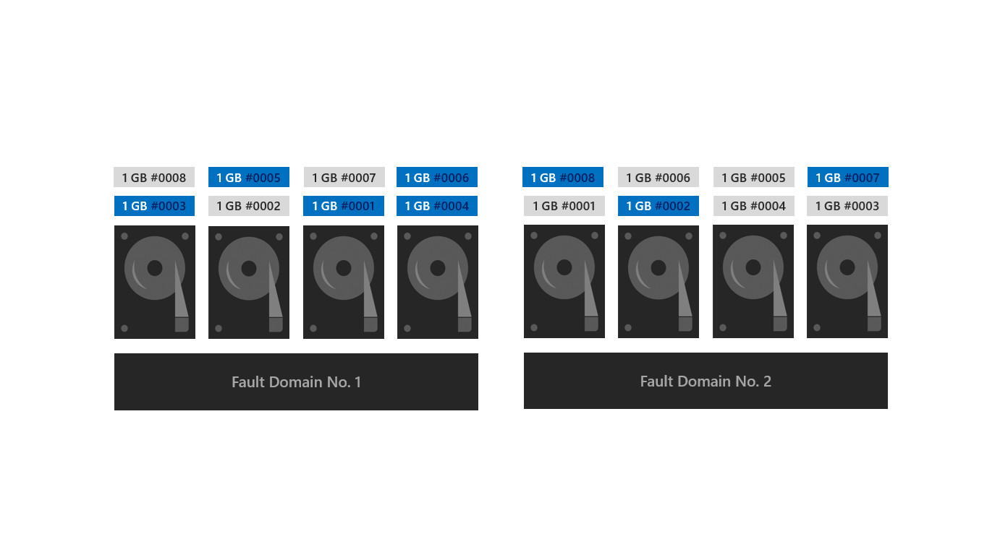

```PowerShell
$ClusterName="ALClus01"

Invoke-Command -ComputerName $ClusterName {
    $VirtualDisk = Get-VirtualDisk -FriendlyName 4ColumnsFixed
    $Extents=$VirtualDisk | Get-PhysicalExtent -CimSession $ClusterName | Where-Object VirtualDiskUniqueID -eq $VirtualDisk.UniqueId
    $Extents[0..15]| Ft ColumnNumber,CopyNumber,PhysicalDiskUniqueID,VirtualDiskOffset
}

```

## Are default volumes "correct"?

Well, this is great question. 

* is the size right? Maybe. But if workload expands beyond some threshold, you will have an issue as you will run out of space.

* is the column size right? Maybe. But if you loose one disk, volumes will not repair until you replace the failed disk as column isolation is configured to PhysicalDisk (so you cant have columns with different column number and same offset on the same physical disk).

* Windows Admin Center recommends (in this case) to keep capacity of 2 disks (in this case 2TB) as a recommended reserve, but you cant rebuild anyway as in this case is default volume NumberOfColumns4 and it won't rebuild. So you can either ignore recommended capacity, or plan a volume that will fit available space and will be able to rebuild (column size 3 and lower)

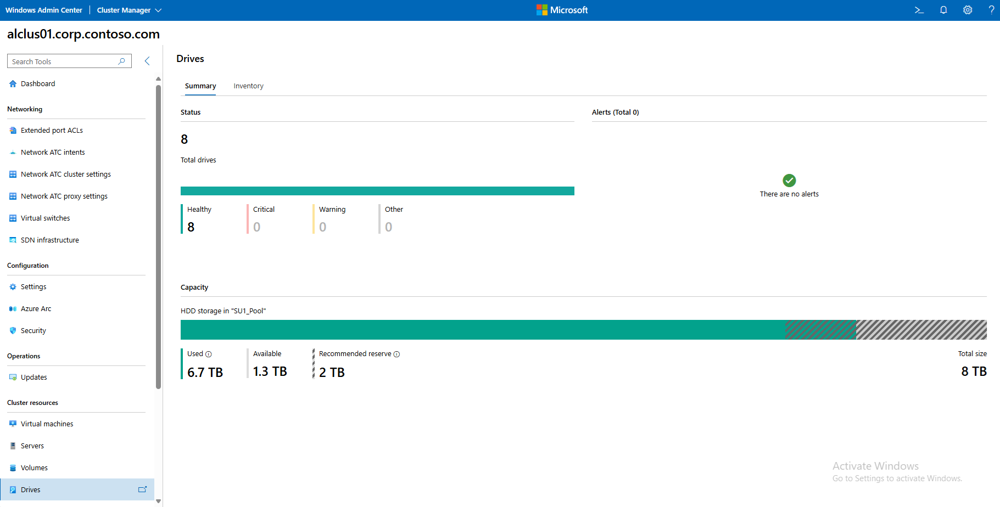

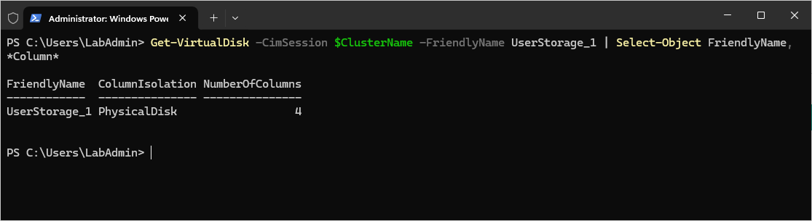

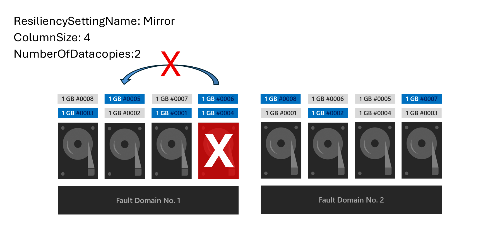


## Delete Default Volumes 

```PowerShell
$ClusterName="ALClus01"

#install az cli
    Start-BitsTransfer -Source https://aka.ms/installazurecliwindows -Destination $env:userprofile\Downloads\AzureCLI.msi
    Start-Process msiexec.exe -Wait -ArgumentList "/I  $env:userprofile\Downloads\AzureCLI.msi /quiet"
    # add az to enviromental variables so no posh restart is needed
    [System.Environment]::SetEnvironmentVariable('PATH',$Env:PATH+';C:\Program Files (x86)\Microsoft SDKs\Azure\CLI2\wbin')

#login
    az login --use-device-code

# add Az extension https://learn.microsoft.com/en-us/cli/azure/stack-hci-vm?view=azure-cli-latest
    az extension add --name stack-hci-vm

#delete storage paths
$StoragePaths=Invoke-Command -ComputerName $CLusterName -ScriptBlock {
    az stack-hci-vm storagepath list | ConvertFrom-Json
}
foreach ($StoragePath in $StoragePaths){
    az stack-hci-vm storagepath delete --resource-group $StoragePath.ResourceGroup --name $StoragePath.Name --yes
}
#delete UserStorage virtual disks
Get-VirtualDisk -CimSession $ClusterName -FriendlyName UserStorage* | Remove-VirtualDisk #-Confirm:0
#and the disks we created
Get-VirtualDisk -CimSession $ClusterName -FriendlyName *Column** | Remove-VirtualDisk #-Confirm:0

```

## Create Custom Volumes (with reserve)

```PowerShell
$ClusterName="ALClus01"
#region create volumes
    #calculate size
        #calculate reserve
        $pool=Get-StoragePool -CimSession $ClusterName | Where-Object OtherUsageDescription -eq "Reserved for S2D"
        $HDDCapacity= ($pool |Get-PhysicalDisk -CimSession $clustername | where mediatype -eq HDD | Measure-Object -Property Size -Sum).Sum
        $HDDMaxSize=  ($pool |Get-PhysicalDisk -CimSession $clustername | where mediatype -eq HDD | Measure-Object -Property Size -Maximum).Maximum
        $SSDCapacity= ($pool |Get-PhysicalDisk -CimSession $clustername | where mediatype -eq SSD | where usage -ne journal | Measure-Object -Property Size -Sum).Sum
        $SSDMaxSize=  ($pool |Get-PhysicalDisk -CimSession $clustername | where mediatype -eq SSD | where usage -ne journal | Measure-Object -Property Size -Maximum).Maximum

        $numberofNodes=(Get-ClusterNode -Cluster $clustername).count
        if ($numberofNodes -le 2){
            if ($SSDCapacity){
            $SSDCapacityToUse=$SSDCapacity-($numberofNodes*$SSDMaxSize)-700GB #700GB just some reserve (25*2 = perfhistory + 252*2 Infrastructure volume)
            $sizeofvolumeonSSDs=$SSDCapacityToUse/2/$numberofNodes
            }
            if ($HDDCapacity){
            $HDDCapacityToUse=$HDDCapacity-($numberofNodes*$HDDMaxSize)-700GB #700GB just some reserve (25*2 = perfhistory + 252*2 Infrastructure volume)
            $sizeofvolumeonHDDs=$HDDCapacityToUse/2/$numberofNodes
            }
        }else{
            if ($SSDCapacity){
            $SSDCapacityToUse=$SSDCapacity-(3*$SSDMaxSize)-1000GB #1000GB just some reserve (25*3 = perfhistory + 252*3 Infrastructure volume)
            $sizeofvolumeonSSDs=$SSDCapacityToUse/3/$numberofNodes
            }
            if ($HDDCapacity){
            $HDDCapacityToUse=$HDDCapacity-(3*$HDDMaxSize)-1000GB #1000GB just some reserve (25*3 = perfhistory + 252*3 Infrastructure volume)
            $sizeofvolumeonHDDs=$HDDCapacityToUse/3/$numberofNodes
            }
        }

    #calculate column size (just assuming that column size should not be larger than 6. but can be anything between 1-4 for sure)
        $numberofNodes=(Get-ClusterNode -Cluster $ClusterName).count
        $pool=Get-StoragePool -CimSession $ClusterName | Where-Object OtherUsageDescription -eq "Reserved for S2D"
        $ColumnSizeHDD= (($pool |Get-PhysicalDisk -CimSession $ClusterName | where mediatype -eq HDD).count/$numberofnodes)-1
        if ($ColumnSizeHDD -gt 6){$ColumnSizeHDD=6}
        $ColumnSizeSSD= (($pool |Get-PhysicalDisk -CimSession $ClusterName | where mediatype -eq HDD).count/$numberofnodes)-1
        if ($ColumnSizeSSD -gt 6){$ColumnSizeSSD=6}
    #create volumes
        #create volumes
        $Nodes=(Get-ClusterNode -Cluster $ClusterName).Name
        Foreach ($Node in $Nodes){
            if ($sizeofvolumeonHDDs){
                New-Volume -CimSession $ClusterName -FileSystem CSVFS_ReFS -StoragePool $pool -Size $sizeofvolumeonHDDs -FriendlyName "HDD_$Node" -MediaType HDD -NumberOfColumns $ColumnSizeHDD
            }
            if ($sizeofvolumeonSSDs){
                New-Volume -CimSession $ClusterName -FileSystem CSVFS_ReFS -StoragePool $pool -Size $sizeofvolumeonSSDs -FriendlyName "SSD_$Node" -MediaType SSD -NumberOfColumns $ColumnSizeSSD 
            }
        }
    #move volumes to owners
    foreach ($node in $nodes){
        Get-ClusterSharedVolume -Cluster $ClusterName -Name *$node* | Move-ClusterSharedVolume -Node $node
    }
#endregion
#region create paths
    <# Already done before
    #install az cli
        Start-BitsTransfer -Source https://aka.ms/installazurecliwindows -Destination $env:userprofile\Downloads\AzureCLI.msi
        Start-Process msiexec.exe -Wait -ArgumentList "/I  $env:userprofile\Downloads\AzureCLI.msi /quiet"
        # add az to enviromental variables so no posh restart is needed
        [System.Environment]::SetEnvironmentVariable('PATH',$Env:PATH+';C:\Program Files (x86)\Microsoft SDKs\Azure\CLI2\wbin')

    #login
        az login --use-device-code

    # add Az extension https://learn.microsoft.com/en-us/cli/azure/stack-hci-vm?view=azure-cli-latest
        az extension add --name stack-hci-vm
    #>
    
    $AzureStackHCI= Invoke-Command -ComputerName $ClusterName -ScriptBlock {Get-AzureStackHCI}
    $ResourceGroupName=($AzureStackHCI).AzureResourceUri -split "/" | Select-Object -Index 4
    $SubscriptionID=($AzureStackHCI).AzureResourceUri -split "/" | Select-Object -Index 2
    $Region=($AzureStackHCI).Region
    $CustomLocation="/subscriptions/$SubscriptionID/resourceGroups/$ResourceGroupName/providers/Microsoft.ExtendedLocation/customLocations/$(($AzureStackHCI).AzureResourceName)"

    #create paths
    Foreach ($Node in $Nodes){
        if ($sizeofvolumeonHDDs){
            az stack-hci-vm storagepath create --resource-group $ResourceGroupName --custom-location $CustomLocation --location $region --path "c:\ClusterStorage\HDD_$Node" --name "HDD_$Node"
        }
        if ($sizeofvolumeonSSDs){
            az stack-hci-vm storagepath create --resource-group $ResourceGroupName --custom-location $CustomLocation --location $region --path "c:\ClusterStorage\SSD_$Node" --name "SSD_$Node"
        }
    }
#endregion

#encrypt (BitLocker) TBD https://learn.microsoft.com/en-us/azure/azure-local/manage/manage-bitlocker

```

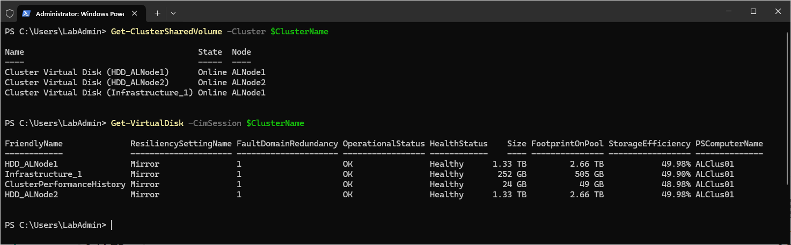

Pool has now recommended reserve

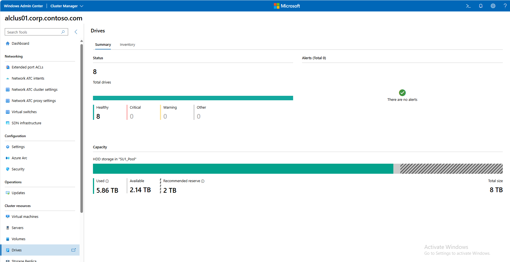

Number of columns is 3, therefore it will rebuild if one disk will fail

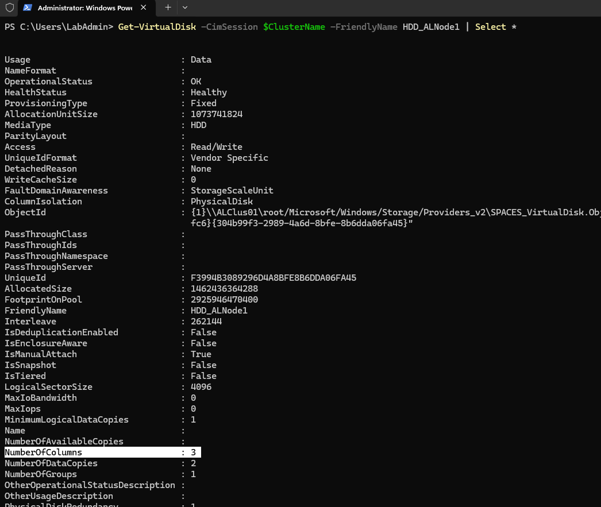

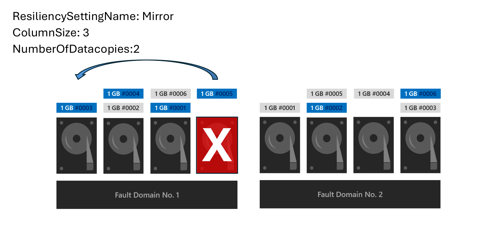


