# Simplified Machine Provisioning (Preview)


## About the lab

In this lab you will learn about [Simplified Machine Provisioning](https://techcommunity.microsoft.com/blog/azurearcblog/announcing-public-preview-simplified-machine-provisioning-for-azure-local/4496811)

Simplified provisioning creates .pem file (ownership voucher) if booted from USB. In this scenario (just to test it) we will boot from iso and pick up ownership voucher using scp or/and with [Configurator App for Azure Local](https://aka.ms/ConfiguratorAppForHCI)

## Prerequisites

As prerequisite, download provision-os.iso that is part of [provisioning package](https://aka.ms/provision/software/2604). You can download up-to-date version at https://portal.azure.com/#servicemenu/Microsoft_Azure_ArcCenterUX/AzureArcCenterHub/provisioningGetStarted

The ISO needs to be placed in your ParentDisks folder

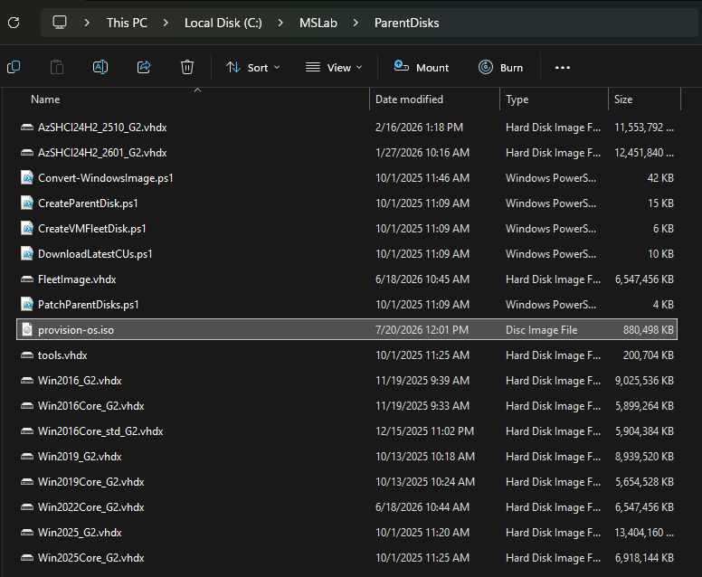

## Labconfig

This labconfig will provision two SMP (Simplified Machine Provisioning) servers with memorystartupbytes 4GB (if you plan to deploy Azure Local instance, increase it to at least 16GB)

Notice, that secureboot is disabled

```PowerShell
$LabConfig=@{AllowedVLANs="1-10,711-719" ; DomainAdminName='LabAdmin'; AdminPassword='LS1setup!';  DCEdition='4'; Internet=$true ; AdditionalNetworksConfig=@(); VMs=@()}

#labconfig for nested virtualization (eith enough RAM to create ARC RB).
$LABConfig.VMs += @{ VMName = "SMPNode1" ; Configuration = 'S2D' ; AttachISO = 'provision-os.iso' ;SecureBoot="Disabled"; HDDNumber = 4 ; HDDSize= 2TB ; MemoryStartupBytes= 4GB; VMProcessorCount="Max" ; vTPM=$true ; NestedVirt=$true }
$LABConfig.VMs += @{ VMName = "SMPNode2" ; Configuration = 'S2D' ; AttachISO = 'provision-os.iso' ;SecureBoot="Disabled"; HDDNumber = 4 ; HDDSize= 2TB ; MemoryStartupBytes= 4GB; VMProcessorCount="Max" ; vTPM=$true ; NestedVirt=$true }

#Management machine
$LabConfig.VMs += @{ VMName = 'Management' ; ParentVHD = 'Win2025_G2.vhdx'; MGMTNICs=1 ; AddToolsVHD=$True }

```

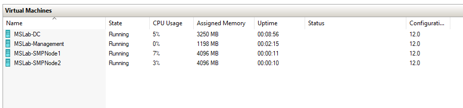

## Scenario

### Task01 - collect ownership vouchers

#### Step01 - connect to SMB Nodes console
    
    Once lab will start, open console to each of the SMP node and note the IP Address

    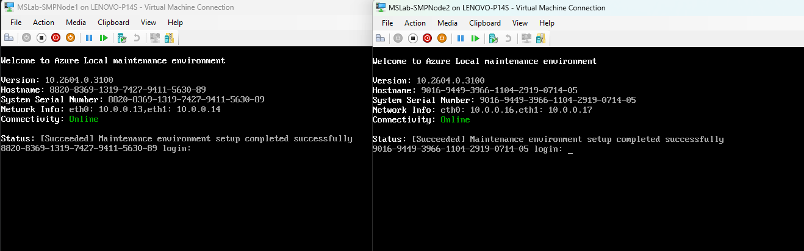

    In this case, Servers have IP addresses 10.0.0.13 and 16. Let's use it in below script to pull ownership vouchers

#### Step02 - connect to Management machine 

Log in into management machine (LabAdmin/LS1setup) and run following command from PowerShell to collect ownership vouchers to download folder.

Modify IP addresses as needed.

```PowerShell
    $Servers="10.0.0.16","10.0.0.18"
    $username="edgeuser"
    #password Password1
    foreach ($Server in $Servers){
        #create folder to download key
        new-item -ItemType directory -name $server -Path $env:userprofile\Downloads -ErrorAction Ignore
        scp -r $username@$server`:/var/staging/export/vouchers/**/*.pem  $env:userprofile\Downloads\$server
    }

```

The shell will ask if you trust the fingerprint. Simply type yes

Once asked for password, type Password1

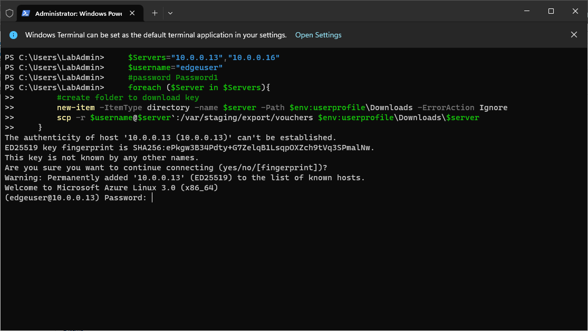

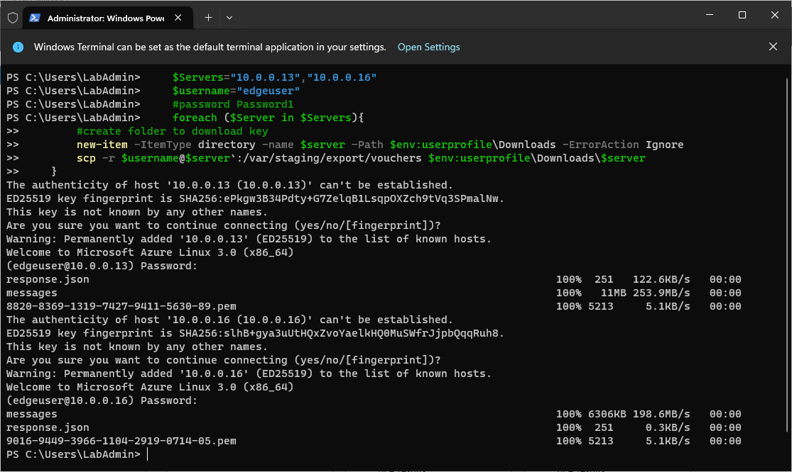

#### Step03 - validate if vouchers were downloaded

If pem files were successfully downloaded, you should be able to see it in Downloads folder

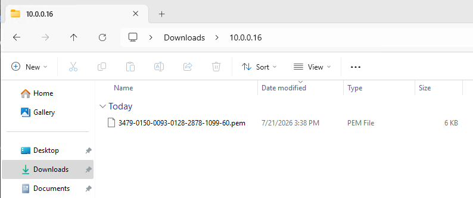

#### Step04 - download vouchers using Configurator App for Azure Local

In management machine, navigate to https://aka.ms/ConfiguratorAppForHCI and open the package to install Configurator app. It will also ask you to install .Net 9.0 Desktop runtime

In Configurator App, specify the IP Address into the Machine Name.

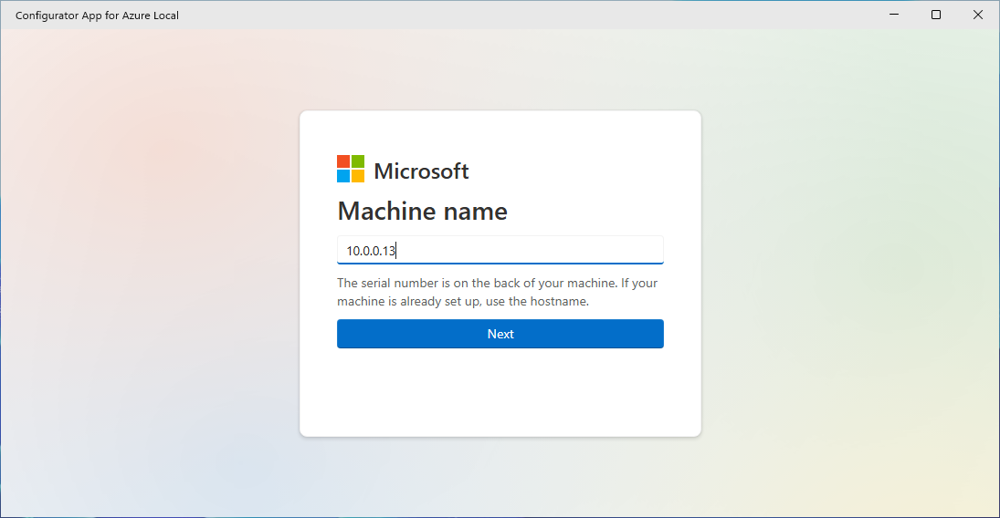

Username and password, specify edgeuser/Password1

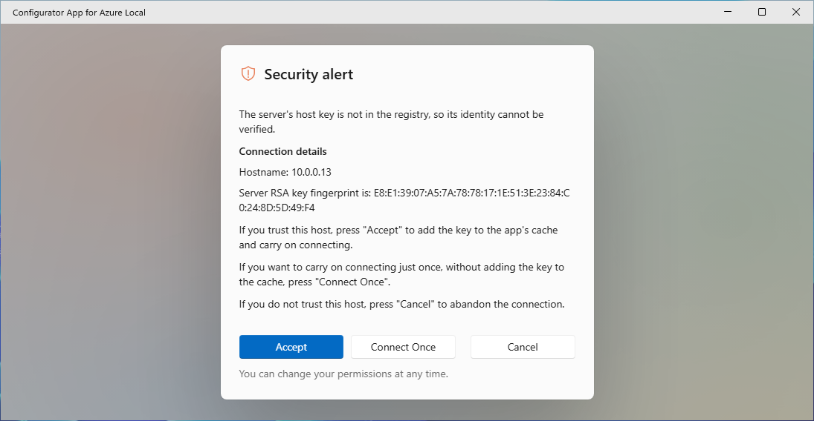

Now you can download ownership voucher

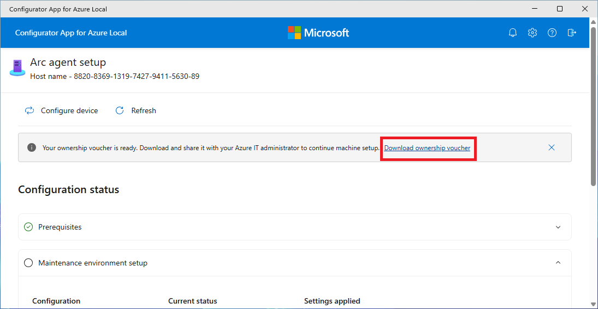


### Task02 - Add provisioned machines into portal

#### Step01 - Create Site

In Azure Portal, navigate to (Azure Arc Site Manager)[https://portal.azure.com/#servicemenu/Microsoft_Azure_ArcCenterUX/AzureArcCenterHub/sitesOverview]

If you dont have site yet, you'll need to create one per Subscription and one per ResourceGroup as on picture below.

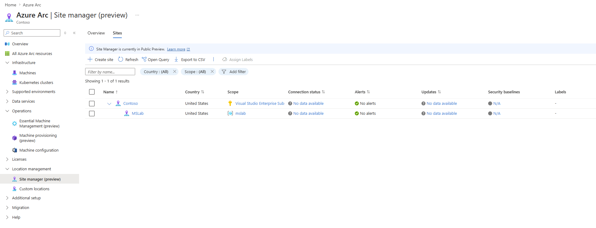

#### Step02 - Add Arc machines

In Azure Portal, navigate to (Azure Arc Machine provisioning)[https://portal.azure.com/#servicemenu/Microsoft_Azure_ArcCenterUX/AzureArcCenterHub/arcProvisioningDevices] and click on Provision

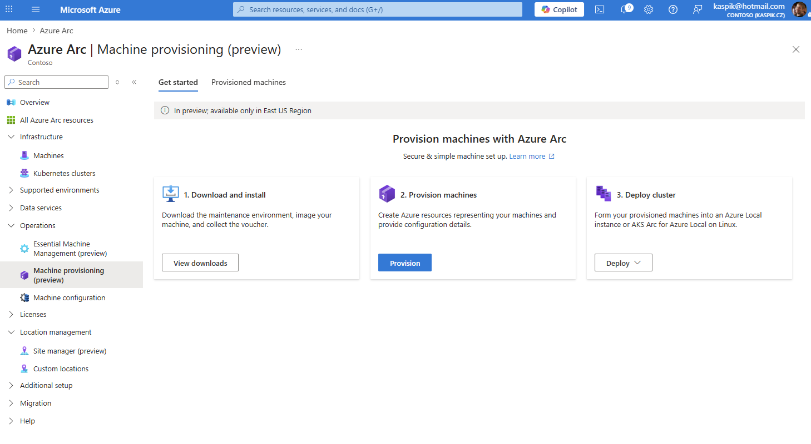

In Site select site you created (in this case MSLab) and add provisioned machines (vouchers)

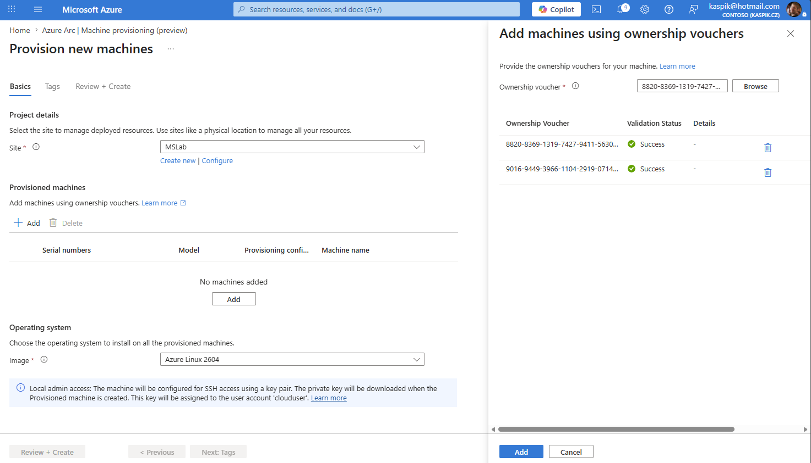

You can also rename machines (SMPNode1/SMPNode2)

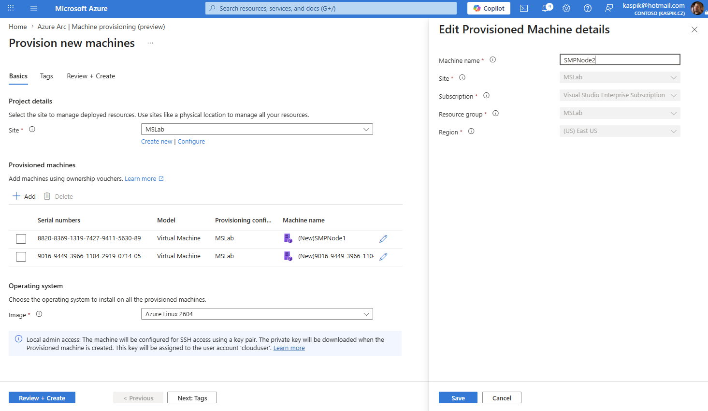

And don't forget to select Azure Local image

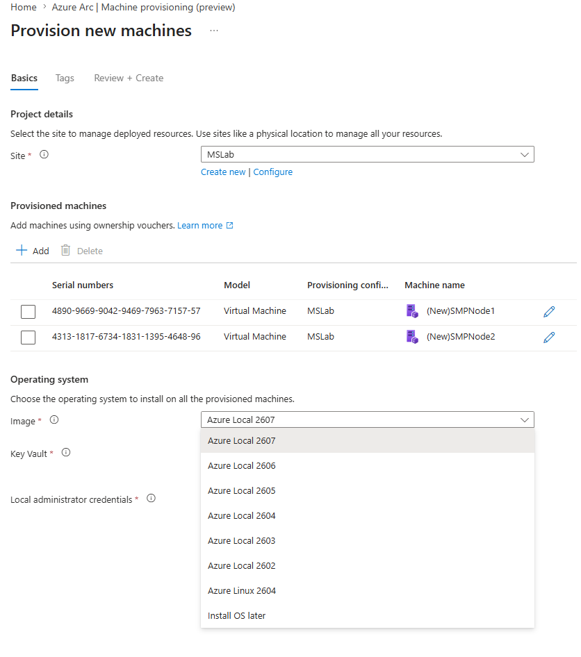


Create Key vault and provide local admin password

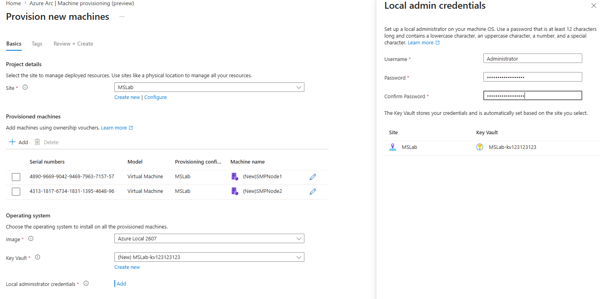

Once deployed, Azure Local OS will be installed

#### Step03 - Monitor Installation

Connect to SMPNode1/SMPNode2 and to Azure Portal (Arc Provisioning)[https://portal.azure.com/#servicemenu/Microsoft_Azure_ArcCenterUX/AzureArcCenterHub/arcProvisioningDevices] to check the status

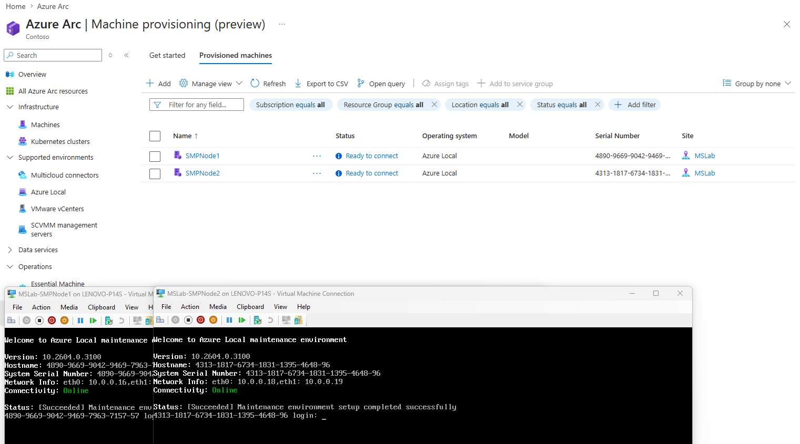

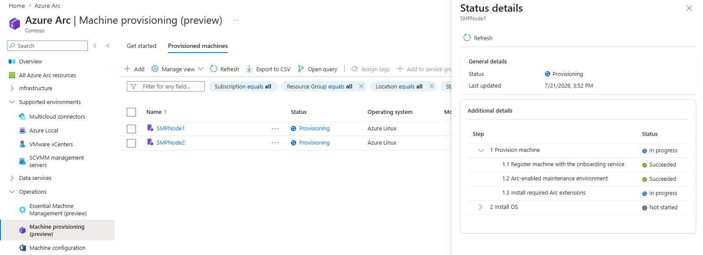
