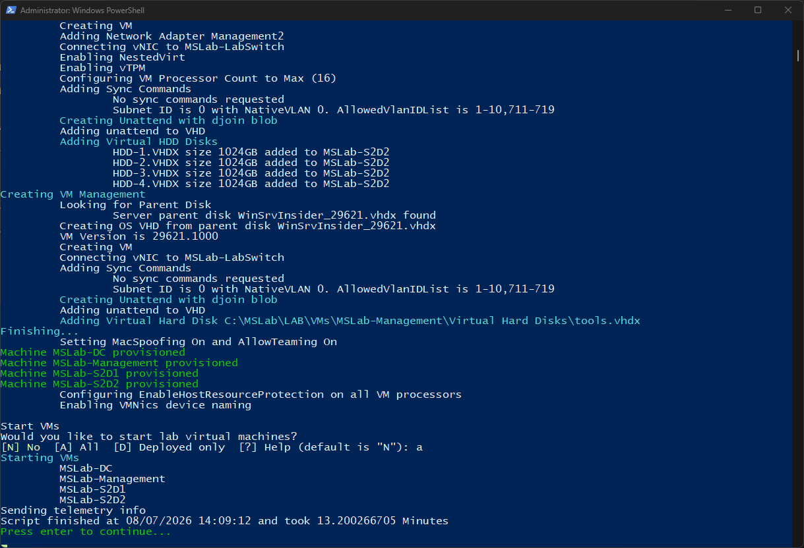
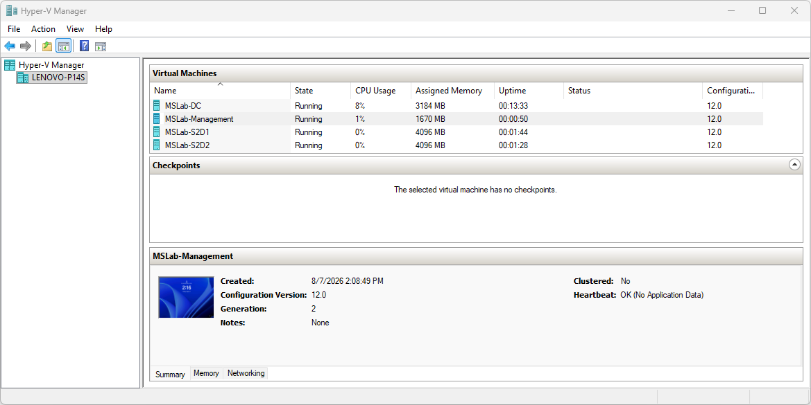
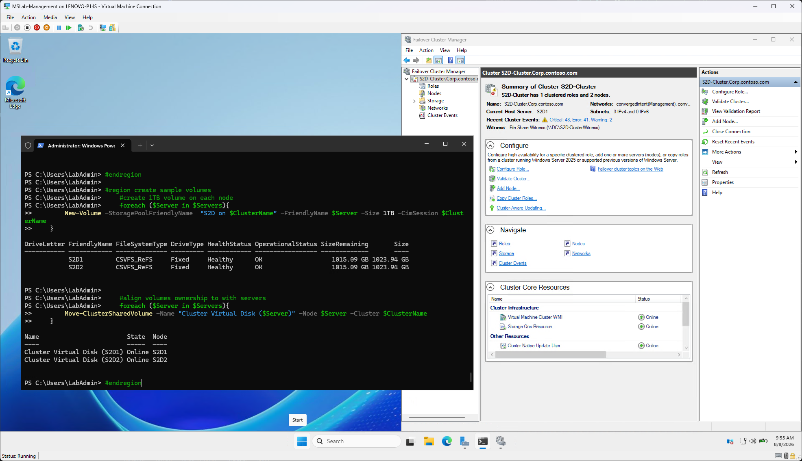
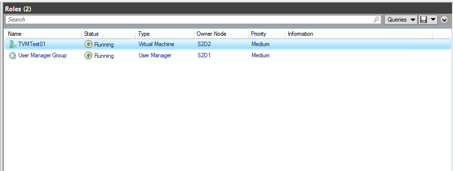
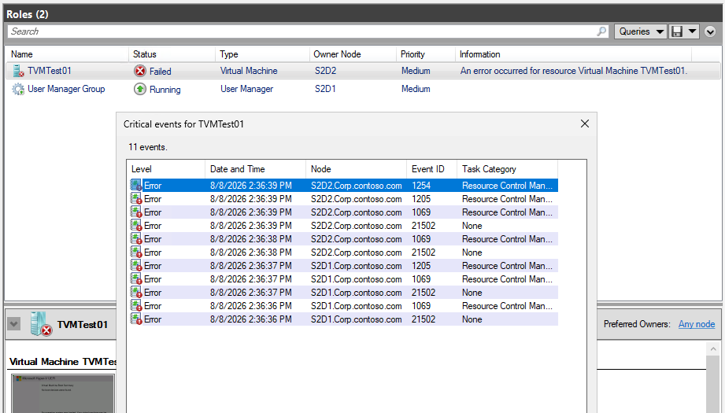
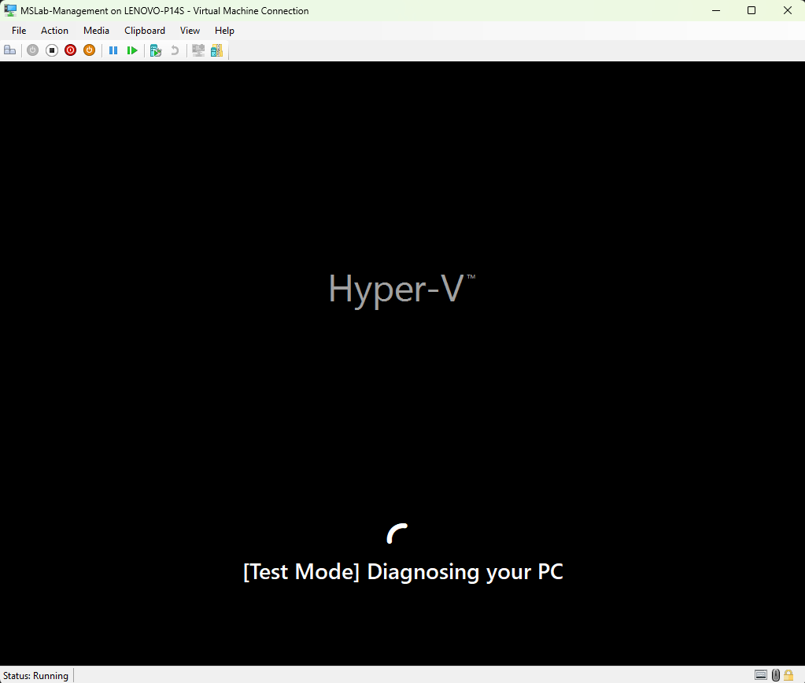

# Testing Windows Server Insider Preview

## About the lab

https://www.microsoft.com/en-us/software-download/windowsinsiderpreviewserver

Blogpost: https://techcommunity.microsoft.com/discussions/windowsserverinsiders/announcing-windows-server-vnext-preview-build-29621/4536572


## Labconfig

```PowerShell
$LabConfig=@{AllowedVLANs="1-10,711-719" ; DomainAdminName='LabAdmin'; AdminPassword='LS1setup!' ; DCEdition='4'; Internet=$true; AdditionalNetworksConfig=@(); VMs=@()}

#Windows Server Insider S2D nodes
$LABConfig.VMs += @{ VMName = "S2D1" ; Configuration = 'S2D' ; ParentVHD = 'WinSrvInsiderCore_29621.vhdx' ; HDDNumber = 4 ; HDDSize= 1TB ; MemoryStartupBytes= 4GB; VMProcessorCount="MAX" ; vTPM=$true ; NestedVirt=$true }
$LABConfig.VMs += @{ VMName = "S2D2" ; Configuration = 'S2D' ; ParentVHD = 'WinSrvInsiderCore_29621.vhdx' ; HDDNumber = 4 ; HDDSize= 1TB ; MemoryStartupBytes= 4GB; VMProcessorCount="MAX" ; vTPM=$true ; NestedVirt=$true }

#Management machine
$LabConfig.VMs += @{ VMName = 'Management' ; ParentVHD = 'WinSrvInsider_29621.vhdx'; MGMTNICs=1 ; AddToolsVHD=$True }
 
```






## Prerequisites

### Create Insider Lab Environment

To create insider parent image, download latest iso from [Windows Server Insiders Downloads](https://www.microsoft.com/en-us/software-download/windowsinsiderpreviewserver) and then follow steps in [01-Creating First Lab](../../HandsOnLabs/01-CreatingFirstLab/readme.md) with Labconfig above.

### Build your cluster

Once you're logged in the management machine, simply paste following PowerShell to build simple 2-node cluster

```PowerShell
#region Variables
    #servers list
    $Servers="S2D1","S2D2"
    #Cluster Name
    $ClusterName="S2D-Cluster"
    #Witness Server
    $WitnessServer="DC"
#endregion

#region install keys and activate servers

$LicenseKey="2KNJJ-33Y9H-2GXGX-KMQWH-G6H67"

    cscript c:\windows\system32\slmgr.vbs /ipk $using:LicenseKey
    cscript c:\windows\system32\slmgr.vbs /ato

Invoke-Command -ComputerName $Servers -ScriptBlock {
    cscript c:\windows\system32\slmgr.vbs /ipk $using:LicenseKey
    cscript c:\windows\system32\slmgr.vbs /ato
}

#check status
Get-CimInstance SoftwareLicensingProduct -CimSession $Servers |
    Where-Object { $_.PartialProductKey -and $_.ApplicationID -eq '55c92734-d682-4d71-983e-d6ec3f16059f' } |
    Select-Object Name, Description, LicenseStatus, PartialProductKey, PSComputerName,
                  @{N='LicenseStatusText';E={
                      switch ($_.LicenseStatus) {
                          0 {'Unlicensed'}
                          1 {'Licensed'}
                          2 {'OOBGrace'}
                          3 {'OOTGrace'}
                          4 {'NonGenuineGrace'}
                          5 {'Notification'}
                          6 {'ExtendedGrace'}
                          default {'Unknown'}
                      }
                  }}
#endregion

#region install required features
    #install features for management (assuming you are running these commands on Windows Server with GUI)
    Install-WindowsFeature -Name NetworkATC,RSAT-Clustering,RSAT-Clustering-Mgmt,RSAT-Clustering-PowerShell,RSAT-Hyper-V-Tools,RSAT-Feature-Tools-BitLocker-BdeAducExt,RSAT-AD-PowerShell,RSAT-AD-AdminCenter,RSAT-DHCP,RSAT-DNS-Server

    #install roles and features on servers
    #install Hyper-V using DISM if Install-WindowsFeature fails (if nested virtualization is not enabled install-windowsfeature fails)
    Invoke-Command -ComputerName $servers -ScriptBlock {
        $Result=Install-WindowsFeature -Name "Hyper-V" -ErrorAction SilentlyContinue
        if ($result.ExitCode -eq "failed"){
            Enable-WindowsOptionalFeature -FeatureName Microsoft-Hyper-V -Online -NoRestart 
        }
    }
    #define and install other features
    $features="Failover-Clustering","RSAT-Clustering-PowerShell","Hyper-V-PowerShell","NetworkATC","Data-Center-Bridging","RSAT-DataCenterBridging-LLDP-Tools","FS-SMBBW","System-Insights","RSAT-System-Insights"
    Invoke-Command -ComputerName $servers -ScriptBlock {Install-WindowsFeature -Name $using:features}
#endregion

#region restart servers to apply
    Restart-Computer $servers -Protocol WSMan -Wait -For PowerShell -Force
    Start-Sleep 20 #Failsafe as Hyper-V needs 2 reboots and sometimes it happens, that during the first reboot the restart-computer evaluates the machine is up
    #make sure computers are restarted
    Foreach ($Server in $Servers){
        do{$Test= Test-NetConnection -ComputerName $Server -CommonTCPPort WINRM}while ($test.TcpTestSucceeded -eq $False)
    }
#endregion

#region Create cluster
    #Create Cluster
    New-Cluster -Name $ClusterName -Node $servers
    Start-Sleep 5
    Clear-DnsClientCache

    ##Configure Witness on WitnessServer
        #Create new directory
            $WitnessName=$Clustername+"Witness"
            Invoke-Command -ComputerName $WitnessServer -ScriptBlock {new-item -Path c:\Shares -Name $using:WitnessName -ItemType Directory -ErrorAction Ignore}
            $accounts=@()
            $accounts+="$env:userdomain\$ClusterName$"
            $accounts+="$env:userdomain\$env:USERNAME"
            #$accounts+="$env:userdomain\Domain Admins"
            New-SmbShare -Name $WitnessName -Path "c:\Shares\$WitnessName" -FullAccess $accounts -CimSession $WitnessServer
        #Set NTFS permissions 
            Invoke-Command -ComputerName $WitnessServer -ScriptBlock {(Get-SmbShare $using:WitnessName).PresetPathAcl | Set-Acl}
        #Set Quorum
            Set-ClusterQuorum -Cluster $ClusterName -FileShareWitness "\\$WitnessServer\$WitnessName"
#endregion

#region Configure networking with NetATC https://techcommunity.microsoft.com/t5/networking-blog/network-atc-what-s-coming-in-azure-stack-hci-22h2/ba-p/3598442
    #make sure NetATC,FS-SMBBW and other required features are installed on servers
    Invoke-Command -ComputerName $Servers -ScriptBlock {
        Install-WindowsFeature -Name NetworkATC,Data-Center-Bridging,RSAT-Clustering-PowerShell,RSAT-Hyper-V-Tools,FS-SMBBW
    }

    #in virtual environment, then skip RDMA config

        Import-Module NetworkATC
        #virtual environment (skipping RDMA config)
        $AdapterOverride = New-NetIntentAdapterPropertyOverrides
        $AdapterOverride.NetworkDirect = 0
        Add-NetIntent -ClusterName $ClusterName -Name ConvergedIntent -Management -Compute -Storage -AdapterName "Ethernet","Ethernet 2" -AdapterPropertyOverrides $AdapterOverride -Verbose #-StorageVlans 1,2


    #check
    Start-Sleep 20 #let intent propagate a bit
    Write-Output "applying intent"
    do {
        $status=Get-NetIntentStatus -ClusterName $ClusterName
        Write-Host "." -NoNewline
        Start-Sleep 5
    } while ($status.ConfigurationStatus -contains "Provisioning" -or $status.ConfigurationStatus -contains "Retrying")

    #remove if necessary
        <#
        Invoke-Command -ComputerName $servers[0] -ScriptBlock {
            $intents = Get-NetIntent
            foreach ($intent in $intents){
                Remove-NetIntent -Name $intent.IntentName
            }
        }
        #>

        #if deploying in VMs, some nodes might fail (quarantined state) and even CNO can go to offline ... go to cluadmin and fix
            #Get-ClusterNode -Cluster $ClusterName | Where-Object State -eq down | Start-ClusterNode -ClearQuarantine
#endregion

#region Enable S2D
    #Enable-ClusterS2D
    Enable-ClusterS2D -CimSession $ClusterName -confirm:0 -Verbose

#endregion

#region create sample volumes
    #create 1TB volume on each node
    foreach ($Server in $Servers){
        New-Volume -StoragePoolFriendlyName  "S2D on $ClusterName" -FriendlyName $Server -Size 1TB -CimSession $ClusterName
    }

    #align volumes ownership to with servers
    foreach ($Server in $Servers){
        Move-ClusterSharedVolume -Name "Cluster Virtual Disk ($Server)" -Node $Server -Cluster $ClusterName
    }
#endregion


```




## Trusted Launch for virtual machines (TVMs)

More information about Trusted Launch - https://techcommunity.microsoft.com/blog/windowsservernewsandbestpractices/announcing-trusted-launch-for-virtual-machines-for-windows-server-insiders/4537082

### Enable TVM feature

```PowerShell
$Servers="S2D1","S2D2"

Invoke-command -ComputerName $Servers -ScriptBlock {
    #Set registry keys
    New-Item -Path "HKLM:\SOFTWARE\Microsoft\AszIgvmAgent" -Force 
    New-ItemProperty -Path "HKLM:\SOFTWARE\Microsoft\AszIgvmAgent" -Name "TvmWinServer" -Value 1 -PropertyType DWord -Force
    #enable feature
    Enable-WindowsOptionalFeature -Online -FeatureName "IsolatedGuestVm" -NoRestart
}

```

### Validate if TVM is running

```PowerShell
    Get-Service -ComputerName $Servers -Name "IGVmAgent"

```

### Create VM

```PowerShell
    New-VM -Name "TVMTest01" -Generation 2 -GuestStateIsolationType TrustedLaunch -SwitchName (get-virtualswitch -cimsession $Servers[0]).Name -Path C:\ClusterStorage\S2D1\ -CimSession $Servers[0]
    #add as Highly Available
    Add-ClusterVirtualMachineRole -VirtualMachine "TVMTest01" -Cluster $ClusterName
    #Start
    Start-ClusterGroup -Name "TVMTest01" -Cluster $ClusterName
```



### Test TVM - disable IGVmAgent

```PowerShell
    Invoke-Command -ComputerName $Servers -ScriptBlock {
        Stop-Service -Name "IGVmAgent"
    }
    #restart VMV
    Stop-ClusterGroup -Name  "TVMTest01" -Cluster $ClusterName
    Start-ClusterGroup -Name "TVMTest01" -Cluster $ClusterName

```



### Test TVM - enable IGVmAgent Again

```PowerShell
    Invoke-Command -ComputerName $Servers -ScriptBlock {
        Start-Service -Name "IGVmAgent"
    }
    #restart VMV
    Start-ClusterGroup -Name "TVMTest01" -Cluster $ClusterName

```


## Quick Machine recovery

https://learn.microsoft.com/en-us/windows/configuration/quick-machine-recovery/


```PowerShell
#run from management machine 
#Enable test mode
reagentc.exe /SetRecoveryTestmode
#Configure Windows to boot to Windows Recovery Environment on the next boot:
reagentc.exe /BootToRe
#reboot machine
Restart-Computer

```



