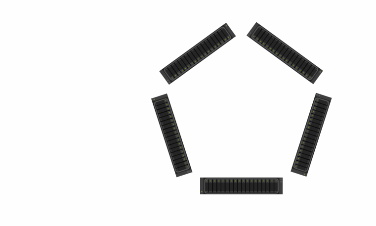
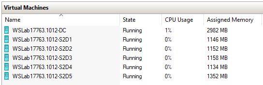

<!-- TOC -->

- [S2D and Direct Connectivity](#s2d-and-direct-connectivity)
    - [About the Lab](#about-the-lab)
    - [Lab](#lab)
    - [Prereq](#prereq)
    - [Region: Install features for S2D Cluster](#region-install-features-for-s2d-cluster)
    - [Region: Explore IPv6 Networks](#region-explore-ipv6-networks)
    - [Region: Create virtual switch and add static IP Addresses to interconnects](#region-create-virtual-switch-and-add-static-ip-addresses-to-interconnects)
    - [Region: Test and create Cluster](#region-test-and-create-cluster)
    - [Region: Configure Cluster networks](#region-configure-cluster-networks)
    - [Region: Enable Cluster S2D and create volumes](#region-enable-cluster-s2d-and-create-volumes)

<!-- /TOC -->

# S2D and Direct Connectivity

## About the Lab

This lab demonstrates feature in Windows Server 2019 that allows direct connection between nodes in cluster. This simulation will demonstrate 5 node cluster with 10 connections (between each node) as illustrated on Gif below.

The lab does not contain all best practices (for best practices visit [S2D HyperConverged Scenario](/Scenarios/S2D%20Hyperconverged/scenario.ps1))



## Lab

Notice 6 NICs present in VMs config (note: in Hyper-V you can have up to 8 NICs).



## Prereq

As prerequisite, you must run following script **from hyper-v host** to configure VLANs on each NIC (to simulate different networks for each pair of connection)

Also make sure, you have latest deploy.ps1 as [I excluded DC from setting trunk on Management vNIC](https://github.com/microsoft/WSLab/commit/7326d54b063a512c9734adb1853e26a9f7550ffa)

```PowerShell
$Servers="s2d1","s2d2","s2d3","s2d4","s2d5"
$serverscount=$servers.Count

#configure VLANs to simulate direct connection
$serverset1=$servers[0..($serverscount-2)]
$serverset2=$servers[1..($serverscount-1)]

#configure VLANs to simulate direct connection for side 1
$number=$serverscount-1 #will be used to select ports
$VLANNumber=1 #will be increased each time Netadapter is configured
foreach ($server in $serverset1){
    $ports=Get-VMNetworkAdapter -VMName *$server | Sort-Object Name | Select-Object -Last ($serverscount-1)
    foreach ($port in ($ports | Select-Object -Last $number)){
        $port | Set-VMNetworkAdapterVlan -Untagged
        $port | Set-VMNetworkAdapterVlan -VlanId $VLANNumber -Access
        $VLANNumber++
    }
    $number--
}

#configure VLANs to simulate direct connection for side 2
$number=$serverscount-1 #will be used to select servers
$VLANNumber=1 #will be increased each time Netadapter is configured
while ($number -ge 1){
    foreach ($server in ($serverset2 | Select-Object -Last $number)){
        $ports = Get-VMNetworkAdapter -VMName *$server | Sort-Object Name | Select-Object -Last ($serverscount-1)
        $port = $ports | Select-Object -Last $number | Select-Object -First 1
        $port | Set-VMNetworkAdapterVlan -Untagged
        $port | Set-VMNetworkAdapterVlan -VlanId $VLANNumber -Access
        $VLANNumber++
    }
    $number--
}

#validate VLANs
Get-VMNetworkAdapterVlan -VMName * | Where-Object AccessVlanID -ne 0 | Sort-Object AccessVlanId | Format-Table -GroupBy AccessVLANID

#start VMs
foreach ($server in $servers){
    Start-VM -VMName *$server
}
 
```

## Region: Install features for S2D Cluster

From now, run all code from DC.

Following code will install management features to DC and will install necessary features to S2D Nodes

## Region: Explore IPv6 Networks

Following code will query last n-1 adapters (n is number of nodes) and post it's IPV6 address with subnet ID. Notice, that using just autoconfig IP Addresses is not reliable as subnets are not unique and sometimes there is only one IP in subnet.

## Region: Create virtual switch and add static IP Addresses to interconnects

<TBD>

## Region: Test and create Cluster

<TBD>

## Region: Configure Cluster networks

<TBD>

## Region: Enable Cluster S2D and create volumes

<TBD>