# Securing LDAP

<!-- TOC -->

- [Securing LDAP](#securing-ldap)
    - [About the lab](#about-the-lab)
    - [Prerequisites](#prerequisites)
    - [The Lab](#the-lab)
        - [Enable Logging of unsecured connections](#enable-logging-of-unsecured-connections)
        - [Query logs from collector](#query-logs-from-collector)
        - [Enforce LDAP Server integrity on Domain Controller](#enforce-ldap-server-integrity-on-domain-controller)
        - [Configure certificate on Domain Controller and enable LDAPS](#configure-certificate-on-domain-controller-and-enable-ldaps)
        - [Configure LDAPS on DC](#configure-ldaps-on-dc)
        - [Configure Grafana to use LDAPS](#configure-grafana-to-use-ldaps)

<!-- /TOC -->

## About the lab

This lab demonstrates how to detect and secure application that is using unsecured LDAP. For more information you can visit this [link](https://techcommunity.microsoft.com/t5/core-infrastructure-and-security/ldap-channel-binding-and-ldap-signing-requirements-march-update/ba-p/921536) or this [link](https://secureinfra.blog/2019/08/03/step-by-step-enforce-require-ldap-signing-on-domain-controllers-part-1/)

As application, scenario script will setup Grafana that is using LDAP on port 389. After finishing [scenario.ps1](Scenario.ps1), you will have also configured collector, that will receive all.

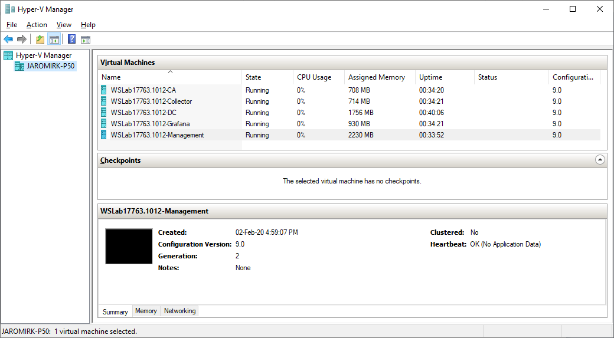

## Prerequisites

Paste [scenario.ps1](Scenario.ps1) into Management machine to setup Grafana, Collector and DC to send events into collector.

Collapsed regions in scenario.ps1

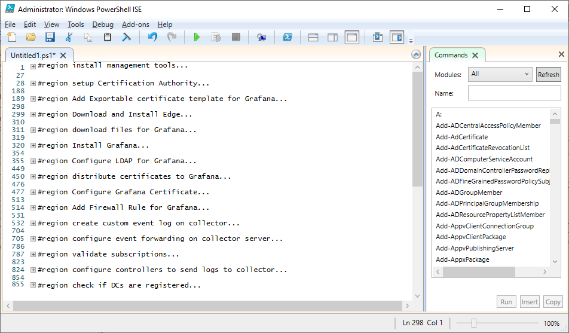

Grafana running on server Grafana.

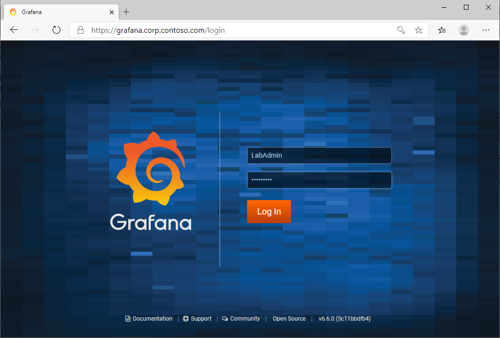

Redirected Events with Custom logs created on server Collector.

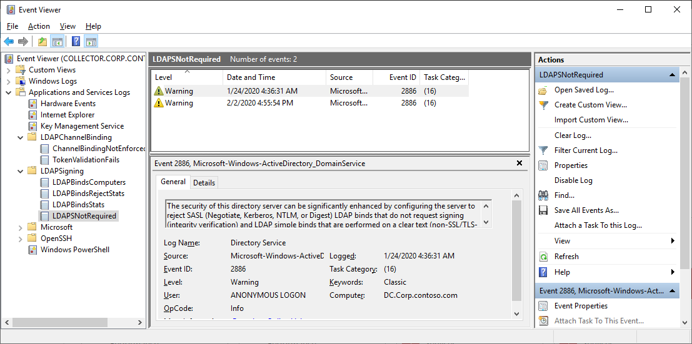

WEF Subscriptions in Collector server.

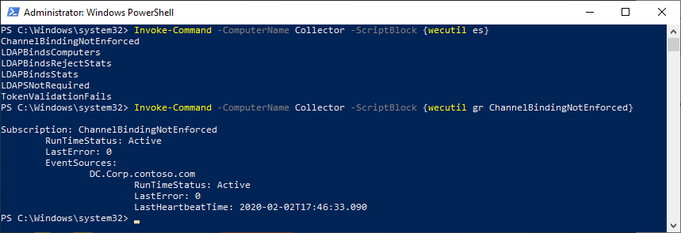

## The Lab

By default, Domain Controller will log only statistics about how many unsecured connections were made in last 24 hours. In Lab you will not find any of those, as lab will probably run for less than this.

### Enable Logging of unsecured connections

To enable logging of unsecured connection where user and computer will be listed run following PowerShell commands. In following script is also codeblock that disables logging. DC will start immediately logging (no restart is needed)

```PowerShell
$DCs="DC" #can be multiple domain controllers

#enable logging
Invoke-Command -ComputerName $DCs -ScriptBlock {
    Reg Add HKLM\SYSTEM\CurrentControlSet\Services\NTDS\Diagnostics /v "16 LDAP Interface Events" /t REG_DWORD /d 2 /f
}

#disable logging
<#
Invoke-Command -ComputerName $DCs -ScriptBlock {
    Reg Add HKLM\SYSTEM\CurrentControlSet\Services\NTDS\Diagnostics /v "16 LDAP Interface Events" /t REG_DWORD /d 0 /f
}
#>
 
```

To Generate event just log in into Grafana using LabAdmin\LS1setup! credentials in following web page https://grafana.corp.contoso.com


You can then query message from DC using following command

```PowerShell
$DCs="DC" #can be multiple domain controllers

#grab message about unsecured connections from remote domain controllers
Invoke-Command -ComputerName $DCs -scriptblock {Get-WinEvent -FilterHashtable @{"ProviderName"="Microsoft-Windows-ActiveDirectory_DomainService";ID=2886}| select -Last 1} | Format-Table PSComputerName,TimeCreated,Message

#Collect log events from domain controllers
$EventLog=Invoke-Command -ComputerName $DCs -ScriptBlock {
    $events=Get-WinEvent -FilterHashtable @{"ProviderName"="Microsoft-Windows-ActiveDirectory_DomainService";Id=2889}
    $EventLog=@()
    ForEach ($Event in $Events) {
        # Convert the event to XML
        $eventXML = [xml]$Event.ToXml()
        # create custom object for all values
        $client=$eventxml.Event.EventData.data[0]
        $ipaddress=$client.SubString(0,$client.LastIndexOf(":"))
        $username=$eventxml.Event.EventData.data[1]
        Switch ($eventXML.event.EventData.Data[2]){
            0 {$BindType = "Unsigned"}
            1 {$BindType = "Simple"}
        }
        $EventLog += [PSCustomObject]@{
            "Client" = $client
            "IPAddress" = $ipaddress
            "DNSName" = [System.Net.DNS]::GetHostByAddress($IPAddress).Hostname
            "Username" = $UserName
            "BindType" = $BindType
            "TimeCreated" = $event.TimeCreated
        }
    }
    return $EventLog
}
$EventLog | Out-GridView
 
```

As you can see, it's not secure as both accounts credentials (the one that is being authenticated and another that is specified in LDAP.toml for logging into LDAP service) were exposed over network (as being sent as [simple BindType](https://docs.microsoft.com/en-us/openspecs/windows_protocols/ms-adts/6a5891b8-928e-4b75-a4a5-0e3b77eaca52)).

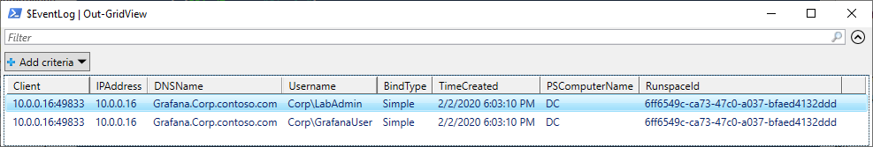

### Query logs from collector

You can also observe the same on collector server.

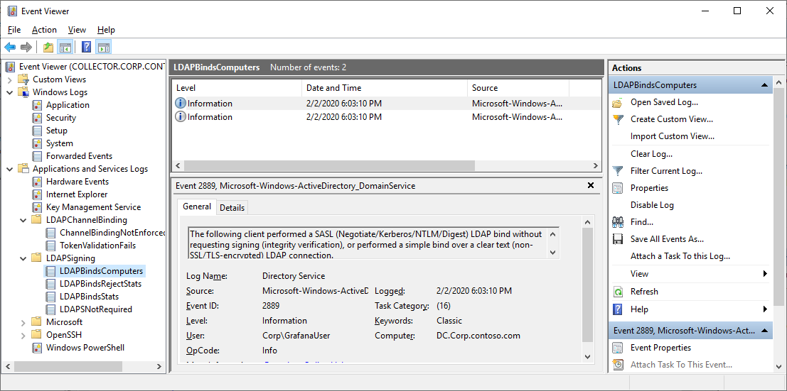

```PowerShell
$CollectorServerName="Collector"

#Collect log events from Collector
$EventLog=Invoke-Command -ComputerName $CollectorServerName -ScriptBlock {
    $events=Get-WinEvent -LogName "LDAPBindsComputers"
    $EventLog=@()
    ForEach ($Event in $Events) {
        # Convert the event to XML
        $eventXML = [xml]$Event.ToXml()
        # create custom object for all values
        $client=$eventxml.Event.EventData.data[0]
        $ipaddress=$client.SubString(0,$client.LastIndexOf(":"))
        $username=$eventxml.Event.EventData.data[1]
        Switch ($eventXML.event.EventData.Data[2]){
            0 {$BindType = "Unsigned"}
            1 {$BindType = "Simple"}
        }
        $EventLog += [PSCustomObject]@{
            "Client" = $client
            "IPAddress" = $ipaddress
            "DNSName" = [System.Net.DNS]::GetHostByAddress($IPAddress).Hostname
            "Username" = $UserName
            "BindType" = $BindType
            "TimeCreated" = $event.TimeCreated
            "DomainController" = $eventxml.Event.system.computer
        }
    }
    return $EventLog
}
$EventLog | Out-GridView
 
```

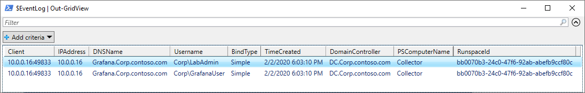

### Enforce LDAP Server integrity on Domain Controller

The next step would be to enforce to require LDAP signing (note: this will disable all applications to be authenticated without proper credentials)

```PowerShell
$DCs="DC" #can be multiple domain controllers

#enforce signing
Invoke-Command -ComputerName $DCs -ScriptBlock {
    Reg Add HKLM\SYSTEM\CurrentControlSet\Services\NTDS\Parameters /v "LDAPServerintegrity" /t REG_DWORD /d 2 /f
}

#configure it back to default
<#
Invoke-Command -ComputerName $DCs -ScriptBlock {
    Reg Add HKLM\SYSTEM\CurrentControlSet\Services\NTDS\Parameters /v "LDAPServerintegrity" /t REG_DWORD /d 1 /f
}
#>
 
```

New connection on Grafana will be refused

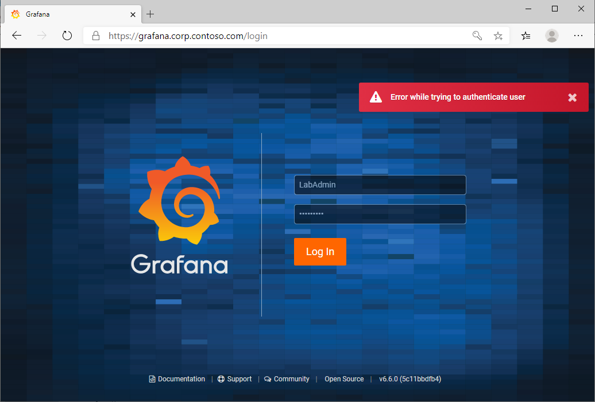

### Configure certificate on Domain Controller and enable LDAPS

Let's Configure certicate for LDAPS

```PowerShell
    #First import ActiveDirectory module to be able to create [Microsoft.ActiveDirectory.Management.ADPropertyValueCollection] type
    Import-Module ActiveDirectory
    Function Get-RandomHex {
        param ([int]$Length)
            $Hex = '0123456789ABCDEF'
            [string]$Return = $null
            For ($i=1;$i -le $length;$i++) {
                $Return += $Hex.Substring((Get-Random -Minimum 0 -Maximum 16),1)
            }
            Return $Return
        }

    Function IsUniqueOID {
    param ($cn,$TemplateOID,$Server,$ConfigNC)
        $Search = Get-ADObject -Server $Server `
            -SearchBase "CN=OID,CN=Public Key Services,CN=Services,$ConfigNC" `
            -Filter {cn -eq $cn -and msPKI-Cert-Template-OID -eq $TemplateOID}
        If ($Search) {$False} Else {$True}
    }

    Function New-TemplateOID {
    Param($Server,$ConfigNC)
        <#
        OID CN/Name                    [10000000-99999999].[32 hex characters]
        OID msPKI-Cert-Template-OID    [Forest base OID].[1000000-99999999].[10000000-99999999]  <--- second number same as first number in OID name
        #>
        do {
            $OID_Part_1 = Get-Random -Minimum 1000000  -Maximum 99999999
            $OID_Part_2 = Get-Random -Minimum 10000000 -Maximum 99999999
            $OID_Part_3 = Get-RandomHex -Length 32
            $OID_Forest = Get-ADObject -Server $Server `
                -Identity "CN=OID,CN=Public Key Services,CN=Services,$ConfigNC" `
                -Properties msPKI-Cert-Template-OID |
                Select-Object -ExpandProperty msPKI-Cert-Template-OID
            $msPKICertTemplateOID = "$OID_Forest.$OID_Part_1.$OID_Part_2"
            $Name = "$OID_Part_2.$OID_Part_3"
        } until (IsUniqueOID -cn $Name -TemplateOID $msPKICertTemplateOID -Server $Server -ConfigNC $ConfigNC)
        Return @{
            TemplateOID  = $msPKICertTemplateOID
            TemplateName = $Name
        }
    }

    Function New-Template {
    Param($DisplayName,$TemplateOtherAttributes)
    
        #grab DC
        $Server = (Get-ADDomainController -Discover -ForceDiscover -Writable).HostName[0]
        #grab Naming Context
        $ConfigNC = (Get-ADRootDSE -Server $Server).configurationNamingContext
        #Create OID
            $OID = New-TemplateOID -Server $Server -ConfigNC $ConfigNC
            $TemplateOIDPath = "CN=OID,CN=Public Key Services,CN=Services,$ConfigNC"
            $OIDOtherAttributes = @{
                    'DisplayName' = $DisplayName
                    'flags' = [System.Int32]'1'
                    'msPKI-Cert-Template-OID' = $OID.TemplateOID
            }
            New-ADObject -Path $TemplateOIDPath -OtherAttributes $OIDOtherAttributes -Name $OID.TemplateName -Type 'msPKI-Enterprise-Oid' -Server $Server
        #Create Template itself
            $TemplateOtherAttributes+= @{
                'msPKI-Cert-Template-OID' = $OID.TemplateOID
            }
            $TemplatePath = "CN=Certificate Templates,CN=Public Key Services,CN=Services,$ConfigNC"
            New-ADObject -Path $TemplatePath -OtherAttributes $TemplateOtherAttributes -Name $DisplayName -DisplayName $DisplayName -Type pKICertificateTemplate -Server $Server
    }

    $DisplayName="DomainControllerLegacyCSP_RSA"
    $TemplateOtherAttributes = @{
        'flags' = [System.Int32]'131692'
        'msPKI-Certificate-Application-Policy' = [Microsoft.ActiveDirectory.Management.ADPropertyValueCollection]@('1.3.6.1.5.5.7.3.1','1.3.6.1.5.5.7.3.2')
        'msPKI-Certificate-Name-Flag' = [System.Int32]'150994944'
        'msPKI-Enrollment-Flag' = [System.Int32]'41'
        'msPKI-Minimal-Key-Size' = [System.Int32]'2048'
        'msPKI-Private-Key-Flag' = [System.Int32]'101056768'
        'msPKI-RA-Signature' = [System.Int32]'0'
        'msPKI-Template-Minor-Revision' = [System.Int32]'1'
        'msPKI-Template-Schema-Version' = [System.Int32]'4'
        'pKIMaxIssuingDepth' = [System.Int32]'0'
        'ObjectClass' = [System.String]'pKICertificateTemplate'
        'pKICriticalExtensions' = [Microsoft.ActiveDirectory.Management.ADPropertyValueCollection]@('2.5.29.15')
        'pKIDefaultKeySpec' = [System.Int32]'1'
        'pKIExpirationPeriod' = [System.Byte[]]@('0','64','57','135','46','225','254','255')
        'pKIExtendedKeyUsage' = [Microsoft.ActiveDirectory.Management.ADPropertyValueCollection]@('1.3.6.1.5.5.7.3.1','1.3.6.1.5.5.7.3.2')
        'pKIKeyUsage' = [System.Byte[]]@('160')
        'pKIOverlapPeriod' = [System.Byte[]]@('0','128','166','10','255','222','255','255')
        'revision' = [System.Int32]'100'
    }
    New-Template -DisplayName $DisplayName -TemplateOtherAttributes $TemplateOtherAttributes

    #Publish Templates
    $TemplateNames="DomainControllerLegacyCSP_RSA"
    #grab DC
    $Server = (Get-ADDomainController -Discover -ForceDiscover -Writable).HostName[0]
    #grab Naming Context
    $ConfigNC = (Get-ADRootDSE -Server $Server).configurationNamingContext

    ### WARNING: Issues on all available CAs. Test in your environment.
    $EnrollmentPath = "CN=Enrollment Services,CN=Public Key Services,CN=Services,$ConfigNC"
    $CAs = Get-ADObject -SearchBase $EnrollmentPath -SearchScope OneLevel -Filter * -Server $Server
    foreach ($TemplateName in $TemplateNames){
        ForEach ($CA in $CAs) {
            Set-ADObject -Identity $CA.DistinguishedName -Add @{certificateTemplates=$TemplateName} -Server $Server
        }
    }
 
```

As result, Certificate Template for Domain Controller will be created

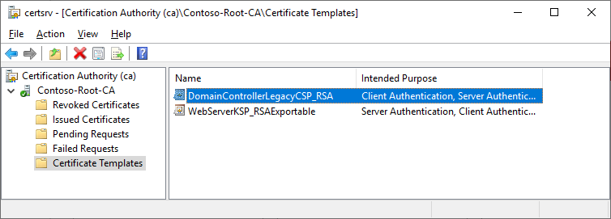

Next step would be to enroll certificate to Domain Controller

```PowerShell
#distribute certificates to Domain Controller(s)
#Enroll Computer2016 template to DC to enable LDAPS
$CertsToEnrollList=@()
$CertsToEnrollList+=@{ServerName="DC";TemplateName="DomainControllerLegacyCSP_RSA"}
#$CertsToEnrollList+=@{ServerName="DC02";TemplateName="DomainControllerLegacyCSP_RSA"}

# Install PSPKI module for managing Certification Authority
Install-PackageProvider -Name NuGet -Force
Install-Module -Name PSPKI -Force
Set-ExecutionPolicy -ExecutionPolicy RemoteSigned -Scope Process -Force
Import-Module PSPKI

foreach ($List in $CertsToEnrollList){
    #Set Cert Template permission
    Get-CertificateTemplate -Name $List.TemplateName | Get-CertificateTemplateAcl | Add-CertificateTemplateAcl -User "$($List.ServerName)$" -AccessType Allow -AccessMask Read, Enroll,AutoEnroll | Set-CertificateTemplateAcl

    #Configure AutoEnrollment policy and enroll cert
    Invoke-Command -ComputerName $List.ServerName -ScriptBlock {
        Set-CertificateAutoEnrollmentPolicy -StoreName MY -PolicyState Enabled -ExpirationPercentage 10 -EnableTemplateCheck -EnableMyStoreManagement -context Machine
        certutil -pulse
        while (-not (Get-ChildItem -Path Cert:\LocalMachine\My)){
            Start-Sleep 1
            certutil -pulse
        }
    }
}
 
```

As result, permissions on template will be modified and certificate will be distributed.

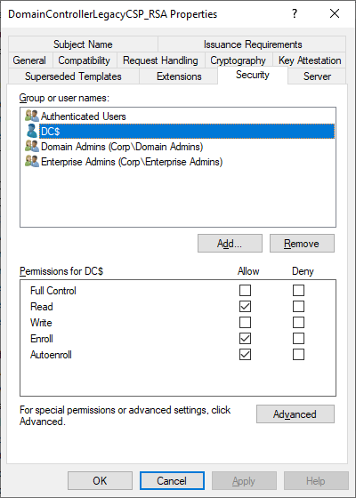

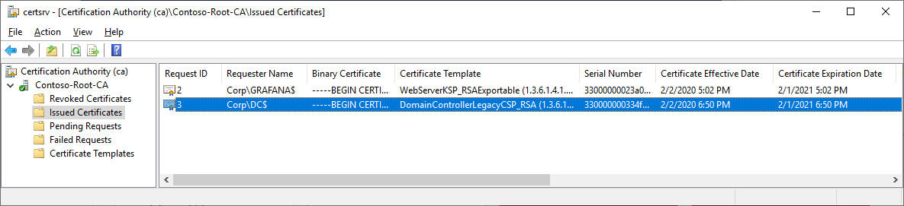

### Configure LDAPS on DC

To reload certificate on Domain Controller just run following command

```PowerShell
$DCs="DC" #can be multiple domain controllers
Invoke-Command -ComputerName $DCs -ScriptBlock {
    $content=@'
dn:
changetype: modify
add: renewServerCertificate
renewServerCertificate: 1
-
'@
    $content | Out-File -FilePath $env:temp\ldap-renewservercert.txt
    & ldifde -i -f $env:temp\ldap-renewservercert.txt
}
 
```

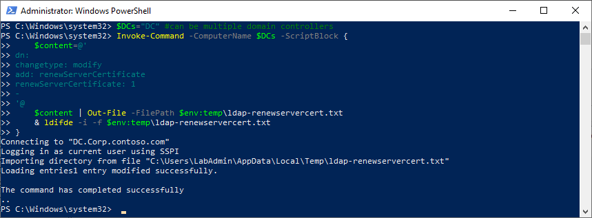

To test if LDAPS is configured, you can run LDP (RSAT-ADDS-Tools is needed)

```PowerShell
Install-WindowsFeature -Name RSAT-ADDS-Tools
C:\Windows\System32\ldp.exe
 
```


### Configure Grafana to use LDAPS

```PowerShell
$GrafanaServerName="Grafana"
#Secure LDAP to use SSL and Configure Grafana Certificate
#Grab DN
$CAcert=(Get-CertificationAuthority).certificate
Invoke-Command -ComputerName $GrafanaServerName -ScriptBlock {
    Stop-Service -Name Grafana
    #region Configure SSL for LDAP
        #export RootCA.crt
        $content = @(
'-----BEGIN CERTIFICATE-----'
[System.Convert]::ToBase64String((get-item "Cert:\LocalMachine\CA\$($using:CACert.Thumbprint)").Export("Cert"), 'InsertLineBreaks')
'-----END CERTIFICATE-----'
)
        $content | Out-File -FilePath "C:\RootCA.crt" -Encoding ascii #as I did not find a way how to specify space in "C:/Program Files" in ldap.toml file
        #load toml file
        $tomlfilecontent=Get-Content -Path "C:\Program Files\Grafana\conf\ldap.toml"
        #configure RootCA
        $tomlfilecontent=$tomlfilecontent.Replace('# root_ca_cert = "/path/to/certificate.crt"','root_ca_cert = "C:/RootCA.crt"')
        #configure port
        $tomlfilecontent=$tomlfilecontent.Replace("port = 389","port = 636")
        #configure SSL
        $tomlfilecontent=$tomlfilecontent.Replace("use_ssl = false","use_ssl = true")
        #set content to Toml file
        $tomlfilecontent | Set-Content -Path "C:\Program Files\Grafana\conf\ldap.toml"
    #endregion
    Start-Service -Name Grafana
}
 
```

And Grafana is working again!

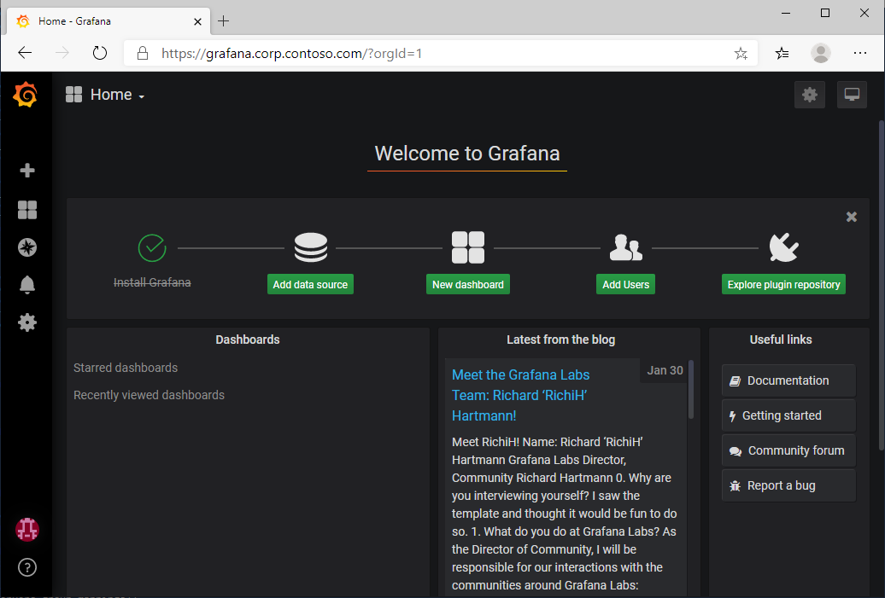
